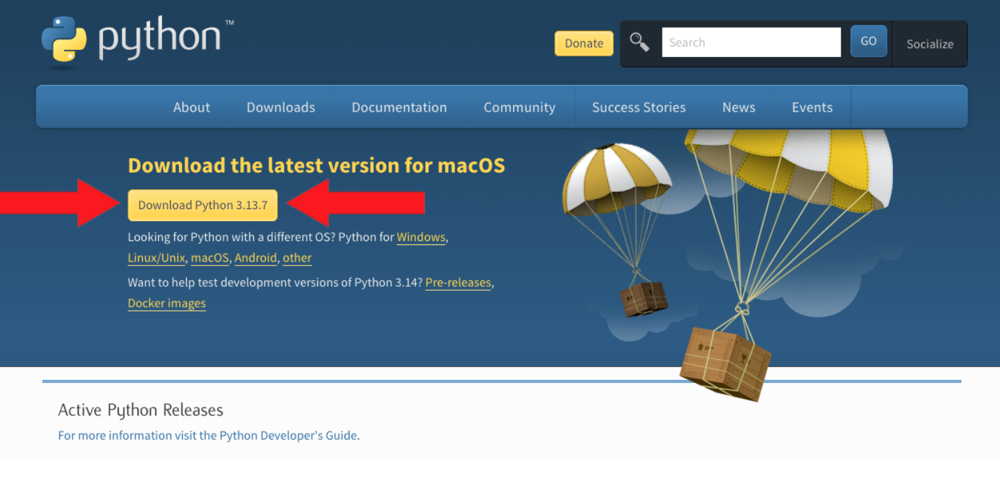
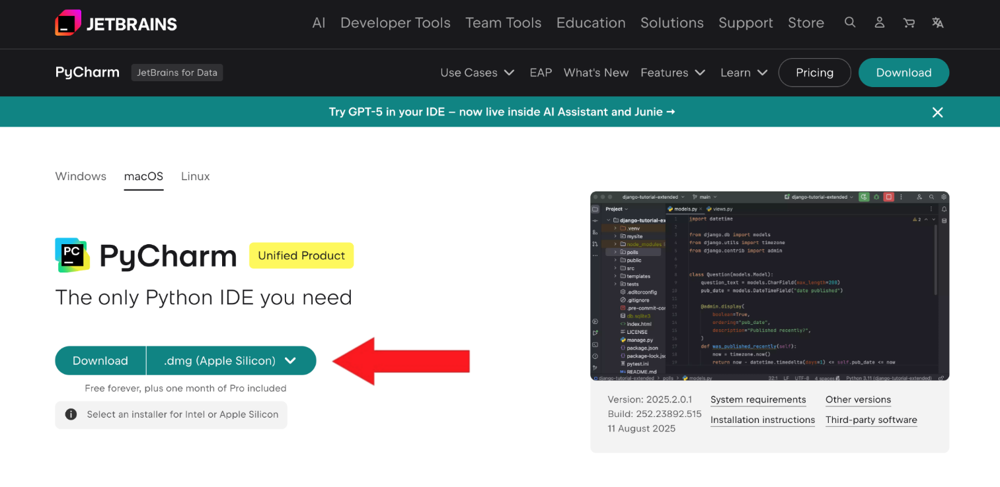

# Installation

If you’re working on your personal computer, follow the steps below to get set up.
If you’re sticking with the lab computers, you can skip all of this!!

⚠️ _Chromebook users: I have bad news for you, but this setup will not work on a Chromebook. You’ll need to use the lab computers 100%_

## Install Python

- Navigate to [www.python.org/downloads/](https://www.python.org/downloads/)
- Click the big yellow button at the top of the page that says 'Download Python 3.13'

Your browser _should_ automatically detect detect whether you’re on Mac or Windows. If it failed to vibe check your computer, just scroll down and select the download link that matches your operating system.

## Install PyCharm

- Navigate to [www.jetbrains.com/pycharm](https://www.jetbrains.com/pycharm)
- This time, click the big green button that says 'Download'

Again, the browser should detect your operating system and your computer’s “chip.” If it doesn’t, just select the correct option manually following the below instructions

## Determining your Computer & Chip

### Mac Users: Check Your Chip

- Click the Apple logo 🍎 at the top left of your screen
- Select **About This Mac**
- Next to “Chip,” you’ll see either **Apple** or **Intel** depending on when you bought your computer

### Windows Users: Check Your Chip

- Go to Settings > System > About
- Look under System Type and you'll see either **x64-based PC** or **ARM64-based PC**

## Free Stuff (optional)

As a student, you get a bunch of benefits with Microsoft.

Check out the [Jetbrains Student Pack](https://www.jetbrains.com/academy/student-pack/#students) and click Request to score some fancy software for free.
