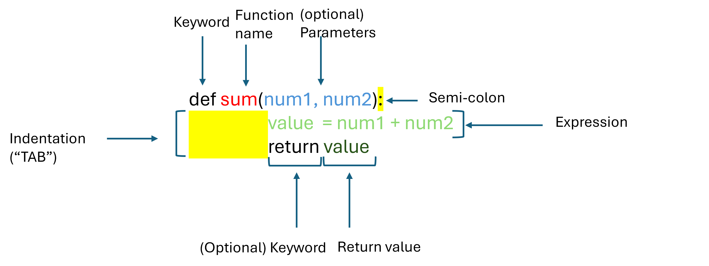
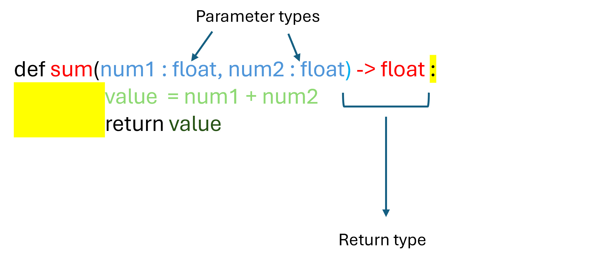
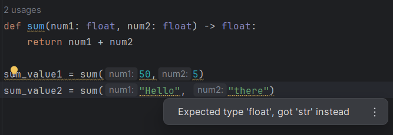

# Functions

Before diving into this topic, ensure that you've already covered the following lectures:

- [Variables & Constants](./Notes/01_Expressions_Variables_Constants)
- [Assignment Operators](./Notes/01_Expressions_Operators_Assignment)


In programming, a function is a set of instructions designed to perform a specific **task**. It's a block of code that executes when called. One example we have already seen on multiple occasions is the `print()` function. To call the function we simply type its name followed by parenthesis `()`. We can add the input string in between the parenthesis: 

```python
print("something")
```

Functions can accept input arguments provided by the user or the entity calling the function. In the prior example, the input argument is the string `"something"`. 

Functions may also, produce return values, which are the results the user expects after the function finishes its task. For example the function `float()` which returns the float equivalent of an input value can be captured into a new variable `my_float`:

```python
my_int = 23
my_float = float(my_int)
```


Remember that in an **assignment operation**, the **right hand side is evaluated first** and then assigned to the variable on the left.

This means that the function will:

1. receive it's inputs
2. run to completion, and then
3. return it's output
4. the output will be assigned to the variable on the left.


#### Math functions

- The `math` module allows you to use mathematic functions. You need to firstly import the module:

  ```python
  import math
  ```

- To use the functions defined within the math module, you can use the "dot" ( `.`)  to access a function:

  ```python
  math.cos(0)
  ```

- There exists many useful functions performing math operations that we will be using in this course:

  <div class="button-container">     
      <a href="https://app.codeboot.org/4.1.2/?init=.odXNpbmdfdmFyaWFibGVzXzIucHk=~XQAAgACAAQAAAAAAAAA6GUn-74cyTh0__GhBNjgdVfqEsZ-12mb5qH1w6HItSS8aB7YPpB70sX-c_R-tuJfsZ7Q5rD2_gLB0p_txmGHlhNTJbW0X5OQh_zuMqn6hVMcGuk-_OFhOu7uWqIoGNneXmnvCASdmSPMOycQkIgDfe9X3Z4CqXqHOS2YuLWkA_-gZ9Mg=.oYXNzaWduaW5nX3ZhcmlhYmxlcy5weQ==~XQAAgAAXAAAAAAAAAAA8CAOiEWEDQUfSteh5uxz_eJ-pfPsoZcaE__9yMgAA.fbWF0aF9mdW5jdGlvbnMucHk=~XQAAgAB7AAAAAAAAAAA0m0pnuFI8c-fPp4GmUQhPyfWm-sZLdkTp2ysHhXIpXdPqLmFecWpjgN9D12FvR64UVRP0p-GLs6zwpzXKoJkMKXeVqch2IFv__7rLgAA=.~lang=py-novice.e1">         
      <button class="codeboot-button">
        <span>Run example</span>
      </button>     
      </a> 
  </div>

  ```python
  # math already imported
  
  math.ceil(5.5)
  math.floor(5.5)
  math.sqrt(9)
  math.sin(3.14)
  math.cos(0)
  math.atan(1)
  math.acos(1)
  math.asin(1)
  ```

- If you intend on using a particular function often, you can import only the function you are interested in:

<div class="button-container">     
    <a href="https://app.codeboot.org/4.1.2/?init=.odXNpbmdfdmFyaWFibGVzXzIucHk=~XQAAgACAAQAAAAAAAAA6GUn-74cyTh0__GhBNjgdVfqEsZ-12mb5qH1w6HItSS8aB7YPpB70sX-c_R-tuJfsZ7Q5rD2_gLB0p_txmGHlhNTJbW0X5OQh_zuMqn6hVMcGuk-_OFhOu7uWqIoGNneXmnvCASdmSPMOycQkIgDfe9X3Z4CqXqHOS2YuLWkA_-gZ9Mg=.oYXNzaWduaW5nX3ZhcmlhYmxlcy5weQ==~XQAAgAAXAAAAAAAAAAA8CAOiEWEDQUfSteh5uxz_eJ-pfPsoZcaE__9yMgAA.obWF0aF9mdW5jdGlvbnMucHk=~XQAAgAB7AAAAAAAAAAA0m0pnuFI8c-fPp4GmUQhPyfWm-sZLdkTp2ysHhXIpXdPqLmFecWpjgN9D12FvR64UVRP0p-GLs6zwpzXKoJkMKXeVqch2IFv__7rLgAA=.fbWF0aF9zaG9ydGN1dC5weQ==~XQAAgABzAAAAAAAAAAAzHIoib6qOhkKVB6-O3fm4OMH2bmXUooVDSXNCOTOx1vn2P7Xw4a1CrMNaImBHJJfBiVLOxug_0_3s50V6keTmARhldZtjP__FLMAA.~lang=py-novice.a">         
    <button class="codeboot-button">
      <span>Run example</span>
    </button>     
    </a> 
</div>

```python
from math import sin
from math import cos

sin_pi = sin(math.pi)
cos_pi = cos(math.pi)
```


#### Defining your own functions

- You may also define your own functions:

  ```python
  def sum(num1, num2):
  	return num1 + num2
  ```


To define your own functions you must:

- Use the keyword `def` followed by the name of your function
- Add parenthesis `()` 
- (optional) add as many parameters as you need separated by `,`
- Use a semi-colon: `:`
- Use an indentation character (TAB) for every line of code within the function.
- (optional) use the keyword `return` and return a value or expression.





**Example 1 - Function with parameters and return value**

```python
def multiply(num1, num2):
    """Function to multiply two numbers."""
    return num1 * num2

# Method call
multiply(4,3)
```

**Example 2 - Function without parameters**

```python
def greetings():
	print("Hello! Welcome to the AI world! How may I help you today?")
    
# Method call
greetings()
```

**Example 3: Functions without return value**

```python
def even_odd( num ): 
    """Function to determine if number is even or odd."""
    if (num % 2 == 0): 
        print("even")
    else: 
        print("odd")
        
# To call this function
even_odd(23)
```


#### Default values

```python
def divide(numerator, denominator=1):
    """Function to divide a numerator by a denominator.
    If denominator unspecified, the default value is 1. """
	return numerator/denominator


# To call this function
divide(3,2)

divide(3)  # will perform 3/1
```


#### Calling a function within a function

To make things more complex, functions may even call other functions. Let's look at a more complex example:

Let's create functions to calculate the variance of three numbers. A variance is the average of the squared differences from the mean. 

<div class="button-container">     
    <a href="https://app.codeboot.org/4.1.2/?init=.odXNpbmdfdmFyaWFibGVzXzIucHk=~XQAAgACAAQAAAAAAAAA6GUn-74cyTh0__GhBNjgdVfqEsZ-12mb5qH1w6HItSS8aB7YPpB70sX-c_R-tuJfsZ7Q5rD2_gLB0p_txmGHlhNTJbW0X5OQh_zuMqn6hVMcGuk-_OFhOu7uWqIoGNneXmnvCASdmSPMOycQkIgDfe9X3Z4CqXqHOS2YuLWkA_-gZ9Mg=.oYXNzaWduaW5nX3ZhcmlhYmxlcy5weQ==~XQAAgAAXAAAAAAAAAAA8CAOiEWEDQUfSteh5uxz_eJ-pfPsoZcaE__9yMgAA.obWF0aF9mdW5jdGlvbnMucHk=~XQAAgAB7AAAAAAAAAAA0m0pnuFI8c-fPp4GmUQhPyfWm-sZLdkTp2ysHhXIpXdPqLmFecWpjgN9D12FvR64UVRP0p-GLs6zwpzXKoJkMKXeVqch2IFv__7rLgAA=.fZnVuY3Rpb25fY2FsbHNfZnVuY3Rpb24ucHk=~XQAAgACIAgAAAAAAAAAyGUj_TtFe5Qp7gdNJjXHYhzcmvd4DmMgZhsWk91foYdyyNUBdLlGBpt_GzXYVvnHDG2UFx8TC1Ic6rWHFMaMa0fqgiII-4DZ8z3aIdnzDEEPz4hslUBUMX5mYbKyw0-RNLg9eq_J1wRBP1OwraoA9abPEBGEU5NtjIxMc64sxUA2o8L7znEUX7_1BVp0Pgg9BZigqnyYH8l9t2qbUk13RqGEsp3s1NFJ6lCkTOXsMk3t2rjzNGD9DkykPeDuwmZ7I4Eha0RMq9pfr3eQLAXnn6IuwnexRV3kAN7yWt6PGd_WPw7Ah4hDTDZ1k4IXJBMFBqmD1KR47rHfhC__fVgoJ.~lang=py-novice.~hidden=true.e">         
    <button class="codeboot-button">
      <span>Run example</span>
    </button>     
    </a> 
</div>

```python
def average(num1, num2, num3):
    """Calculates the average of three numbers"""
    sum = num1 + num2 + num3
    return sum/3

def squared_difference(num1, num2):
    """Calculated the squared difference between two numbers"""
    return (num1-num2)**2

def variance(num1, num2, num3):
    mean = average(num1, num2, num3)
    sqared_diff1 = squared_difference(num1, mean)
    sqared_diff2 = squared_difference(num2, mean)
    sqared_diff3 = squared_difference(num3, mean)
    
    variance_value = average(sqared_diff1, sqared_diff2,sqared_diff3)
    return variance_value
    
   
value = variance(16, 18, 19)   
print("The variance is:", value)
```


### **Pros of using functions:**

- One big benefit of using functions is that you can reuse code you've already written instead of starting from scratch each time. Now if you need to calculate the average of three different numbers, you can easily switch the values:

  

  ```python
  variance = variance(22, 21, 24)   
  print("The variance is:", value)
  ```

  

- The best functions are as general as possible so they can be used in many different contexts. 

  - In the example above `average()` is a good example of a re-usable concept, as it is the same calculation when calculating average temperature in Montréal in the past 3 days:

  ```python
  temperature1 = 23.5
  temperature2 = 26.8
  temperature3 = 32.5
  
  avg_temperature = average(temperature1,temperature2,temperature3)
  ```

  - As you progress through this course, you will learn how to create your own functions in a way that optimizes code re-usability. 

    

#### Type hinting

Type hinting reinforces some additional constraints on the types or arguments and returned values of a user defined function. It is optional, but highly recommended to ensure that functions are used as intended.

In this course, you are asked to use type hinting on all your defined functions. Marks will be deduced if you do not.

 

```python
def sum(num1: float, num2: float)  -> float :
    """Function which adds two numbers"""
	value = num1 + num2
	return value
```

```python
sum(20, 5)  #This will work
```

```python
sum("Hello", "there")  #This still works but will display a warning
```

