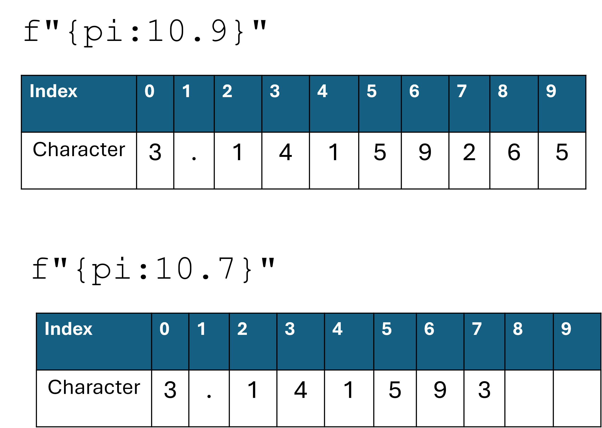
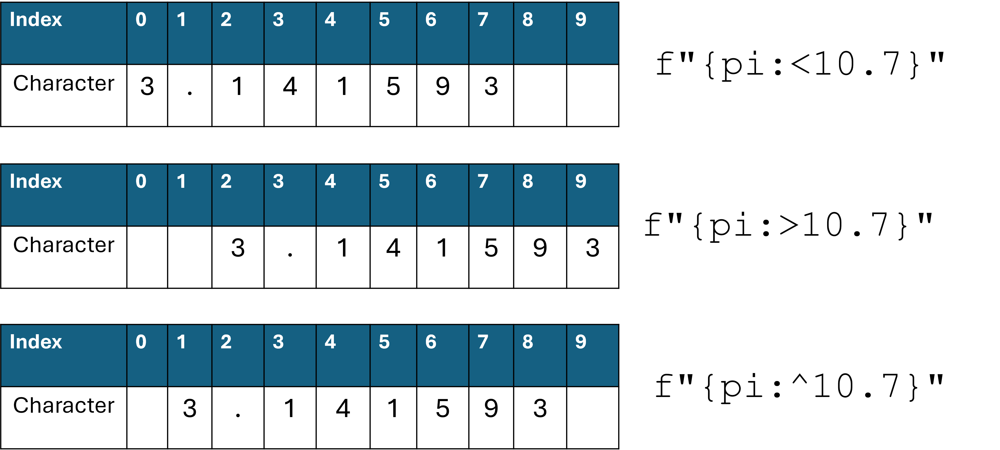

# Additional notes on f-strings

We have introduced f-strings earlier when learning about string concatenation. F-strings are very useful to combine various strings as well as strings with integers and floats.
This tutorial is about how to format numbers within an f-string. 

[Source of examples](https://cissandbox.bentley.edu/sandbox/wp-content/uploads/2022-02-10-Documentation-on-f-strings-Updated.pdf)
[Official documentation](https://docs.python.org/3/tutorial/inputoutput.html)

## Decimal place
To control the decimal places of a float, use the `:.f` format. 

For example, here are a few lines that print the value of pi at different precisions:


<div class="button-container">     
    <a href="https://app.codeboot.org/5.0.0/?init=.fZl9zdHJpbmdzX2Zvcm1hdHRpbmcucHk=~XQAAgABBAQAAAAAAAAA4GkAC0ByzvCjtabl8Z6dvA39VetDTfwSgb7RGNRvQnDv3RW9NJFtUw8hFT52Q4dTZ47nqg-wXzPqbl1yK8U-SQNZzB2CTSFCH-3BSN7TggUuFbJFJpXp4U40J4sS0DncJAYSSXII4-9lXvhAZVnboYMFshgfQkVeCeL6D5FCo5s9lpBsjev_IWSAA.oZl9zdHJpbmdzX2xhcmdlX251bS5weQ==~XQAAgAD4AAAAAAAAAAA4G8poN568H4TKvrkNmV-Zm9bgyjtE5TseTHxDjNcidMZjB2a16QkeVInLHWVlYtZSrva4Y7oncz83r4XXa7GkR2Ex83rR25bPRwtURV0QxVb4J8FT1Yp5TrPUYdvU_P1NNV-xzTGJiovCEof6aWBplrQ3Z83V__86ToAA.oZl9zdHJpbmdzX3RyYW5zYWN0aW9ucy5weQ==~XQAAgABHAQAAAAAAAAA6HIhGlRN8UpG9oPgHogcbklM99BMeogJqT_a_kODmbJVfvOB0Kl4_3Rpejc8skSfaIrzwPVdGBpjWUFofUEQg4CoLRsAivJS6trQfX4tDxWMC8fk51XsEkdbu3B7KWlffNiT__97lsAA=.~lang=py-novice.~hidden=true.e" target="_blank">         
    <button class="codeboot-button">
      <span>Run example</span>
    </button>     
    </a> 
</div>


```python
pi = 3.141592653589793

print("The value of pi without formatting: ", pi)  
print(f"The value of pi with two decimal places: {pi:.2f}")
print(f"The value of pi with three decimal places: {pi:.3f}")
print(f"The value of pi with four decimal places: {pi:.4f}")
```

**Output:**

```text
The value of pi without formatting:  3.141592653589793
The value of pi with two decimal places: 3.14
The value of pi with three decimal places: 3.142
The value of pi with four decimal places: 3.1416
```


## Large numbers

- Large numbers can also be formatted in a special way using f-strings, e.g.: `333_300_000` :
  - **Scientific notation**  `:e` will print the number in scientific notation i.e. with a coefficient (3.333), an exponent (10) and a base (8). Result`3.333000e+08`
  - **Comma separated** thousands `:,` will print the number with `,` for every 1000th power of 10 Result: `333,300,000` 

<div class="button-container">     
    <a href="https://app.codeboot.org/5.0.0/?init=.oZl9zdHJpbmdzX2Zvcm1hdHRpbmcucHk=~XQAAgABBAQAAAAAAAAA4GkAC0ByzvCjtabl8Z6dvA39VetDTfwSgb7RGNRvQnDv3RW9NJFtUw8hFT52Q4dTZ47nqg-wXzPqbl1yK8U-SQNZzB2CTSFCH-3BSN7TggUuFbJFJpXp4U40J4sS0DncJAYSSXII4-9lXvhAZVnboYMFshgfQkVeCeL6D5FCo5s9lpBsjev_IWSAA.fZl9zdHJpbmdzX2xhcmdlX251bS5weQ==~XQAAgAD4AAAAAAAAAAA4G8poN568H4TKvrkNmV-Zm9bgyjtE5TseTHxDjNcidMZjB2a16QkeVInLHWVlYtZSrva4Y7oncz83r4XXa7GkR2Ex83rR25bPRwtURV0QxVb4J8FT1Yp5TrPUYdvU_P1NNV-xzTGJiovCEof6aWBplrQ3Z83V__86ToAA.oZl9zdHJpbmdzX3RyYW5zYWN0aW9ucy5weQ==~XQAAgABHAQAAAAAAAAA6HIhGlRN8UpG9oPgHogcbklM99BMeogJqT_a_kODmbJVfvOB0Kl4_3Rpejc8skSfaIrzwPVdGBpjWUFofUEQg4CoLRsAivJS6trQfX4tDxWMC8fk51XsEkdbu3B7KWlffNiT__97lsAA=.~lang=py-novice.~hidden=true.e" target="_blank">         
    <button class="codeboot-button">
      <span>Run example</span>
    </button>     
    </a> 
</div>

```python
population_usa = 333_300_000   # note: you are allowed to use _

print(f'The population of the usa without formatting {population_usa}')

print(f'The population of the usa in scientific notation {population_usa:e}')

print(f'The population of the usa with commas {population_usa:,}')
```

**Output:** 

```text
The population of the usa without formatting 333300000
The population of the usa in scientific notation 3.333000e+08
The population of the usa with commas 333,300,000
```


## Aligning numbers 

To align numbers together to the left or to the right, you can use fill characters with f-strings.

There is another way of looking at an f-string, we might want to print a fixed number of characters after the decimal. 

Let's go back to the example of `pi`  and run the following lines:

```python
print(f"{pi:10.9})
print(f"{pi:10.7})  
```

This will fill exactly 10 characters from that number, either with 9 characters for the decimal part or 7 characters. 



Notice that in the second example, the program fills the string with empty characters to reach exactly 10 character. 


Let's now discuss alignment using the `>` , `<` or `^`




✍️  **Challenge 1:** Print the receipt of the following transaction: price of item1, item2, item3, the subtotal, the tax amount and the total.

We wish to have all the numbers of the receipt aligned to the right. 

```python
item1 = 15.00
item2 = 23.50
item3 = 26.50
tax_rate = 0.15

sub_total = item1 + item2 + item3
tax_amount = 0.15 * sub_total
total = sub_total + tax_amount

... complete this

```


<div class="button-container">     
    <a href="https://app.codeboot.org/5.0.0/?init=.oZl9zdHJpbmdzX2Zvcm1hdHRpbmcucHk=~XQAAgABBAQAAAAAAAAA4GkAC0ByzvCjtabl8Z6dvA39VetDTfwSgb7RGNRvQnDv3RW9NJFtUw8hFT52Q4dTZ47nqg-wXzPqbl1yK8U-SQNZzB2CTSFCH-3BSN7TggUuFbJFJpXp4U40J4sS0DncJAYSSXII4-9lXvhAZVnboYMFshgfQkVeCeL6D5FCo5s9lpBsjev_IWSAA.oZl9zdHJpbmdzX2xhcmdlX251bS5weQ==~XQAAgAD4AAAAAAAAAAA4G8poN568H4TKvrkNmV-Zm9bgyjtE5TseTHxDjNcidMZjB2a16QkeVInLHWVlYtZSrva4Y7oncz83r4XXa7GkR2Ex83rR25bPRwtURV0QxVb4J8FT1Yp5TrPUYdvU_P1NNV-xzTGJiovCEof6aWBplrQ3Z83V__86ToAA.oZl9zdHJpbmdzX3RyYW5zYWN0aW9ucy5weQ==~XQAAgABHAQAAAAAAAAA6HIhGlRN8UpG9oPgHogcbklM99BMeogJqT_a_kODmbJVfvOB0Kl4_3Rpejc8skSfaIrzwPVdGBpjWUFofUEQg4CoLRsAivJS6trQfX4tDxWMC8fk51XsEkdbu3B7KWlffNiT__97lsAA=.fZl9zdHJpbmdfcmlnaHRfYWxpZ24ucHk=~XQAAgADwAQAAAAAAAAA0nQjOemBaOhYRjhJhRsiWrtvXRvTv-FcbIYKitGRb8-ntCvrbds63-1WahViQTPpoh9MFnQNssuMNs_iKD_VOVLwHcQizWdvJW2PLeRZAfKWpeZd7NuOKgh7NJbtfJE-IyMg_6-yu-MUKykINIlGVR6eHs1JBK7ymi1r_J8EMK2Ao-u7pSm4k4oI_fJapeJVOwbmrrmSH4XmTLW_-KbjgUM1pwai5MY8m__K1p1o=.~lang=py-novice.~hidden=true.e" target="_blank">         
    <button class="codeboot-button">
      <span>Solution</span>
    </button>     
    </a> 
</div>

✍️ **Challenge 2:** The following transactions appear in your bank statement:

Using a combination of formatting seen above, display the number in the format described below.

```python
transaction1 = 120.00
transaction2 = -180.00
transaction3 = 20
transaction4 = -50.00
transaction5 = -88.90
transaction6 = -12.50
```

**Expected output:**

```python
   +120.00
   -180.00
    +20.00
    -50.00
    -88.90
    -12.50
```

<div class="button-container">     
    <a href="https://app.codeboot.org/5.0.0/?init=.oZl9zdHJpbmdzX2Zvcm1hdHRpbmcucHk=~XQAAgABBAQAAAAAAAAA4GkAC0ByzvCjtabl8Z6dvA39VetDTfwSgb7RGNRvQnDv3RW9NJFtUw8hFT52Q4dTZ47nqg-wXzPqbl1yK8U-SQNZzB2CTSFCH-3BSN7TggUuFbJFJpXp4U40J4sS0DncJAYSSXII4-9lXvhAZVnboYMFshgfQkVeCeL6D5FCo5s9lpBsjev_IWSAA.oZl9zdHJpbmdzX2xhcmdlX251bS5weQ==~XQAAgAD4AAAAAAAAAAA4G8poN568H4TKvrkNmV-Zm9bgyjtE5TseTHxDjNcidMZjB2a16QkeVInLHWVlYtZSrva4Y7oncz83r4XXa7GkR2Ex83rR25bPRwtURV0QxVb4J8FT1Yp5TrPUYdvU_P1NNV-xzTGJiovCEof6aWBplrQ3Z83V__86ToAA.fZl9zdHJpbmdzX3RyYW5zYWN0aW9ucy5weQ==~XQAAgABGAQAAAAAAAAA6HIhGlRN8UpG9oPgHogcbklM99BMeogJqT_a_kODmbJVfvOB0Kl4_3Rpejc8skSfaIrzwPVdGBpjaJoPYITqRVOlrTDpTOxel_RSqnM8ODL13P2qlQuXAAG2Dzeq4a3nN3__3f56A.~lang=py-novice.~hidden=true.e" target="_blank">         
    <button class="codeboot-button">
      <span>Solution</span>
    </button>     
    </a> 
</div>

## Percentage

- Percent values can be automatically formatted using `:%`

Coming soon...


