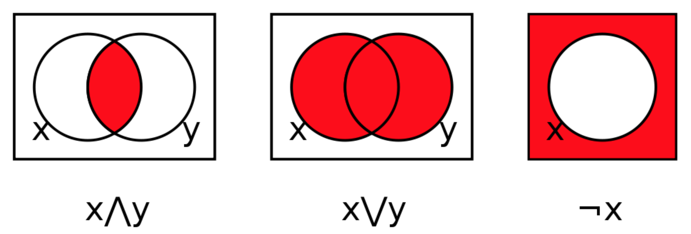

# Operators


**Operators**: Similarly to mathematics, the `+`, `-`, `*`, `/` are operators used to perform arithmetic operations on numbers. In Python, complications may arise if you combine literals of different types. 

Let's remind that there are three types of numeric literals and one type for strings in Python:

**Numeric** 

- `int `
- `float`
- `complex` (Imaginary numbers are not covered in this course)

**Text**

- `string` 

**Boolean**

- `bool`


### Combining narrow and wider types

To use arithmetic operators you firstly need to understand what happens when you combine different numeric types. 

**Integers to Floats**

- Any `int` value e.g.: `10` has a `float` equivalent e.g.: `10.0`. 

- You can convert an integer into a float by using the constructor, e.g: `float(10)` 

- Likewise, you can convert a `float` into an integer using `int(3.14)`

  ⚠️ **Note:**  This will truncate the decimal part of the `float` number, the resulting `int` is `3`.  Therefore, you must be careful when performing those conversion because this might result in loosing precision or loosing information. We say that `float`s are **wider** range than `int`or `int` are **narrower** than floats. 

**Boolean to integers or floats**

Although extremely rare, arithmetic operations with the `bool` type are possible in Python. 

- To convert a `bool` into an integer or a float, you can also use the `int(True)` or `float(True)` constructors. 
- A Boolean value of `True` translates into the value `1` (or `1.0` ) and  `False` translates into `0` (or into `0.0` ). 
- If you perform an addition of two `bool`, for example `True + True`, Python will convert each `bool` into the next wider type, in this case `int`, and perform the operation (`1+1 = 2`). If it's a more complex operation, for example `False / True`, the values will be converted to `float`, therefore the result will be `0.0 / 1.0 = 0.0`

In summary, when performing an arithmetic operation, the numbers will be converted to a **wider** type to ensure the operation is performed without losing information.


## Arithmetic operators


- **Addition  `+`:** 
  
  - If combining two`int`, this operator performs an addition and returns the result as an `int` : (e.g.: `3 + 2`,  result:` 5`)
  - If combining two `float`, this operator performs an addition and returns the result as a `float` (e.g.: `3.2 + 2.5`,  result:` 5.7`)
  - If combining an `int` and a `float`, this operation will convert the `int` into a float, performs a mathematical addition and returns the result as a `float` (e.g: `3.0 + 2` , result `5.0`)
  - On string literals, this operator concatenates the two strings (e.g.: `"Hi " + "Charlie"`, result: `"Hi Charlie"` )
  
- **Subtraction `-` :**
  - If combining two`int`, this operator performs a mathematical subtraction and returns the result as an `int` : (e.g.: `3 - 2`,  result:` 1`)
  - If combining two `float` or a `float` with an `int`, this operator performs a mathematical subtraction and returns the result as a `float` (e.g.: `3.2 - 2,  result:` 0.7`)
  - This operator doesn't apply to string literals and will cause an error if used on strings.
  
- **Multiplication *`:**
  
  - If combining two`int`, this operator performs a mathematical multiplication and returns the result as an `int` : (e.g.: `3 * 2`,  result:` 6`)
  - If combining two `float` or a `float` with an `int`,this operator performs a mathematical multiplication and returns the result as a `float` (e.g.: `3.5 * 2`,  result: ` 7.0`)
  - This operator doesn't apply to string literals and will cause an error if used on strings.
  
- **Division  `/`:**

  - If combining any two real numbers (`float` or `int`), this operator always converts them into `float`, performs a mathematical division and returns the result as a `float`  (e.g: `3/2` , result `1.5`, `4/2`, result: `2.0`)
  - Similar to mathematics, division by zero will cause an error. Your program needs to handle this situation, especially if the denominator is a variable that might become zero.
  - This operator doesn't apply to string literals and will cause an error if used on strings.

- **Modulus `%`:**

  - To grasp this operator, it's essential to recall what a division remainder is. Consider the following division:
    $$
    7/5 = 1.4  = 1 + 2/5
    $$

    - Quotient: 1 
    - Remainder: 2 

  - The **modulus** operation returns the remainder of a long division (e.g. `7 % 5 = 2`). If is an easy way to verify if a number is divisible by another number (remainder is 0).

  - If performing this operation with two `int`, the result will be an `int` 

  - If performing this operation with two `float`, the result will be a `float` (e.g.: `7.0 % 5.0 = 2.0`)

  - If performing this operation with an `int` and a `float`, the int is automatically converted into the wider type `float` and the result is a `float`.

  - This operator doesn't apply to string literals and will cause an error if used on strings.

- **Floor division `//`:**

  - Divides the first operand by the second and rounds the result down to the nearest whole number. 
  - If two `int` are used in this operation, the result is and `int`
  - If any of the number is a `float`, the result will be a `float` and any integer will automatically be converted to the wider type `float`.
  - This operator doesn't apply to string literals and will cause an error if used on strings.

- **Exponentiation `**`:**

  - Raises the first operator to the power of the second operator (e.g.: `4**2`, result :`16` )
  - Doesn't exist for string literals and will cause an error.

  


✍️**Challenge**: Manually execute the operations of the program below and write the expected result.  Check your answers by running the code. 

<div class="button-container">     
    <a href="https://app.codeboot.org/5.0.0/?init=.fYXJpdGhtZXRpY3MxLnB5~XQAAgABzAAAAAAAAAAA7iAOiEWEBkg99P3WsHCwTzyEnkel2CBOuLrjllUppjR2CUAq-gAuD7LU2oyanmA9U_RpSi-drNpr416lu9L-NrvGsbtQ5a-GEWkgA0kTkSGfwDTPluIsbrwON_vHxgA==.~lang=py-novice.~showLineNumbers=true.a">         
    <button class="codeboot-button">
      <span>Check answer</span>
    </button>     
    </a> 
</div>

```python
w = 2
x = 10.0
y = 7

a = w + y
b = y - w
c = 10 % 7
d = y // w
e = y ** w
f = w * x
g = y / x
print(a,b,c,d,e,f,g)
```


✍️**Challenge**: Manually execute the operations below and write the expected result. Check your answers by running the code. 

<div class="button-container">     
    <a href="https://app.codeboot.org/5.0.0/?init=.oYXJpdGhtZXRpY3MxLnB5~XQAAgABzAAAAAAAAAAA7iAOiEWEBkg99P3WsHCwTzyEnkel2CBOuLrjllUppjR2CUAq-gAuD7LU2oyanmA9U_RpSi-drNpr416lu9L-NrvGsbtQ5a-GEWkgA0kTkSGfwDTPluIsbrwON_vHxgA==.fYXJpdGhtZXRpY3MyLnB5~XQAAgAAyAAAAAAAAAAAwiAOiEahbOGuxQe1CZvIjyRYu5mub1I1Va1AIIODnRLN-GxtFSkmZFiGNPbP__7xKAAA=.~lang=py-novice.~showLineNumbers=true.a">         
    <button class="codeboot-button">
      <span>Check answer</span>
    </button>     
    </a> 
</div>

```python
a = 9
b = 4
c = 5
x = a % b
y = a // c
print(x, y)
```


<div class="button-container">     
    <a href=https://app.codeboot.org/5.0.0/?init=.oYXJpdGhtZXRpY3MxLnB5~XQAAgABzAAAAAAAAAAA7iAOiEWEBkg99P3WsHCwTzyEnkel2CBOuLrjllUppjR2CUAq-gAuD7LU2oyanmA9U_RpSi-drNpr416lu9L-NrvGsbtQ5a-GEWkgA0kTkSGfwDTPluIsbrwON_vHxgA==.oYXJpdGhtZXRpY3MyLnB5~XQAAgAAyAAAAAAAAAAAwiAOiEahbOGuxQe1CZvIjyRYu5mub1I1Va1AIIODnRLN-GxtFSkmZFiGNPbP__7xKAAA=.fYXJpdGhtZXRpY3MzLnB5~XQAAgAAvAAAAAAAAAAAwiAOiEYBKyZe2I4QdWm7UXFjOvyviV84ZJSWiNp-9cEcuUekImN8jtfnmf3_4HMgA.oYXJpdGhtZXRpY3MyLTItMi5weQ==~XQAAgAAyAAAAAAAAAAAwiAOiEahbOGuxQe1CZvIjyRYu5mub1I1Va1AIIODnRLN-GxtFSkmZFiGNPbP__7xKAAA=.~lang=py-novice.~showLineNumbers=true.a>         
    <button class="codeboot-button">
      <span>Check answer</span>
    </button>     
    </a> 
</div>


```python
a = 5.5
b = 5

x = a % b
y = a // b
print(x, y)
```


<div class="button-container">     
    <a href="https://app.codeboot.org/5.0.0/?init=.oYXJpdGhtZXRpY3MxLnB5~XQAAgABzAAAAAAAAAAA7iAOiEWEBkg99P3WsHCwTzyEnkel2CBOuLrjllUppjR2CUAq-gAuD7LU2oyanmA9U_RpSi-drNpr416lu9L-NrvGsbtQ5a-GEWkgA0kTkSGfwDTPluIsbrwON_vHxgA==.oYXJpdGhtZXRpY3MyLnB5~XQAAgAAyAAAAAAAAAAAwiAOiEahbOGuxQe1CZvIjyRYu5mub1I1Va1AIIODnRLN-GxtFSkmZFiGNPbP__7xKAAA=.oYXJpdGhtZXRpY3MzLnB5~XQAAgAAvAAAAAAAAAAAwiAOiEYBKyZe2I4QdWm7UXFjOvyviV84ZJSWiNp-9cEcuUekImN8jtfnmf3_4HMgA.fYXJpdGhtZXRpY3M0LnB5~XQAAgAA0AAAAAAAAAAAwiAOiES9Ps37Inw0qfG9M7-T-i9pIlseMPdretZIdGs5iE_XRmjDhfUT9FqrYzaHB_-xOgAA=.~lang=py-novice.~showLineNumbers=true.a1">         
    <button class="codeboot-button">
      <span>Check answer</span>
    </button>     
    </a> 
</div>


```python
a = -7
b = -4
x = a % b
y = (a + b) // b
print(x, y)
```


## Assignment operator

Assignment operators are used to set the value of a variable, unlike mathematics. For instance, in math 5 + 3 = 8 is a correct **statement**. However in Python, executing`5 + 3 = 8` will cause a syntax error. This is because the `=` operator is not used for arithmetic operations or equality. In programming, `5 + 3` is an expression that cannot be reassigned. Python expects the left hand side of the equality to be a variable.

There exists much more assignment operators, but we will only focus on the following ones:

### Assignment `=`

Assigns a value to a variable (e.g.: `name = "Julie"` , result: assigns the value `"Julie`" to the variable `name`)

⚠️ This operator does not have the same definition as in math. In math and algebra, = is a **statement** used to communicate that two values are equal as in 5+3 = 8. In Python, `=` is an **assignment**, it sets the value of a variable. `5 + 3 = 8` would cause a syntax error in Python because you cannot reassign the value of a literal or an expression. 


<div class="button-container">     
    <a href="https://app.codeboot.org/5.0.0/?init=.oYXJpdGhtZXRpY3MxLnB5~XQAAgABzAAAAAAAAAAA7iAOiEWEBkg99P3WsHCwTzyEnkel2CBOuLrjllUppjR2CUAq-gAuD7LU2oyanmA9U_RpSi-drNpr416lu9L-NrvGsbtQ5a-GEWkgA0kTkSGfwDTPluIsbrwON_vHxgA==.oYXJpdGhtZXRpY3MyLnB5~XQAAgAAyAAAAAAAAAAAwiAOiEahbOGuxQe1CZvIjyRYu5mub1I1Va1AIIODnRLN-GxtFSkmZFiGNPbP__7xKAAA=.oYXNzaWdubWVudF9wbHVzX2VxdWFsXzEucHk=~XQAAgAAhAAAAAAAAAAA7GEncQfTWSH3AOTZQVq949oPwc4AHCfa7_CrqzOIf_qQQAA==.fYXNzaWdubWVudF8xLnB5~XQAAgAAtAAAAAAAAAAA3GEn9-d2KwgqzO3WiO93_asMbSuJMPn19rh4Ws-7u99O1ogE7PwqtmXBsxnv_-HNgAA==.~lang=py-novice.~showLineNumbers=true.a">         
    <button class="codeboot-button">
      <span>Run example</span>
    </button>     
    </a> 
</div>

```python
name = "Julie"
sum  = 5 + 3
average = sum / 2
```


<div class="button-container">     
    <a href="https://app.codeboot.org/5.0.0/?init=.oYXJpdGhtZXRpY3MxLnB5~XQAAgABzAAAAAAAAAAA7iAOiEWEBkg99P3WsHCwTzyEnkel2CBOuLrjllUppjR2CUAq-gAuD7LU2oyanmA9U_RpSi-drNpr416lu9L-NrvGsbtQ5a-GEWkgA0kTkSGfwDTPluIsbrwON_vHxgA==.oYXJpdGhtZXRpY3MyLnB5~XQAAgAAyAAAAAAAAAAAwiAOiEahbOGuxQe1CZvIjyRYu5mub1I1Va1AIIODnRLN-GxtFSkmZFiGNPbP__7xKAAA=.oYXNzaWdubWVudF9wbHVzX2VxdWFsXzEucHk=~XQAAgAAhAAAAAAAAAAA7GEncQfTWSH3AOTZQVq949oPwc4AHCfa7_CrqzOIf_qQQAA==.oYXNzaWdubWVudF8xLnB5~XQAAgAAtAAAAAAAAAAA3GEn9-d2KwgqzO3WiO93_asMbSuJMPn19rh4Ws-7u99O1ogE7PwqtmXBsxnv_-HNgAA==.fYXNzaWdubWVudF9lcnJvci5weQ==~XQAAgAAJAAAAAAAAAAAaiAG1DW5pPxYc_ZQa__3KsAA=.~lang=py-novice.~showLineNumbers=true.e">         
    <button class="codeboot-button">
      <span>Run example</span>
    </button>     
    </a> 
</div>

```python
5 + 3 = 8 # This will cause an error
```


### Addition assignment `+=`

- Performs an addition (numeric addition or string concatenation) on the two operands and **assigns** the result to the left operand. 


<div class="button-container">     
    <a href="https://app.codeboot.org/5.0.0/?init=.oYXJpdGhtZXRpY3MxLnB5~XQAAgABzAAAAAAAAAAA7iAOiEWEBkg99P3WsHCwTzyEnkel2CBOuLrjllUppjR2CUAq-gAuD7LU2oyanmA9U_RpSi-drNpr416lu9L-NrvGsbtQ5a-GEWkgA0kTkSGfwDTPluIsbrwON_vHxgA==.oYXJpdGhtZXRpY3MyLnB5~XQAAgAAyAAAAAAAAAAAwiAOiEahbOGuxQe1CZvIjyRYu5mub1I1Va1AIIODnRLN-GxtFSkmZFiGNPbP__7xKAAA=.fYXNzaWdubWVudF9wbHVzX2VxdWFsXzEucHk=~XQAAgAAhAAAAAAAAAAA7GEncQfTWSH3AOTZQVq949oPwc4AHCfa7_CrqzOIf_qQQAA==.~lang=py-novice.~showLineNumbers=true.a">         
    <button class="codeboot-button">
      <span>Run example</span>
    </button>     
    </a> 
</div>

```python
value = 6
value += 2
print(value) # output: 8
```


 

<div class="button-container">     
    <a href="https://app.codeboot.org/5.0.0/?init=.oYXJpdGhtZXRpY3MxLnB5~XQAAgABzAAAAAAAAAAA7iAOiEWEBkg99P3WsHCwTzyEnkel2CBOuLrjllUppjR2CUAq-gAuD7LU2oyanmA9U_RpSi-drNpr416lu9L-NrvGsbtQ5a-GEWkgA0kTkSGfwDTPluIsbrwON_vHxgA==.fYXNzaWdubWVudF9wbHVzX2VxdWFsXzIucHk=~XQAAgAAqAAAAAAAAAAA3GEn9-d2KwgquAeQuSLwRz6Cqke6qg6gX-Mz_0bJzRbF9mH-blJSf___YPIAA.~lang=py-novice.~showLineNumbers=true.a">         
    <button style="border: none; background-color: transparent;">         
    <button class="codeboot-button">
      <span>Run example</span>
    </button>     
    </a> 
</div>

```python
name = "Emma"
name += "Watson"
print(name) # output: "EmmaWatson"
```


### Subtraction assignment `-=`

- Performs a subtraction on the two operands and **assigns** the result to the left operand. 


<div class="button-container">     
    <a href="https://app.codeboot.org/5.0.0/?init=.obWludXNfZXF1YWwucHk=~XQAAgAAhAAAAAAAAAAA7GEncQfTWSH3AOTZQWRok9oPwc4AHCfa7_CrqzOIf_qQQAA==.fYXNzaWdubWVudF9wbHVzX2VxdWFsXzEucHk=~XQAAgAAhAAAAAAAAAAA7GEncQfTWSH3AOTZQVq949oPwc4AHCfa7_CrqzOIf_qQQAA==.~lang=py-novice.~showLineNumbers=true.a">         
    <button class="codeboot-button">
      <span>Run example</span>
    </button>     
    </a> 
</div>

```python
value = 6
value -= 2
print(value) # output: 4
```


### Multiplication assignment `*=`

- Performs a multiplication on the two operands and **assigns** the result to the left operand. 


<div class="button-container">     
    <a href="https://app.codeboot.org/5.0.0/?init=.oYXJpdGhtZXRpY3MxLnB5~XQAAgABzAAAAAAAAAAA7iAOiEWEBkg99P3WsHCwTzyEnkel2CBOuLrjllUppjR2CUAq-gAuD7LU2oyanmA9U_RpSi-drNpr416lu9L-NrvGsbtQ5a-GEWkgA0kTkSGfwDTPluIsbrwON_vHxgA==.oYXJpdGhtZXRpY3MyLnB5~XQAAgAAyAAAAAAAAAAAwiAOiEahbOGuxQe1CZvIjyRYu5mub1I1Va1AIIODnRLN-GxtFSkmZFiGNPbP__7xKAAA=.fYXNzaWdubWVudF9wbHVzX2VxdWFsXzEucHk=~XQAAgAAhAAAAAAAAAAA7GEncQfTWSH3AOTZQVq949oPwc4AHCfa7_CrqzOIf_qQQAA==.oYXNzaWdubWVudF8xLnB5~XQAAgAAtAAAAAAAAAAA3GEn9-d2KwgqzO3WiO93_asMbSuJMPn19rh4Ws-7u99O1ogE7PwqtmXBsxnv_-HNgAA==.oYXNzaWdubWVudF9lcnJvci5weQ==~XQAAgAAJAAAAAAAAAAAaiAG1DW5pPxYc_ZQa__3KsAA=.ob3BlcmF0b3JzX2NoYWxsZW5nZTEucHk=~XQAAgABoAQAAAAAAAAAyGEuUHxEvL_uf85Adn-YPLdgd9bjdwPPfaaBxGsx9NvHx1yG6xtpH-jzukUm0BsSAfCsTE1pQA6lcsmm9M5PZB7uVg8DzAk81mds4hcDAxgHOxTF8V_3PTUz7kBOaqbF7VO60KlzSQ-X03fTR1HmgNMnaQv814WAA.oYXNzaWdubWVudF9kaXZfZXF1YWw=~XQAAgAAhAAAAAAAAAAA7GEncQfTWSH3AOTZQW4TQ9oPwc4AHCfa7_CrqzOIf_qQQAA==.oYXNzaWdubWVudF9wbHVzX2VxdWFsXzEtMy5weQ==~XQAAgAAhAAAAAAAAAAA7GEncQfTWSH3AOTZQVq949oPwc4AHCfa7_CrqzOIf_qQQAA==.oYXNzaWduX211bHRfcGx1cy5weQ==~XQAAgAAhAAAAAAAAAAA7GEncQfTWSH3AOTZQVXog9oPwc4AHCfa7_CrqzOIf_qQQAA==.~lang=py-novice.~showLineNumbers=true.a8">         
    <button class="codeboot-button">
      <span>Run example</span>
    </button>     
    </a> 
</div>

```python
value = 6
value *= 2
print(value) # output: 12
```


### Division assignment `/=`

- Performs a division on the two operands and **assigns** the result to the left operand. 


<div class="button-container">     
    <a href="https://app.codeboot.org/5.0.0/?init=.oYXJpdGhtZXRpY3MxLnB5~XQAAgABzAAAAAAAAAAA7iAOiEWEBkg99P3WsHCwTzyEnkel2CBOuLrjllUppjR2CUAq-gAuD7LU2oyanmA9U_RpSi-drNpr416lu9L-NrvGsbtQ5a-GEWkgA0kTkSGfwDTPluIsbrwON_vHxgA==.oYXJpdGhtZXRpY3MyLnB5~XQAAgAAyAAAAAAAAAAAwiAOiEahbOGuxQe1CZvIjyRYu5mub1I1Va1AIIODnRLN-GxtFSkmZFiGNPbP__7xKAAA=.oYXNzaWdubWVudF9wbHVzX2VxdWFsXzEucHk=~XQAAgAAhAAAAAAAAAAA7GEncQfTWSH3AOTZQVq949oPwc4AHCfa7_CrqzOIf_qQQAA==.oYXNzaWdubWVudF8xLnB5~XQAAgAAtAAAAAAAAAAA3GEn9-d2KwgqzO3WiO93_asMbSuJMPn19rh4Ws-7u99O1ogE7PwqtmXBsxnv_-HNgAA==.oYXNzaWdubWVudF9lcnJvci5weQ==~XQAAgAAJAAAAAAAAAAAaiAG1DW5pPxYc_ZQa__3KsAA=.ob3BlcmF0b3JzX2NoYWxsZW5nZTEucHk=~XQAAgABoAQAAAAAAAAAyGEuUHxEvL_uf85Adn-YPLdgd9bjdwPPfaaBxGsx9NvHx1yG6xtpH-jzukUm0BsSAfCsTE1pQA6lcsmm9M5PZB7uVg8DzAk81mds4hcDAxgHOxTF8V_3PTUz7kBOaqbF7VO60KlzSQ-X03fTR1HmgNMnaQv814WAA.fYXNzaWdubWVudF9kaXZfZXF1YWw=~XQAAgAAhAAAAAAAAAAA7GEncQfTWSH3AOTZQW4TQ9oPwc4AHCfa7_CrqzOIf_qQQAA==.oYXNzaWdubWVudF9wbHVzX2VxdWFsXzEtMy5weQ==~XQAAgAAhAAAAAAAAAAA7GEncQfTWSH3AOTZQVq949oPwc4AHCfa7_CrqzOIf_qQQAA==.~lang=py-novice.~showLineNumbers=true.a60">         
    <button class="codeboot-button">
      <span>Run example</span>
    </button>     
    </a> 
</div>

```python
value = 6
value /= 2
print(value) # output: 3
```


✍️**Challenge**: Manually execute the operations below and write the expected result. Check your answers by copying the code into a Python editor or terminal. 


<div class="button-container">     
    <a href="https://app.codeboot.org/5.0.0/?init=.oYXJpdGhtZXRpY3MxLnB5~XQAAgABzAAAAAAAAAAA7iAOiEWEBkg99P3WsHCwTzyEnkel2CBOuLrjllUppjR2CUAq-gAuD7LU2oyanmA9U_RpSi-drNpr416lu9L-NrvGsbtQ5a-GEWkgA0kTkSGfwDTPluIsbrwON_vHxgA==.oYXJpdGhtZXRpY3MyLnB5~XQAAgAAyAAAAAAAAAAAwiAOiEahbOGuxQe1CZvIjyRYu5mub1I1Va1AIIODnRLN-GxtFSkmZFiGNPbP__7xKAAA=.oYXNzaWdubWVudF9wbHVzX2VxdWFsXzEucHk=~XQAAgAAhAAAAAAAAAAA7GEncQfTWSH3AOTZQVq949oPwc4AHCfa7_CrqzOIf_qQQAA==.oYXNzaWdubWVudF8xLnB5~XQAAgAAtAAAAAAAAAAA3GEn9-d2KwgqzO3WiO93_asMbSuJMPn19rh4Ws-7u99O1ogE7PwqtmXBsxnv_-HNgAA==.oYXNzaWdubWVudF9lcnJvci5weQ==~XQAAgAAJAAAAAAAAAAAaiAG1DW5pPxYc_ZQa__3KsAA=.fb3BlcmF0b3JzX2NoYWxsZW5nZTEucHk=~XQAAgABoAQAAAAAAAAAyGEuUHxEvL_uf85Adn-YPLdgd9bjdwPPfaaBxGsx9NvHx1yG6xtpH-jzukUm0BsSAfCsTE1pQA6lcsmm9M5PZB7uVg8DzAk81mds4hcDAxgHOxTF8V_3PTUz7kBOaqbF7VO60KlzSQ-X03fTR1HmgNMnaQv814WAA.~lang=py-novice.~showLineNumbers=true.~hidden=true.e">         
    <button class="codeboot-button">
      <span>Check answer</span>
    </button>     
    </a> 
</div>

```python
day = 1
temperature  = 25.0
print(temperature)
day+=1
temperature -= 5.0
print(temperature)
day+=1
temperature = 23.5
print(temperature)
day+=1
temperature += 2.5
print(temperature)
day+=1
temperature -= 5.0
print(temperature)
day+=1
temperature /= 2
print(temperature)
day+=1
temperature *= 3

print("The weather in Canada is nuts...")
print(day, temperature)
```


## Comparison operators

The comparison operators are used to determine how two values compare to eachother : *Are these two values equal?* *Is the first value greater than this second value?* *Is the first value less than or equal to the second value?* The result is a Boolean: `True` or `False`.

For instance, let's say I borrowed 13 books at the library and I would like to check if I can rent more given that the maximum amount of books is 15.   


<div class="button-container">     
    <a href="https://app.codeboot.org/5.0.0/?init=.fYm9va3NfZXhhbXBsZS5weQ==~XQAAgABhAQAAAAAAAAAmkEdXvOTiBd_V7Sg2UnzxiMPkGnPkqjQFb6bsOFALs1usuIst7u1dKnSr12RkABkw8rxC5uZF2R3k_d80JTCGKk1cqSLRu68iR3cGLQam7oYOHgSyRUv-KLVXoxsnxg82x0PHN_h2fmcxo7awM2dhsjiuCPpnXAa5Es7TYHq8VT6G2ggDKbp1GC36d_lK_fEZlyd9INBaTxy9fpTMv3N2bhLYG5SelCOFyB2Z95_8YitA.~lang=py-novice.~showLineNumbers=true.~hidden=true.e">         
    <button class="codeboot-button">
      <span>Run example</span>
    </button>     
    </a> 
</div>

```python
MAX_BOOKS = 15    #Note this variable is capitalized because it is a constant.

my_book_count = 13

print("Can I borrow more books?")
print(my_book_count < MAX_BOOKS)

my_book_count +=1
print("Can I borrow more books?")
print(my_book_count < MAX_BOOKS)

my_book_count +=1
print("Can I borrow more books?")
print(my_book_count < MAX_BOOKS)
```


Why use such operators? Those operation will become handy when we introduction conditional statements. This will allow you to establish the relationship between values and be able to implement simple algorithms for decision making. 


### Equality operator `==` 

- The double equal operator`==` compares two operands, if they are equal the result is `True` otherwise the result is `False`. 

| English                               | Python                 |
| ------------------------------------- | ---------------------- |
| Did I borrow 14 books at the library? | `my_book_count == 14`  |
| Is the user's name "Alice"?           | `user_name == "Alice"` |

### Inequality operator != 

- Returns `True` if the operands are not equal and `False` if they are equal 

| English                                                      | Python                       |
| ------------------------------------------------------------ | ---------------------------- |
| I put 10 cookies in my pantry, did my cookie count change?   | `current_cookie_count != 10` |
| I will go to work so long as it's not my birthday. Will I go to work today? | `today != my_birthday`       |


### Greater than `>` 

- Return `True` if the left side operand is greater than the right side operand. Returns `False` otherwise.

| English                                                      | Python                                        |
| ------------------------------------------------------------ | --------------------------------------------- |
| Is Summer McIntosh the first Canadian to win that many gold medals in a single Summer Olympics? | `mcintosh_gold_count > max_canada_gold_count` |


### Greater than or equal `>=`

- Return `True` if the left side operand is greater or equal than the right side operand. Returns `False` otherwise.

| English                                               | Python             |
| ----------------------------------------------------- | ------------------ |
| The passing grade is 60, is Josh passing this course? | `josh_grade >= 60` |


### Less than `<`

- Return `True` if the left side operand is less than the right side operand. Returns `False` otherwise.
- e.g.: `3 < 6 ` result: `True` , `3 < 2`, result: `False`


| English                                                      | Python                                    |
| ------------------------------------------------------------ | ----------------------------------------- |
| Did Summer McIntosh set a new world record in the 400m butterfly? | `mc_intosh_time < world_record_butterfly` |


### Less than or equal `<=`

- Return `True` if the left side operand is less or equal than the right side operand. Returns `False` otherwise.

| English                                              | Python               |
| ---------------------------------------------------- | -------------------- |
| If the temperature outside below the freezing point? | `temperature <= 0.0` |


✍️**Challenge**: Manually execute the operations below and write the expected result. Check your answers by copying the code into a Python editor or terminal. 

<div class="button-container">     
    <a href="https://app.codeboot.org/5.0.0/?init=.fY29tcGFyaXNvbl9jaGFsbGVuZ2VzLnB5~XQAAgADRAAAAAAAAAAARiAToaYFPsVi6rkOY_gtPVhVlVMgMy9wU4vlKRmkTVwrDJddUdRiQhJT3EwSKPiJ8zQXpx7-QY0pis40KWc1I1vWP_QdVVdu0Rerf-ZlAqTc5tMK1TBKFDURcro9LSSbcbpYKde0MLEoG3M-JI9UFvVzEvV_9YtQA.~lang=py-novice.~showLineNumbers=true.~hidden=true.e">         
    <button class="codeboot-button">
      <span>Check answer</span>
    </button>     
    </a> 
</div>

```python
a = 11.999
b = 12
print(a < b)
```

```python
a = (30 / 6) + 3
b = 2**3
print(a == b)
```

```python
a = (25 // 10) * 10 
b = 4**2 + 4
print(a != b)
```

```python
a = 10
b = 7**2 +1
print(a >= b)
```


## Logical operators


Logical operators are used to combine Boolean  values and expressions (`True` or `False`).  They are helpful when programming decision making or creating more complex algorithms. We will learn more about conditional statements in the future. 

There are instances where we need to test if multiple conditions are true at the same time. For example: 

- The relative humidity index must be around 100% **AND** the temperature has to be decreasing for it to rain.
- The oil in the car should be changed every 6 months **OR** every 5,000 km.
- To return a new sweater you must have the receipt **AND NOT** remove the price tag.


The combination of **AND**, **OR**, and **NOT** conditions with the boolean values `True` and `False` is called boolean algebra (or boolean logic), each operation has a special symbol in math and in Python.


| MATH | Python | Operation | Description                             |
| :--- | :----- | :-------- | :-------------------------------------- |
| ⋀    | `and`  | AND       | True when all elements are true.        |
| ⋁    | `or`   | OR        | True when at least one element is true. |
| ¬    | `not`  | NOT       | The inverse of an element.              |




## Operator `and`

**Example**

For a meal to be considered a "special", a client must by a pizza and a drink.

| English                                                      | Math                                 | Python                                       |
| ------------------------------------------------------------ | ------------------------------------ | -------------------------------------------- |
| Omnivox is accessible if you are a student  **AND** have the correct password. | access = student ∧∧ correct password | `access = is_student and is_valid_password;` |


### Operator `or`

**Example**

| English                           | Math                    | Python                      |
| --------------------------------- | ----------------------- | --------------------------- |
| Today is a weekday *OR* a weekend | day = weekend ⋁ weekday | `day = weekend or weekday;` |

So, we send our friend out to get pizza and drinks. They come back with pizza and a drink.


### Operator `not`

This operator transforms the variable into **its opposite**. It's also know as **negation**.

**Example**

You are at the library and can only borrow a new book if you do not have any overdue books.

| English                                                 | Math                                 | Python                                        |
| :------------------------------------------------------ | :----------------------------------- | :-------------------------------------------- |
| I can borrow a book if I do *NOT* have an overdue book. | borrow permissible  = ¬ book overdue | `borrow_permissiable = not has_overdue_books` |


✍️**Challenge**: Manually execute the operations below and write the expected result. Check your answers by copying the code into a Python editor or terminal. 

<div class="button-container">     
    <a href="https://app.codeboot.org/5.0.0/?init=.oYm9va3NfZXhhbXBsZS5weQ==~XQAAgABhAQAAAAAAAAAmkEdXvOTiBd_V7Sg2UnzxiMPkGnPkqjQFb6bsOFALs1usuIst7u1dKnSr12RkABkw8rxC5uZF2R3k_d80JTCGKk1cqSLRu68iR3cGLQam7oYOHgSyRUv-KLVXoxsnxg82x0PHN_h2fmcxo7awM2dhsjiuCPpnXAa5Es7TYHq8VT6G2ggDKbp1GC36d_lK_fEZlyd9INBaTxy9fpTMv3N2bhLYG5SelCOFyB2Z95_8YitA.fb2x5bXBpY195ZWFyLnB5~XQAAgAAUAQAAAAAAAAA8mUhJnNeTvgcHkuX6AKbvV44PQEueSO04tYqSeNwNpQw3aHA63QYB9T_K98jsUjlhK0oH-Tj_fEaUlYRNW7jtRw7NdNvfEaww9YUxJMC_6w_QlXlRiFipOXqsfFiEeeQmWuxuBRQBuoD-4j_WkC1MRH9lIei-wS8G8IvFmM-f6DUMXm9z78XVDIK4bFqtoP30gwU=.~lang=py-novice.~showLineNumbers=true.~hidden=true.e">         
    <button class="codeboot-button">
      <span>Check answer</span>
    </button>     
    </a> 
</div>

```python
year = 2024
time_to_next_olympiad  = year % 4
is_summer_olympics = (time_to_next_olympiad == 0)
is_winter_olympics = (time_to_next_olympiad == 2)  and ((year % 2) == 0)
print("True or False, this year is an olympic Games year?")
print(is_summer_olympics or is_winter_olympics)
```

> *The last Summer and Winter Games held in the same year were in Barcelona (Summer) and Albertville (Winter) in 1992. Since then, the Summer and Winter Games are each still held every four years but the Summer Games are celebrated during the first year of an Olympiad and the Winter Games held in the third year.* Source: [International Olympic Committee](https://olympics.com/ioc/faq/history-and-origin-of-the-games/since-when-have-the-summer-and-winter-games-no-longer-been-held-in-the-same-year) algorithm.


## Priority of operators

You probably remember from you mathematics classes that there exists a hierarchy of priorities when evaluating a math expression. For example, a multiplication is evaluated before the addition in the following expression: 
$$
3 * 2 + 4 = (3*2) + 4 
$$
The operation (3 * 2) should be evaluated first, then 4 is added to the result. 

Python defines very precisely the priorities of all operators and you should be aware of this when writing code.

| Level of Priority | Category       | Operators                     |
| ----------------- | -------------- | ----------------------------- |
| (6) Highest       | Exponent       | `**`                          |
| 5                 | Multiplication | `*`, `/`, `//`, `%`           |
| 4                 | Addition       | `+`, `-`                      |
| 3                 | Comparison     | `==`, `!=`, `<=`,`>=`,`>`,`<` |
| 2                 | Logical Unary  | `not`                         |
| 1                 | Logical Binary | `and` ,`or`                   |

**Importance of using parathesis**

When writing scripts to process data, formulas and equations can become lengthy and difficult to read. To enhance the readability of your code, it's advisable to use parentheses e.g: `(2+4)**3` to clearly define the order of operations. Additionally, using variables can help make the code more understandable and easier to follow.

✍️**Challenge**: Manually execute the operations below and write the expected result. Check your answers by copying the code into a Python editor or terminal. 

1. Arithmetic and comparison

```python
print(3*4**2 + 10*2 >= 23 - 4**2)
```

2. Arithmetics, comparison and `or`

```python
print((34 == 34%5*7) or (52 == 8**2/2 + 4*5))
```

3. Comparison with strings

```python
name = "Joshua"
age = 20
print(name != "Stephen" and age >=19 )
```


✍️**Challenge**: Joshua is using Python to calculate his current average in computer science in percent. Here are his grades so far:

- 18/20 in an assignment worth 15%
- 15.5/20 in the test worth 20%
- 5/5 on a homework worth 2%

He has not yet learned about the priority of operations and does not understand where the mistake is in his script. Add parentheses where needed to correct his mistake.

```python
assignment_grade = 18 / 20 * 15
test_grade = 15.5 / 20 * 20
homework_grade = 5 / 5 * 2

my_grade = 100 * assignment_grade + test_grade + homework_grade / 15 + 20 + 2
print(my_grade)
```

