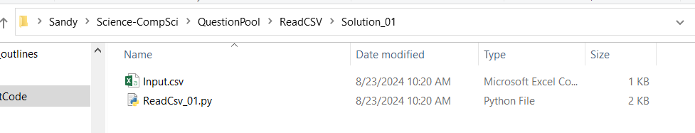

# Files, etc

## Tutorials

[Working with files](https://edu.gcfglobal.org/en/windowsbasics/working-with-files/1/)

## How do computers store information?

Computers only *think* in terms of `1`s and `0`s (binary).  Every bit of information on your computer is coded in binary and the your computer will translate one set of of `1`s and `0`s to another when displaying information on your screen.


## What is a file?

On a computer, you probably have pictures, word documents, saved video games, applications, code, plus a whole lot more. It would be very difficult if every time you opened Word, every document that you ever wrote was all smushed together.

So, to make your life easier, your computer organizes data into discrete elements, called files.  Each file has the data for *one* thing only, for example, one picture, one Word Document, one application, etc.

In the old days, files used to be a document that was printed on paper.  Today, most people refer to files as a document of some kind (picture, code, Word, etc) that is stored on your computer.

## How are the files organized?

### The old days

Before computers were everywhere, most people and companies organized their files into folders.


Each folder would have a name, describing what types of files it contained (example: '*Project 1*', '*Project 2*')

Maybe, if the number of files were large, the owner of a company might reorganize their files, so that the folder '*Project 1*' might be contain more folders (example: '*customer complains*', '*expenses*', etc.)


### Computers

To make the transition from storing files on paper, in paper folders, in filing cabinets, to storing files on computers easier, the powers that be decided to use the same names, i.e. *files* and *folders*.

> NOTE: before computers were used everywhere, *folders* used to be called *directories* and the words mean EXACTLY the same thing, so if your teacher forgets, and says *directory*, remember that she actually means *folder*.

So, in a *folder* you can have *files* and other *folders*.

Since folders are not longer physical things, we need a way to envision them.  

In short, folders (or directories) are organized into a *tree* format.

```text
My Documents
     | --- English
             Assignment 1.docx
             Assignment 2.docx
     | --- Programming
             | --- Assignment 1
                   Instructions.pdf
                   code.py
                   output.txt
              | --- Assignment 2
                   Instructions.pdf
                   code.py
                   output.csv
```


#### Windows File Explorer

Welcome to `File Explorer`

An excellent tutorial on using files on a Windows platform can be found [here](https://edu.gcfglobal.org/en/windowsbasics/working-with-files/1/).

ALWAYS VIEW YOUR FILES IN FILE EXPLORER IN `DETAIL` MODE TO SEE ALL THE PERTINENT INFORMATION.




In the image above the top line indicates all of the folders relative to each other:

`Sandy > Science-CompSci > QuestionPool > ReadCSV > Solution_01`

means that the folder `Sandy` contains the folder `Science-CompSci` which contains ...

```text
Sandy
  | --- Science-CompSci
           | --- QuestionPool
                    | --- ReadCSV
                            | --- Solution_01
```

And the list of files in the main window are the files that are contained in the folder `Solution_01`


## What is a File Extension?

The file extension is defined as the last bit of a file name that follows the last dot (`.`)

Example: `code.py` has a file extension `.py`.  A word document typically has the extension `.docx`, so the filename is typically `assignment 1.docx`.

### Why don't I see them in File Explorer?

The developers at Microsoft have designed File Explorer to be *easy(?)* for non-programmers to use, and so by default they hide the file extension. 

But, you are now a programmer, and you absolutely need to know what the file extensions are... 

Please follow the instructions in: [MS Windows Support - Show file extensions](https://support.microsoft.com/en-us/windows/common-file-name-extensions-in-windows-da4a4430-8e76-89c5-59f7-1cdbbc75cb01)

### Why do we use File Extensions?

The file extensions give a hint to the operating system (Windows/Linux/Mac) as to what type of data is in the file.  So if the extension is `.png` then the operating system knows that it is a picture, and if you double click the filename in File Explorer, it will call the appropriate program that can show you the picture.

Likewise if the file extension is `.docx`, double clicking the file in File Explorer will open Microsoft Office which in turn will read the file and display it to you.

#### Import File Extensions in this course:

| Extension | Icon | Meaning                                                      |
| --------- | ---- | -------------------------------------------------------- |
| |  | Folders have no extension |
| `.docx`   |  | Word Document                                                |
| `.py`     |   |Python Code                                                  |
| `.pdf`    |  | Portable Document File (PDF) document.  Any printer can print this file without having any specialized software. |
| `.csv`    |  |Comma Separated Values (can be read as a text file, or opened with Excel, where Excel will put data into the various columns, where each column data is separated by a comma) |
| `.zip`    |  | Zip file.  Contains multiple files within one file. It needs to be `unzipped` before you can use the files within.  WARNING: In File Explorer it can look like it is not zipped, even though it is. |


## Compressing / Uncompressing files (`zip`/`unzip`)

There are multiple ways to create a single file from a set of other files (LEA only accepts one document).  We will only be discussing one method in this document.

### MAC/Linux

* open up the terminal window

* to create a zip file type

  `zip -f somefilename.zip file1.txt, file2.csv ...` where you replace the filenames with the appropriate names of the files

* to create a zip file type

  `unzip somefilename.zip` where you replace the filenames with the appropriate names of the files

### Windows

Open file explorer.

To zip, 

* select the files that you want to zip together, and right-click.  Select `send to` then `compressed folder`


To unzip

* Select the file you want to unzip
* Click the `Extract` tab at the top of the screen
* Click `Extract All` button on the right, and follow instructions


## Zip Files can be Misleading! in File Explorer

If you have `double-clicked` on a zip file, it will open a new window showing all the files within the zip file.  This can be misleading because it looks just the same as if the files have been unzipped.  

> Do not work with these files directly, because weird stuff can happen (not always, so it makes it even more confusing)

**What to look out for**: - if the folder information ends with a zip file.


