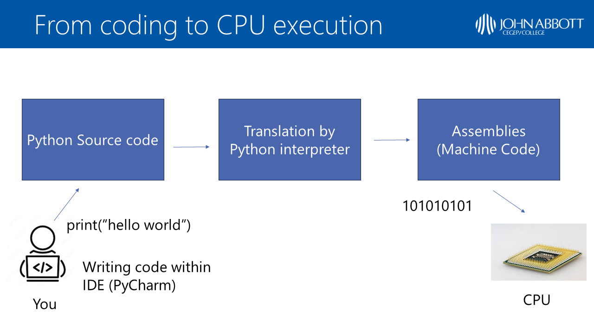

# What is Programming?


Computers are digital machines, which means they perform operations using binary (1 or 0) operations. They are particularly useful to perform tasks in a **deterministic** way. This means that a repeated task produces the same result if provided with the same inputs. Therefore computers are very reliable in sending, receiving, processing information and will do so in a consistent manner. 

Programming is the process of writing a **set of instructions** in the form of source code that can be understood by a computer.  

A **program** is a precise set of instructions that are used to perform a task. 


> For example:
>
> *Calculating the average of two numbers:*
>
> 1. *Input the first number* 
> 2. *Input the second number* 
> 3. *Add the two numbers = sum* 
> 4. *Divide the sum by 2 = average*
> 5. *Output average*


Computers only understand instructions that are written in **machine code**. That is a sequence of ones and zeros such as "101001010101010100001", this is because they are made of electric circuits and wires. Electricity is either on ("1") or off ("0") in a given circuit. All instructions sent to a computer need to be described in a sequence of "ON" or "OFF" states. This is very hard for us humans who think in terms of concepts and images, and abstract ideas. This is where Programming Languages become useful. 

**Programming languages** are used by humans to communicate with computers in a relatively intuitive way. For example Python, C#, Java, C++ are different programming languages. Learning one of these languages will require learning and practicing its syntax, semantics and how to correct your spelling mistakes just like learning French, English or Spanish. Programming languages have some similarities with one another, have typically different syntax and structure. 	

Python is the language you will be learning in this course for the following reasons:

- It is easy to learn and use

- Is intuitive thanks to its English-like syntax

- It's very accessible as it can run on Windows, Mac and Linux.

- There is a lot of support and help online.

- It can easily be equipped with add-ons called "modules" to help perform all kinds of scientific computation and charts (more on this later)

  

Now this is great! But how are programming languages understood by computers? Answer: they are translated into ones and zeros. For example, the Python code is translated by the Python interpreter into machine code.  




## Demo: Using a Terminal to write your first lines of code


- On your Windows PC, type "CMD" in the search bar to open the ***Command Line Prompt*** (type CMD in the search bar)

- Type the following command and hit the enter button: 

  ```cmd
  python
  ```

  

This will tell your computer that you will start writing instructions in the programming language called *Python*. You can start typing python code directly here!

- Type the following line of code and hit the enter button:

  ```python
  print('Hello World')
  ```

  - You should observe that "hello world" appears in the prompt under your written line of code.  This is the response of the computer.

    ```cmd
    >>> print('hello world')
    hello world
    ```

  - `print()` is a very useful Python instruction which can help us output information to the user. 

- You can type the following lines:

  ```python
  name = "Alex"
  print("My name is " + name)
  ```

  - The line `name = "Alex"` creates a variable called `name` and assigns "Alex" as its value. We will come back to variables in the future.  
  - The second line `print("My name is " + name)` prints the combined text *"My name is"* with the value stored in the variable `name` (which is "Alex"). The "+" sign here will combine the two texts into one. 

- Congratulations! You have written and executed your first lines of code! Now try to print your name and your age in the command prompt.

  

  

## Additional notes


### What is a Command Prompt?

- A Command Prompt or Terminal is a **text-based** user interface which allows us to send commands and interact with the computer. 
- In contrast, the computer Desktop is a **graphical** user interface which allows you to use the mouse and keyboard to interact more easily with the computer.
- If you are using a Mac, computer the equivalent app is called: *Terminal*