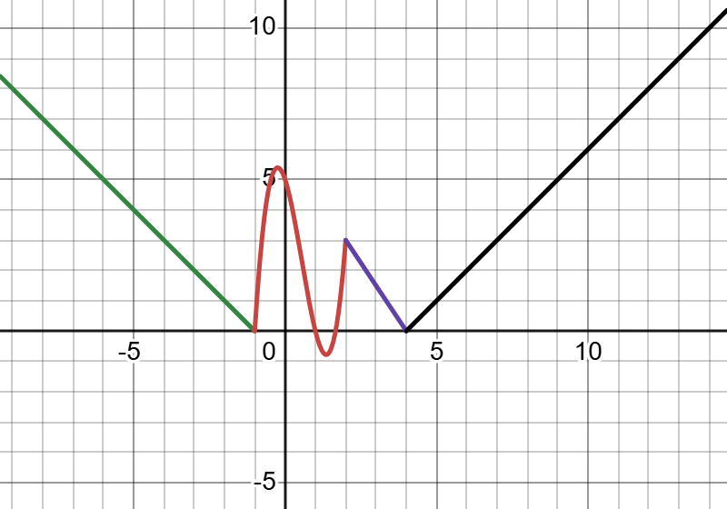
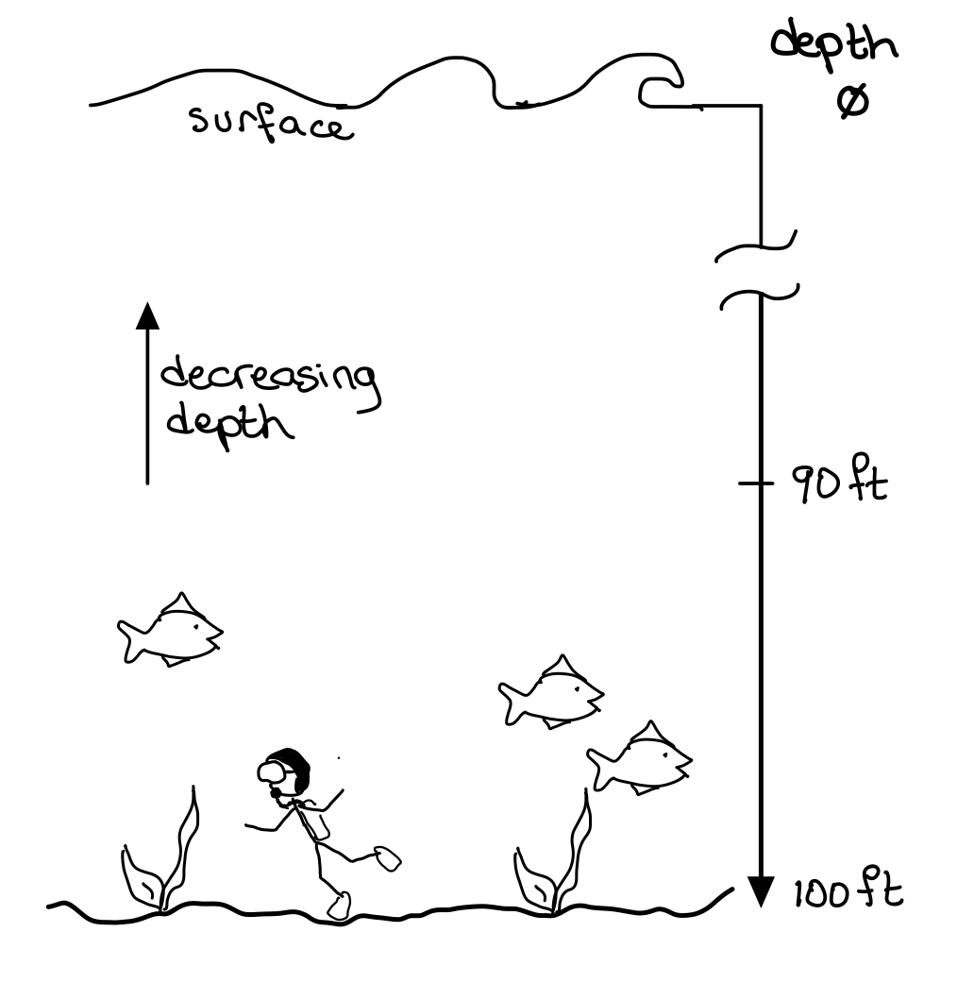
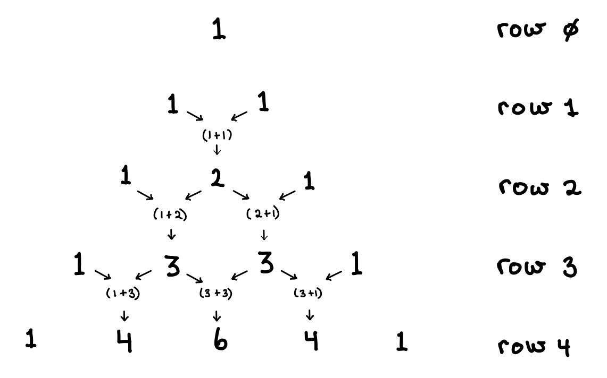

# Final Exam - Winter 2025

Solutions aren’t shown. Before jumping to look things up, try sitting with the problem for a moment. That uncomfortable feeling is unfortunately where the learning happens in this course lol

- **Really stuck?** Draw it out
- **Still really stuck?** Try explaining it to a friend
- **It's been an hour tho?** Contact your prof to discuss IRL

## Question 1: Errors (3 marks)

**Fix the errors.**

**Part a)**

```python
# should print 4, fix code so that it does what it is supposed to.
a = "2"
b = a*2
print(b)
```

**Part b)**

```python
# should print all the numbers in the list

a = [1, 9, 3, 7, 8, 2, 1]
for number in range(a):
  print(number)
```

**Part c)**

```python
def three():
  return 3

# without replacing the word `three` with `3`, fix this so that it prints 18
b = three * 6
print(b)
```

## Question 2: Tracing 👣 (6 marks)

**a) What is the output when this code is run:**

```python
for number in [9, 7, 4, 3, 18]:
    if number % 3 == 0:
        print(f"{number} is divisible by 3")
    else:
        if number % 2 == 0:
            print(f"{number} is divisible by 2")
```

**b) What is the output when this code is run:**

```python
for number in [7, 9, 4, 3, 18]:
  print(number)
  if number > 8:
    break
```

## Question 3: Length of a list (4 marks)

**_Without_ using the `len` method, or `enumerate`, find the length of a list**

```python
def length(values):
    # write your code here

c = [6, 4, 2, 0, ... , 9, 9]
y = length(c)
```

## Question 4: Coding piece-wise functions (6 marks)



Consider the following piecewise function

$$
f(x) =\begin{cases}  -x-1  & \text{if}\quad   x < -1\\
3x^{3}-5x^{2}-3x+5 & \text{if}\quad -1 \leq x \leq 2\\
6-\frac{3}{2}x & \text{if}\quad    2 < x < 4 \\
x-4 & \text{if}\quad x \geq 4
\end{cases}
$$

- **Write a Python function named`f`** that

  - takes `x` as input parameter and
  - returns $f(x)$ according to the above definition.

## Question 5: Target value (6 marks)

**Write a function `filter_list` that**

- takes as input parameters:

  - `values` - a list of integers
  - `target_value` - an integer

- returns
  - a new list of numbers from `values` that are within $\pm$3 units from the `target_value` (inclusive).

**Example** (this is an example only, your code must work for _any_ `values` and `target_value`):

```python
c =  [6, 4, 9, 2, 1]
filtered = filter_list(c, 5)
print(filtered)  #output : [6,4,2]
```

## Question 6 - Fridays (5 marks)

You are given two lists. Each one has one item for every day of the year.

- The `months` list shows the month of each day.
- The `days` list shows the day number of each day.
- The first date is January 1st which is a **Wednesday**

```python
months = ['Jan', 'Jan', ..., 'Jan','Feb', 'Feb', ... 'Feb', 'Mar', "Mar", ...]
days =  [    1,     2, ...,   31,    1,      2, ...    28,     1,     2, ...]
```

Example: To print the 53rd day of the year, use:

```python
print(f"{months[52]} {days[52]}")
```

Write Python code that:

- Prints every **Friday** of the year as `Month Day`
- If the day is **Friday the 13th**, print a special message

**Sample output:**

```text
...
may 23
may 30
jun 6
jun 13 WOoOo, Friday the 13th
jun 20
jun 27
...
```

## Question 7 - Mind Game (7 marks)

**Mind Game** is an old game where you have to guess the colour arrangement of 4 hidden pegs. But we live in the digital age, so lets create a computer game along the same concept.

- **Write a function called `process_guess` that:**
  - Takes in two lists as parameters:
    - `secret`: a list of 4 hidden integers
    - `guess`: a list of 4 integers the user tries to guess.
  - Returns a list called `clues`, also with 4 integers.
- For each number in the guess:
  - If it's **correct and in the right spot**, the clue is `1`
  - If it's **in the secret but in the wrong spot**, the clue is `2`
  - If it's **not in the secret at all**, the clue is `4`

**Example**

ASSUME THERE ARE NO DUPLICATES NUMBERS IN THE SECRET AND GUESS

If the secret is: `[4, 6, 1, 8]`

and the guess is `[1, 5, 7, 8]`

the clue will be `[2, 4, 4, 1]`

- `2` because the 1st guessed number `1` is in the secret list
- `4` because the 2nd guessed number `5` is not in the secret list
- `4` because the 3rd guessed number `7` is not in the secret list
- `1` because the 4th guessed number`8` is in the secret list, and in the correct spot

## Question 8: Solar Panels ☀️🔋(6 marks)

Sarah is considering installing solar panels on her home to save on electricity bills. She would like to use a program to help her predict how many years it will take to recover the cost of the `installation`.

**Write a python program that:**

- **per year** (Note when printing, year counting should start at 1)

  - calculate and print:
    - the savings on electricity
      - the amount of electricity produced by the solar panel (`output`) multiplied by the price of electricity (`electricity`)
    - the cumulative savings
    - adjust the price of electricity due to `inflation`
  - **stop printing** this info once the cumulative savings exceed the price of the initial cost of the solar panels (`installation`)

- **print** the total number of years it took to recoup the installation price.

**_Example:_**

Assuming we start with these values (which may not be the correct numbers)

```python
output = 800          # the amount of electricity produced by the solar panels in KWh
installation = 12000  # the cost of installing the solar panels (install_cost) in $
electricity = 0.80    # the estimated cost of electricity $/kWh
inflation = 5         # the percentage increase in electricity prices per year in %
```

The output would be:

```text
Year: 1, Savings: 640.00, Cumulative: 640.00
Year: 2, Savings: 672.00, Cumulative: 1312.00
Year: 3, Savings: 705.60, Cumulative: 2017.60
...
Year: 14, Savings: 1206.82, Cumulative: 12543.12

In year 14 you have recouped your losses
```

## Question 9: Scuba Diving (6 marks)

You are on the bottom of the sea. See below:



You need to escape quickly, but if you ascend too fast you will get the bends (a bad thing).

Your friend has sent down instructions on where you should be at every minute of your ascent.

This is a good plan **_only_** if the following conditions are met:

- the depth is decreasing (going towards the surface) at every step
- the difference in depth between every step of your journey to safety is less than or equal to 30 feet

**Write a python function `is_good` that**

- takes in as parameter:
  - a sequence of `depths` (list of numbers)
- sets your initial depth is 100 feet
- returns `True` if it's safe, `False` otherwise.

**Examples**

- `[50, 30, 20, 0]`: _Bad_ in the first minute you have gone from 100 feet to 50 feet, which is too fast (a difference of 50 feet in one minute).
- `[80, 90, 70, 30, 0]`: _Bad_ you go up to 80 feet, but then go back down to 90 feet. You cannot go back down.
- `[80, 60, 30, 20, 10, 0]`: _Good_ you keep going up, you never go more than 30 feet in one minute.

## Question 10: Time is running out ⏰ (5 marks)

**Write a function that simulates a countdown timer**.

When the function is called, it displays every second starting from 01:0:0 (1 hour, 0 minutes, 0 seconds) to 0:0:0 and then stops. There is no input required from the user.

**_Example:_**

```text
1:0:0
0:59:59
0:59:58
. . .
0:1:0
0:0:59
0:0:58
. . .
0:0:2
0:0:1
0:0:0
💥 BOOM 💥
```

## Question 11 - Pascal's Triangle (6 marks)

Pascal's triangle is a simple method to determine the coefficients of the expanded math formula `(a+b)**n`



Each row of Pascal's triangle is determined by using the previous row in the following manner...

- the new row starts with 1
- each preceding element of the row is the sum of the previous row's diagonal elements.
- the new row's last element is a 1

**Code a function `next_pascal(row: list) -> list` that**

- takes a row of Pascal's triangle as a parameter and
- returns the next row in the triangle in a list.

Example:

```python
row = [1,4,6,4,1]
new_row = next_pascal(row)
print(new_row)		# [1,5,10,10,5,1]
```

**Write a python program that**

- takes `n` as input (ask the user) the height of the pascal triangle (row number) and
- prints the pascal triangle.
- NOTE: Use your function `next_pascal`

Example output for n = 5

```text
[1]
[1, 1]
[1, 2, 1]
[1, 3, 3, 1]
[1, 4, 6, 4, 1]
[1, 5, 10, 10, 5, 1]
```
