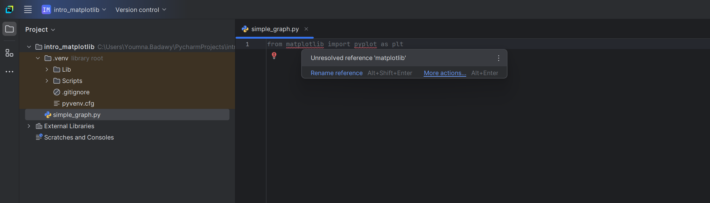
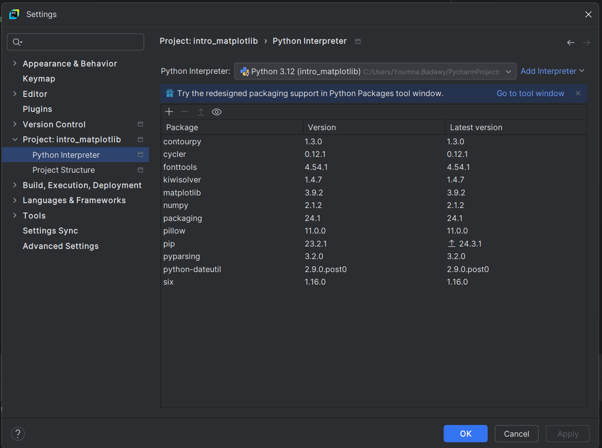
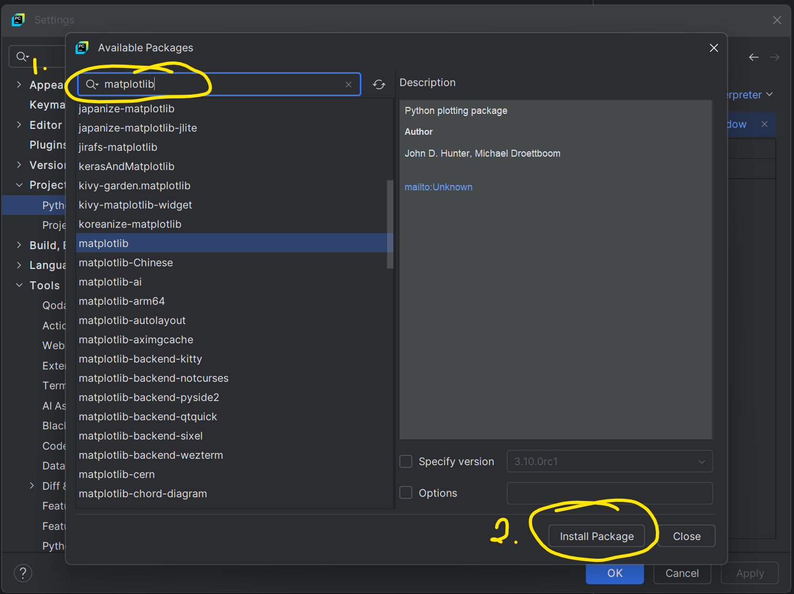
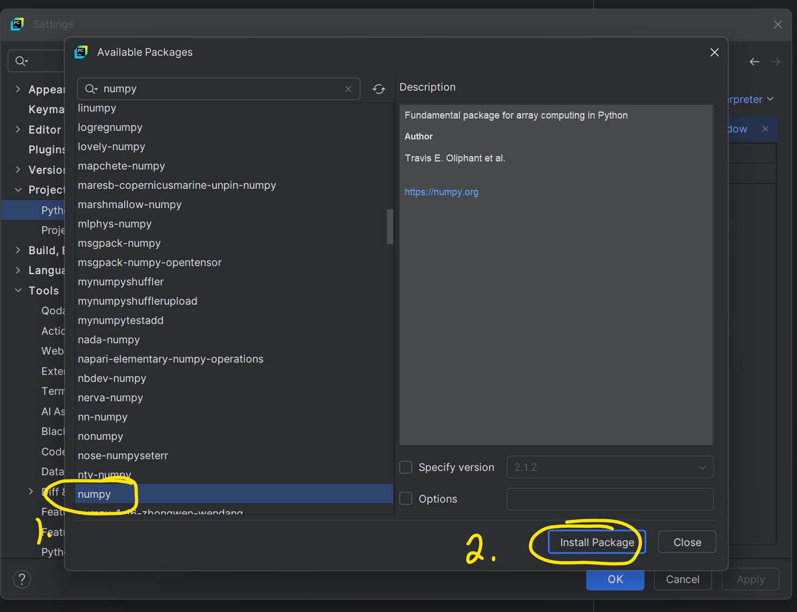

# Installing Python Modules

In this course, we have used a variety of _built-in_ modules like `math`, `turtle`, `datetime`.

We are not limited to these _built-in_ modules: developers from all over the world can create new modules that serve particular needs.

In the final chapter of our course, we will make extensive use of the following external libraries, popular for scientific research:

- [Numpy](Notes/33_2_numpy.md)
- [Matplotlib](Notes/33_3_intro_to_matplotlib.md)

For these modules, extra steps are needed: they are not _built-in_ to Python, so we have to install them separately.

## Importing and installing a module

1. Ensure that the PyCharm project is using the System's interpreter
2. Add a python file to write your code.
3. The `import` statement followed by the module name, allows you to import a module into your script. For example:

   ```python
   import math   #comes built-in with python
   ```

   > Note: You can use an alias to "nickname" a package and shorten your lines of code by using the `as` keyword For example:
   >
   > ```python
   > import math as m
   >
   > print(m.pi)
   > ```
   >
   > Note: You can also import a function or a sub-module within a given module
   >
   > ```python
   > from math import sin
   >
   > print(sin(0))
   > ```

4. If you are importing a module that wasn't installed, it will be underlined in red:

   ```python
   import numpy as np
   from matplotlib import pyplot as plt
   ```



1. If you see an error saying "Unresolved reference", that means the module **is not installed** on the computer.

### **Installing via PyCharm**

1. Click File > Settings to open the Settings menu:



2. Select Project > Project interpreter from the left hand side menu

3. This is all the list of modules that are installed in my project, yours might not contain much for now.

4. To add a package/module, click the + button at the top of the list

5. Search for the package you want installed: "_matlplotlib_" then click _Install Package_



6. While you are here, install _numpy_ as well:



7. Now that the packages are installed, try typing those lines in your python file:

   ```python
   import numpy as np
   from matlplotlib import pyplot

   ```

### **Installing via command line on Windows (like a pro 😎)**

1. Type **cmd** in the Windows search bar and click the "Command Prompt" icon.

2. Type the following command in the [command prompt](https://phoenixnap.com/glossary/command-prompt):

```
pip install --upgrade pip
```

4. Install your packages:

```cmd
pip install matplotlib
pip install numpy
```

### **Installing via Terminal on Mac (like a pro 😎)**

1. From Launch page, search for an app called Terminal
2. Type the following command in [Terminal](https://support.apple.com/en-ca/guide/terminal/welcome/mac):

```
pip3 install --upgrade pip
```

3. Install your packages with the following commands:

```
pip3 install matplotlib
pip3 install numpy
```
