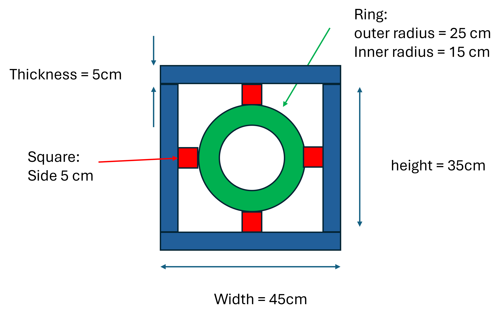

# Custom Functions

## Level 1

### Sumthings up

Write a simple function called `calculate_sum()` which takes two numbers as input and returns the sum. Call the function `calculate_sum()` with values 3, 4 and print the returned value.

<details>
  <summary>👀 Hint</summary>
  <p>What would you expect this function to "return"</p>
</details>


<details>
  <summary>✅ Solution</summary>
  <pre>
    <code class="language-python">
    def calculate_sum(num1, num2):
        return num1 + num2
    </code>
    <code class="language-python">
    sum_value = calculate_sum(3,4)
    print(sum_value)
    </code>
    </pre>
</details>


### Summing squares

Consider the following function which implements this formula:

$$
n_1^2 + n_2^2
$$

```python
def sum_squares(num1, num2):
    result =   num1**2 + num2**2
    return result
```

What will be the output of this line of code:

```python
print(sum_squares(3,4) + sum_squares(1,2))
```

<details>
    <summary>✅ Solution</summary>
    <pre>
    25 + 5 = 30
    </pre>
</details>


### f of x

Write a function which helps apply this formula:

$$
f(x) = (x-4)(x+7)
$$

Then, use it to evaluate $f(x)$ for the values of $x$:

- $x = 4$
- $x=-7$
- $x=2$
- $x=-6$

<details>
  <summary>👀 Hint</summary>
  <p>What would you expect this function to "return"</p>
</details>


<details>
  <summary>✅ Solution</summary>
  <pre>
    <code class="language-python">
       def f_quadratic(x):
            term1 = (x-4)
            term2 = (x+7)
            return term1*term2
    </code>
    <code class="language-python">
        print(f_quadratic(4))  #prints 0
        print(f_quadratic(-7)) #prints 0
        print(f_quadratic(2))  #prints -18
        print(f_quadratic(-6)) #prints -10
    </code>
    </pre>
</details>


### A matter of threes

Write a function which helps apply this formula:

$$
f(x,y) = 3(x+y)
$$

Then, use it to evaluate $f(x,y)$ for the following values:

- $x = 3$ , $y=4$
- $x = 5$ , $y=6$
- $x = 2$ , $y=8$

<details>
  <summary>✅ Solution</summary>
  <pre>
    <code class="language-python">
    def f_plane(x,y):
        return 3*(x+y)
    </code>
    <code class="language-python">
    print(f_plane(3,4))  #21 
    print(f_plane(5,6))  #33
    print(f_plane(2,8))  #30
    </code>
    </pre>
</details>

## Tracing

Consider the following functions:

```python
def function1():
  print("Hi")
  function2()
  function3()

def function2():
  print("How are you?")

def function3():
  print("Bye")
```

1. What will be the output when calling `function1()`:

```python
function1() 
```

<details>
  <summary>✅ Solution</summary>
  <pre>
"Hi"
"How are you?"
"Bye"
  </pre>
</details>

2. What will be the output when running those lines of code: 

   ```python
   function1()  
   function2()
   function3()
   ```


<details>
  <summary>✅ Solution</summary>
  <pre>
"Hi"
"How are you?"
"Bye"
"How are you?"
"Bye"
    </pre>
</details>

## Level 2

### The Average

Consider the following function:

```python
def calculate_average(num1, num2):
	result = (num1+num2)/2
```

_Part 1:_ What will be the output of the following line:

```python
average = calculate_average(3,4)
```

_Part 2:_ Explain the reason for this outcome and propose an improvement.

<details>
  <summary>✅ Solution</summary>
  <pre>
    Part 1: `None`
    Part 2: The function doesn't return the average. 
This is why it evaluates as `None` instead of the expected result. 
To fix this we should add a return statement
</pre>
</details>


### Fun Circles

Write a simple function called `area_circle()` which takes the `radius` as parameter and returns the area:

$$
A_{circle} = \pi r^2
$$

- Calculate the area of a circle with `radius=2` by using the function defined above.
- Calculate the area of a circle with `radius=9` by using the function defined above.
- Calculate the area of a ring which has an inner circle of radius 4 and an outer circle of radius 6.

<details>
  <summary>👀 Hint</summary>
  <p>What do you need to import for this to work?</p>
</details>


<details>
  <summary>✅ Solution</summary>
  <pre>
<code class="language-python">
        import math


        def area_circle(radius):
            area = math.pi * (radius**2)
            return area

</code>

<code class="language-python">
    area1 = calculate_area_circle(2)
    area2 = area_circle(9)
    area_ring = area_circle(6) -area_circle(4)
</code>
    </pre>
</details>

## More areas

1. Write a simple function called `area_rect()` which takes the `width` and `height` of a rectangle and returns the area:
   $$
   A_{rect} = w * h
   $$

2. Write a simple function called `area_square()` which takes the `side` and returns the area:
   $$
   A_{square}= s^2
   $$

3. Using the `area_cricle()`, `area_rect()` and `area_square()` functions, calculate the area of the following shape. You can assume that the red squares are perfect, that the green central ring is composed of two perfect inner and outer circles and that the blue borders are all perfect rectangles. :



<details>
  <summary>✅ Solution</summary>
  <pre>
    <code class="language-python">
    def area_square(side_length):
    	area = side_length**2
    	return area
    def area_rect(height, width):
    	area = height * width
    	return area
    </code>
    <code class="language-python">
area_ring = area_circle(25) - area_circle(15)
area_borders = (2*area_rect(45,5)
                + 2*area_rect(35,5))
area_squares = 4*area_square(5)

total_area = area_ring + area_borders + area_squares
print(f"The total area is {total_area}")
    </code>
    </pre>
</details>

### Calculus ?!

Ok, just some easy calculus...

Given:
$$
f(x)=ax^{n}
$$

Write a function called power_rule that has two int parameters called *coefficient* and *exponent*. The result of the function will be a **string** representation of the derivative with respect to x. Your string should look like:
"6x^2"
to represent $$6x^2$$

Try your function like:

```python
derivative1: str = power_rule(3, 2)
print(derivative1)
```

<details>
  <summary>👀 Hint</summary>
  <p>If you're not sure how to make the string for the result, think of how you would just print the correct string first. Once you know your string is correct, then just return it instead of printing it.</p>
</details>


<details>
  <summary>✅ Solution</summary>
  <pre>
    def power_rule(coefficient: int, exponent: int) -> str:
      result: str = f"{coefficient * exponent}x^{exponent - 1}"
      return result
</pre>
</details>
