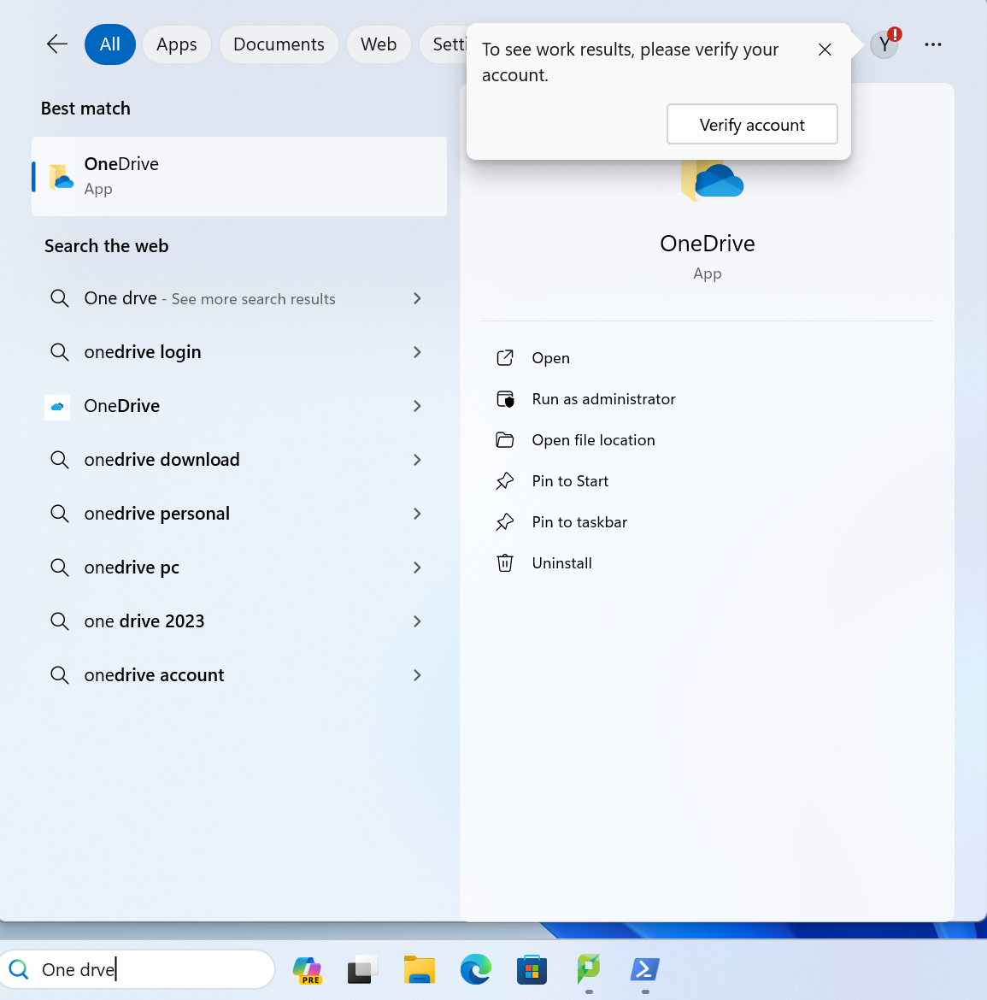
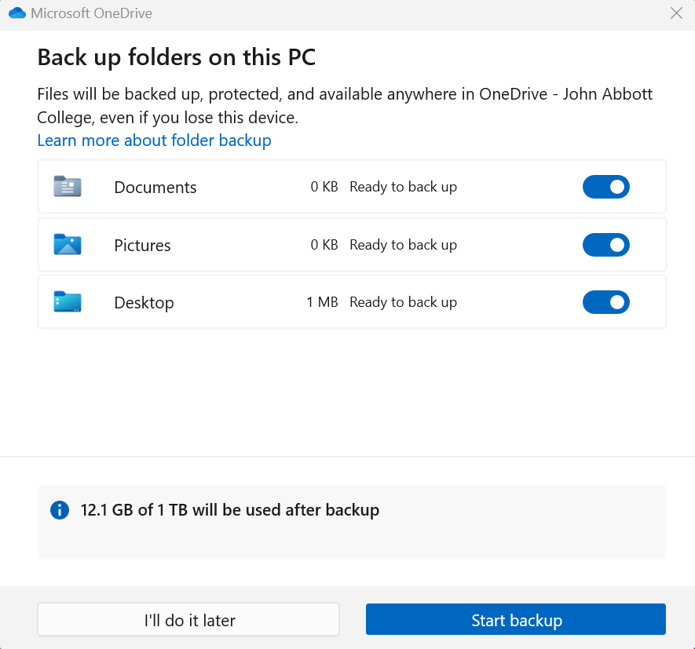
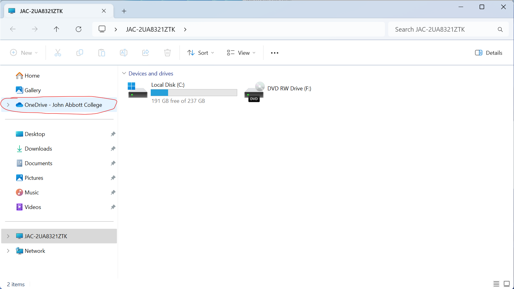
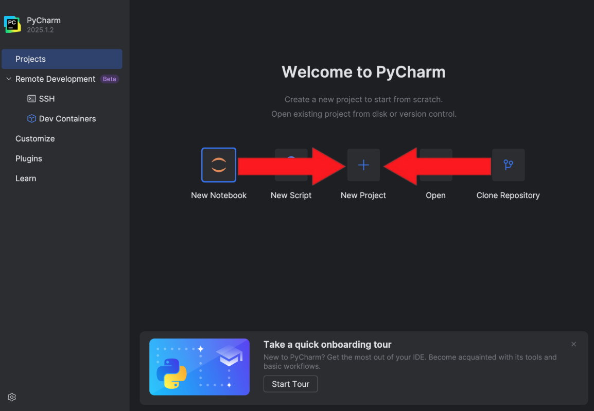
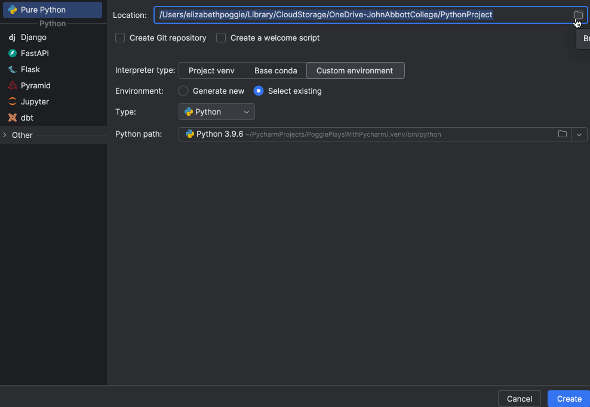
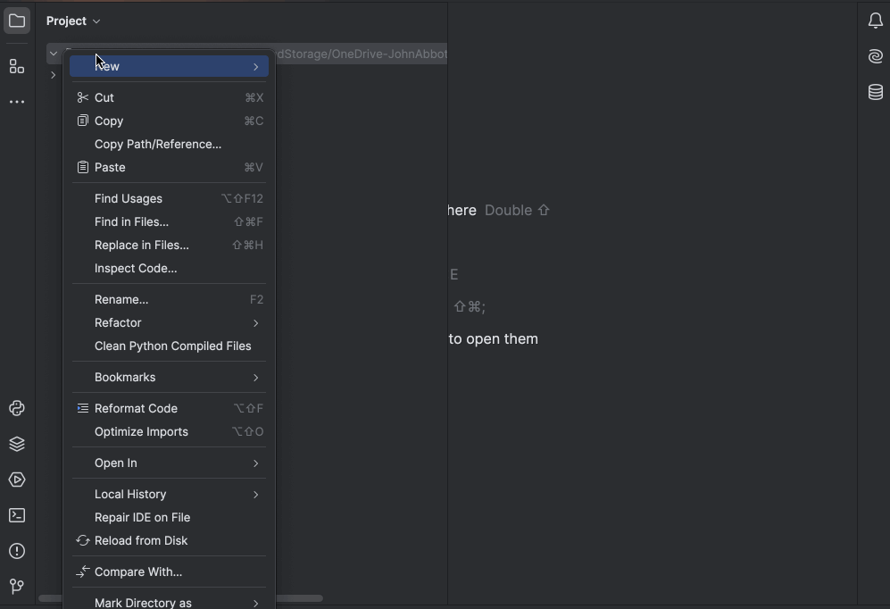
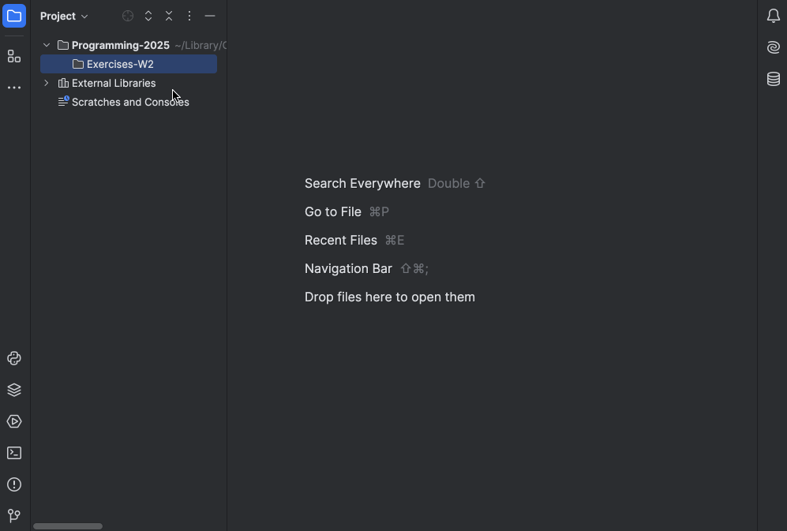
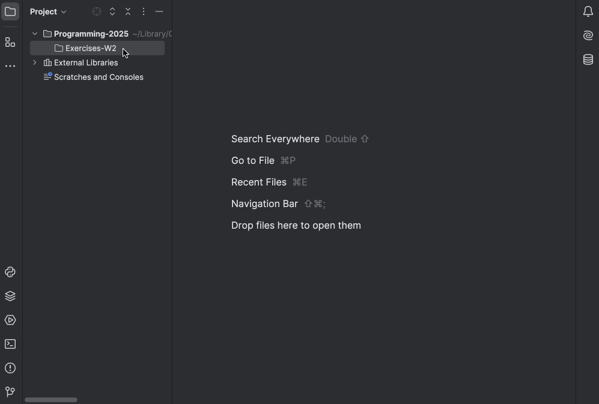

# Creating a Project

If you’re using your personal computer, you can skip the **OneDrive Configuration** section and go straight to **Starting a New Project**.

## OneDrive Configuration

This is where all your work will live for the semester :) You’ll be able to access your files outside of the lab and recover corrupted files

### First time Login

All lab computers already have OneDrive installed. To find it, open the search bar and look for the **OneDrive** app:



Log in using your John Abbott credentials:

- Email: `student_id@johnabbottcollege.net`
- Password: Same as the one you use in the labs


<figure>
   
   <figcaption style="font-style: italic;">Note: your student email address uses the domain <code>@johnabbottcollege.net</code>, NOT <code>@johnabbott.qc.ca</code> as shown in the image.</figcaption>
</figure>

Wait for the file scan to complete, then click **Start backup**. This makes sure your files are _always_ accessible:



When the backup finishes, open **File Explorer**. You should now see a folder called OneDrive – John Abbott College:



Your personal OneDrive folder will be located here:

```text
C: > Users > student_id > OneDrive - John Abbott College.
```

### Creating your Programming in Science folder

Inside your OneDrive folder, create a new folder called **programming_in_science**. This is where all your course work will live :)

## Starting a New Project

Launch **PyCharm** and click **New Project**:



Select the **programming_in_science** folder from your **OneDrive**.

- On a personal computer, you can instead create that folder inside your **Documents** and select that.



Choose **Custom Environment** > **Select Existing** > **Create from Existing Sources**:

- **On lab computers:** Select Python version `3.11` or newer
- **On your personal computer:** Select the Python version you installed

## Create a folder

- Right-click your **programming_in_science** folder
- Select **New**
- Select **Directory**



## Create a file

- Right-click the folder you want to put a file in
- Select **New**
- Select **Python File**



Alternatively, if you are enthusiastic about file extensions, you can select **File** instead and specify the extension you want:


