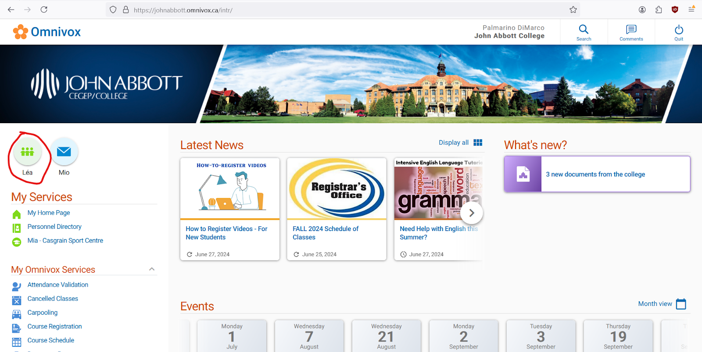
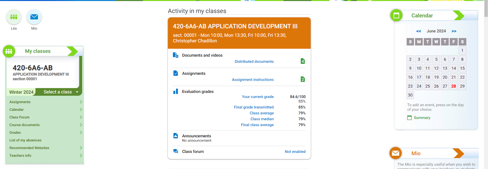
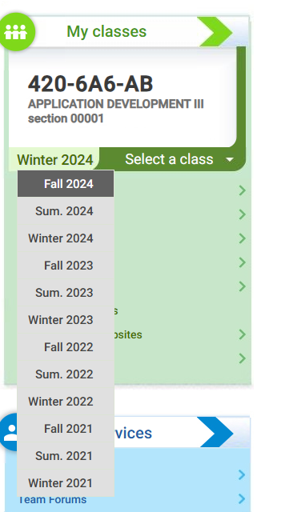
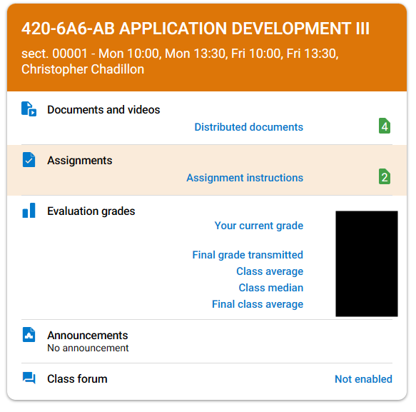
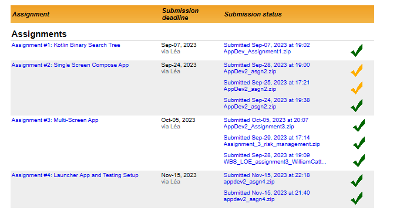
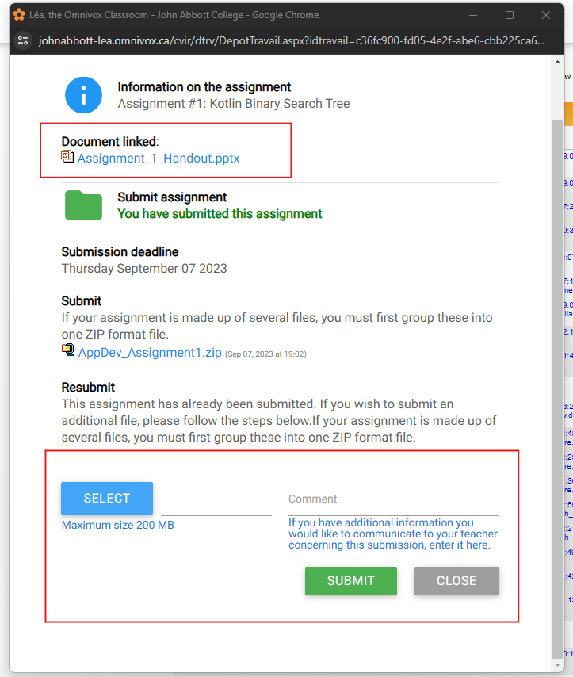
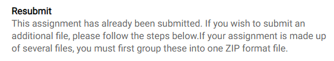
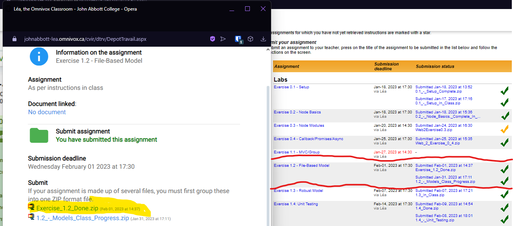

# Using Lea

# Accessing Léa Assignments on PC

> This guide is written by the John Abbott’s Computer Science Students

Click the _Léa_ Button on the Omnivox Homepage (located on the left hand side under the college logo)

On the left hand side of the screen there will be a box labeled _My classes_.

In this box ensure Fall 2024 is selected in the drop down menu. Change this selection as applicable to your semester (fall/winter)

Once this is selected, you will see all your courses for your semester. From the desired course select the “Assignments” tab

A list of available assignments will be shown to you. Please note the submission deadline. Lea will confirm the submission of your assignment with a datetime and file name. The checkbox on the right indicates if the assignment was submitted on time in green, and in yellow if submitted late

Click on the desired assignment and a popup window will show you the details of the assignment. At the top in the red box you will see any instructions for the assignment you can download to view, and boxed in red at the bottom will be a submission box.

- Press the blue “select” button to choose a file

- Click the green “Submit” button to submit the assignment.

An accepted submission will popup in the center of the window with a datetime.

If you’ve noticed you may have made a mistake, or if your professor asks you for a resubmission, or you have some other reason to update your work, that’s okay! Provided you’ve let your professor know, the process of updating is the same as outlined above, with a slightly different description:

Once you resubmit, here’s what the assignments should look like. Highlighted, in yellow, is your most recent submission to an assignment, followed by the one previous, and so on. On the right, I circled the corresponding assignment to show the checks will appear for every submission you add based on if they were on time for the assignment’s deadline or not.

