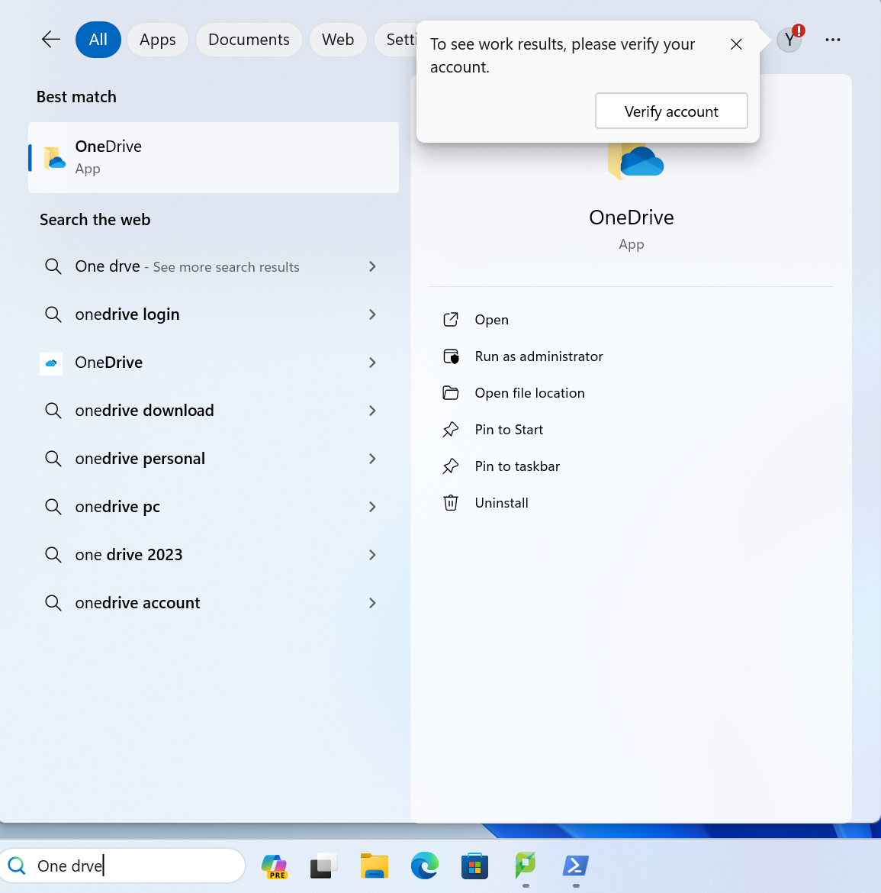
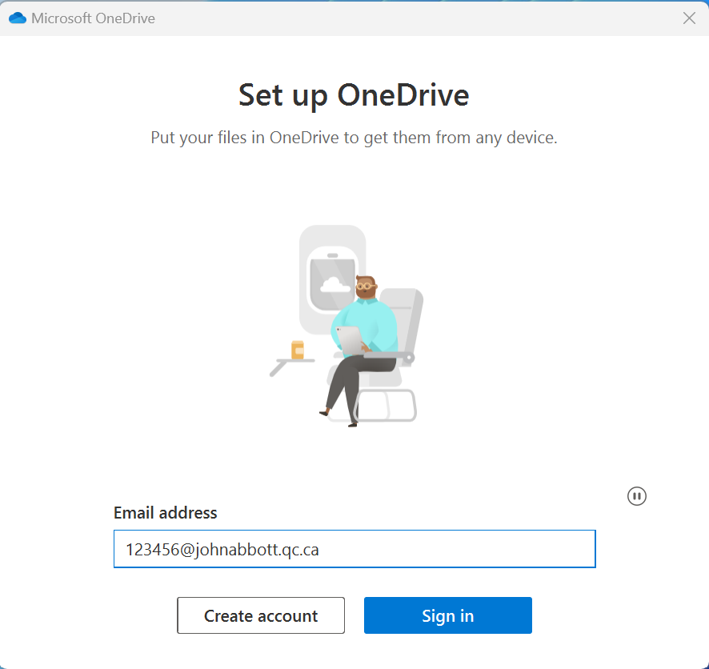
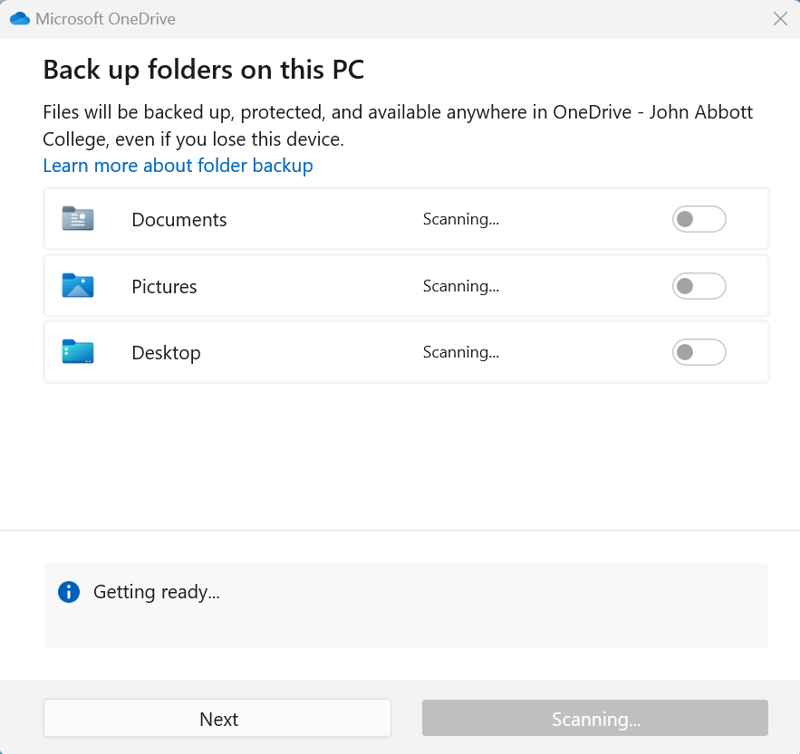
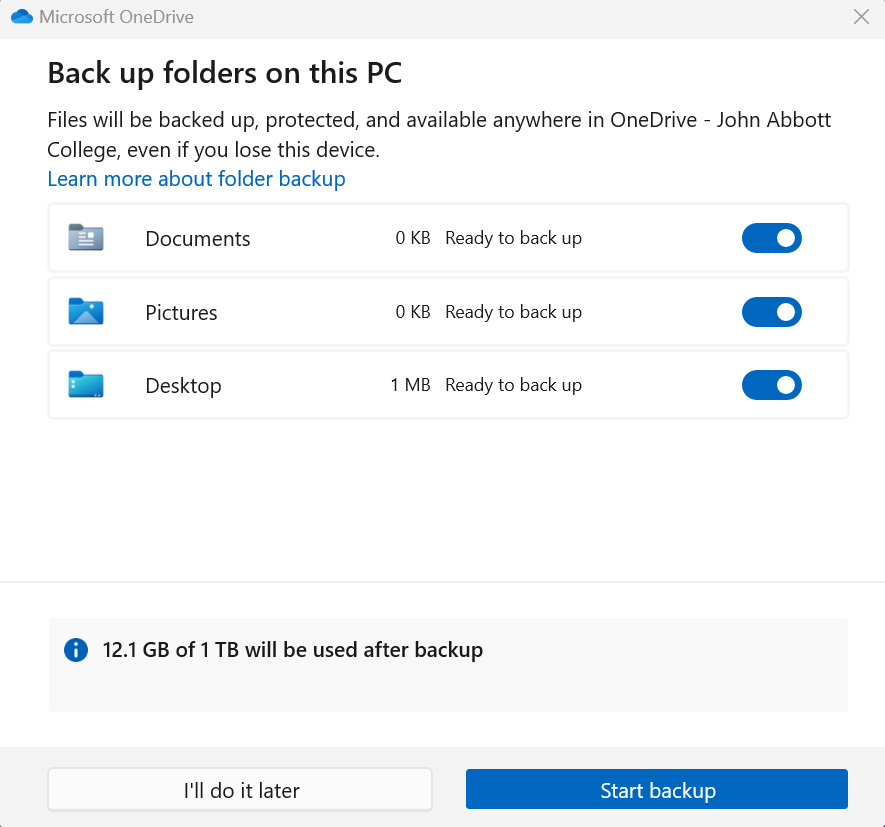
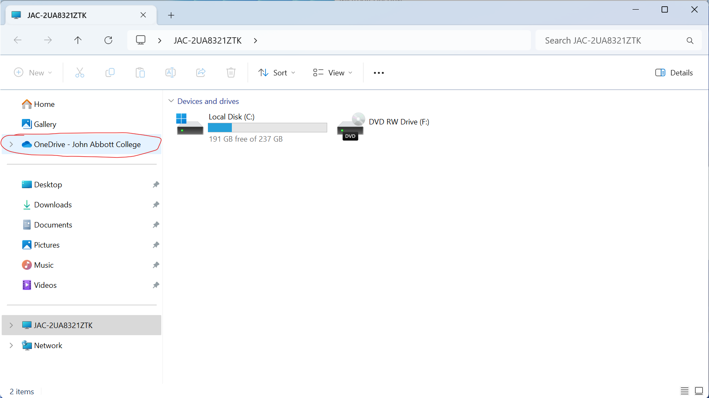
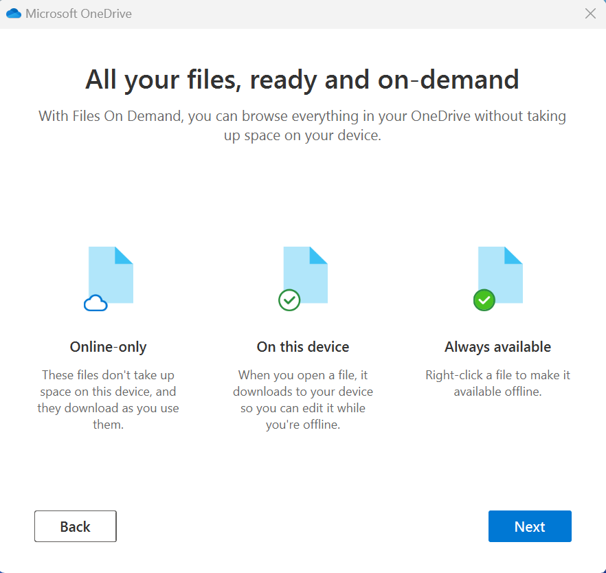
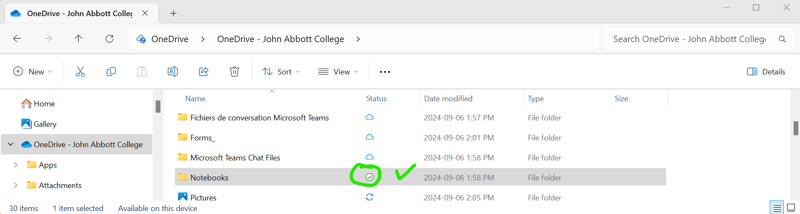

# One Drive

This tutorial will walk you through the steps of setting up One Drive and using it to run your PyCharm projects. Configuring one drive saves your files into the Cloud and therefore allows you to alternate through multiple computers in school and at home without losing your files. 

## Windows

One Drive is installed by default on all Windows computers. 

1. Use the search bar to search for the ***One Drive*** App:

   

2. Login to the app using your John Abott credentials :

   - Email: <student_id>.johnabbottcollege.net
   - Password: Same as the one you use in the labs

   

3. Complete the steps of verification using your phone or personal email.

4. Click **Next** , your One Drive folder will be saved in: *C: > Users > student _id > OneDrive - John Abbott College*

5. Wait until the scanning of the files is complete.

   

6. Click **Start backup**

   

This might take a few minutes to complete....

7. Once the backup is complete, navigate to the **File Explorer**

8. You should see the *OneDrive - John Abbott College* folder appear as a file directory:

   

9. All synchronized files have three types of icon: **Online-only, On this device and Always available** 

10. As you navigate inside the OneDrive John Abbott College, you should see these icons appear in the File Explorer:

    

11. We highly suggest you keep this One Drive organized as you will be using it throughout your college studies. 
12. Create a folder named ***SN1***. Moving forward this is where you should put your labs and assignments.

