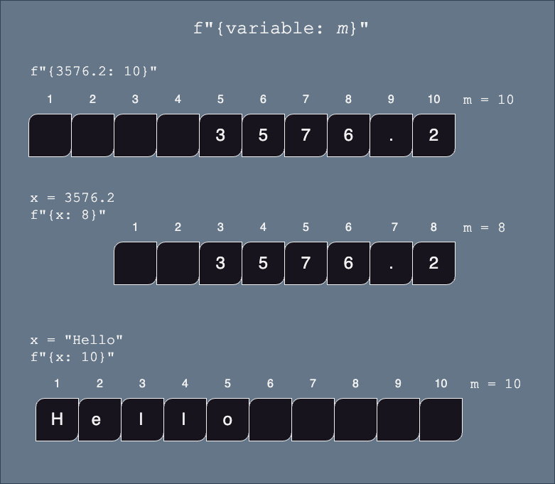

# _f-string_ Review

We have introduced f-strings earlier when learning about string concatenation. F-strings are a useful way to combine write a string while inserting numbers and formatting them in a specific way.

## Variables and Other Code (review)

> **BASIC SYNTAX**: `f" anything {`_`variable`_`} anything"`
>
> - _`variable`_ is any python variable that is currently defined. It can be of any type (`int`, `float`, `bool`, `str`, _etc_)
> - You do _not_ have to convert the `variable` to a string, that is done automatically
> - Notice that there is _no_ space between the `f` and the first quote

or

> **BASIC SYNTAX**: `f" anything {`_`python code`_`} anything"`
>
> - _`python code`_ that when evaluated, returns a value.
> - Notice that there is _no_ space between the `f` and the first quote

Example

```python
x = 3
z = f"the value of x is {x + 2}"   # OK!, prints 5
z = f"Is x equal to 5? {x == 5}"	 # OK!, prints False
z = f"Setting x to 2 {x = 2}"      # NOT OK!, x=2 does not return a value
```

# Formatting Variables using _f-strings_

This section is about how to format numbers within an f-string.

Within the `{...}` part of the _f-string_, we can specify how we want our numbers or strings to be formatted (example: left or right aligned, number of characters printed, precision (how many digits) etc.)

> **BASIC SYNTAX**: `{`_`variable: format string`_`}`
>
> - notice that the variable name is followed by a colon `:` and then a format string which is used to define how to format your output.

## Length:

> **BASIC SYNTAX**: `{`_`expression: m`_`}`
>
> - _`expression`_ (variable or python expression) must have type `int` or `float` or `str`
> - _`m`_ is the minimum numbers of characters of the resulting string. It will be padded with spaces if necessary.
>   - `int` and `float` will be padded so that the number is right aligned
>   - `str` will be padded so that the string will be left aligned



## Floating Point Numbers:

To control the decimal places of a float, use the `:`_`m.n`_`f` format.

> **BASIC SYNTAX**: `{`_`expression: m.n`_`f}`
>
> - _`expression`_ (variable or python expression) must have type `int` or `float`
>
> - _`m`_ is the minimum numbers of characters of the resulting string. It will be padded with spaces if necessary.
>
>   - if `m` is not specified, then the length of the string will be dependent on the size of the number (i.e. no extra padding)
>
> - _`.n`_ is the required precision (number of digits after the decimal point).
>   - if not specified, then zeros will be used to pad the number to accommodate the width of the string


**Examples**

```python
x = 375.2
print( f"{x: .3f}" )     # 'm' is not specified, so only worry about number of digits after decimal point
print( f"{x: 6.3f}" )    # the printed number will be greater than 6 digits, so the '6' is ignored
print( f"{x: 10.3f}" )   # use at least 10 characters for this string, right aligned
print( f"{x: 10})				 # use default number of digits after the decimal point
```

Output:

```text
375.200
375.200
  375.200
    375.2
```

For example, here are a few lines that print the value of pi at different precisions:

<div class="button-container">     
    <a href="https://app.codeboot.org/5.0.0/?init=.fZl9zdHJpbmdzX2Zvcm1hdHRpbmcucHk=~XQAAgABBAQAAAAAAAAA4GkAC0ByzvCjtabl8Z6dvA39VetDTfwSgb7RGNRvQnDv3RW9NJFtUw8hFT52Q4dTZ47nqg-wXzPqbl1yK8U-SQNZzB2CTSFCH-3BSN7TggUuFbJFJpXp4U40J4sS0DncJAYSSXII4-9lXvhAZVnboYMFshgfQkVeCeL6D5FCo5s9lpBsjev_IWSAA.oZl9zdHJpbmdzX2xhcmdlX251bS5weQ==~XQAAgAD4AAAAAAAAAAA4G8poN568H4TKvrkNmV-Zm9bgyjtE5TseTHxDjNcidMZjB2a16QkeVInLHWVlYtZSrva4Y7oncz83r4XXa7GkR2Ex83rR25bPRwtURV0QxVb4J8FT1Yp5TrPUYdvU_P1NNV-xzTGJiovCEof6aWBplrQ3Z83V__86ToAA.oZl9zdHJpbmdzX3RyYW5zYWN0aW9ucy5weQ==~XQAAgABHAQAAAAAAAAA6HIhGlRN8UpG9oPgHogcbklM99BMeogJqT_a_kODmbJVfvOB0Kl4_3Rpejc8skSfaIrzwPVdGBpjWUFofUEQg4CoLRsAivJS6trQfX4tDxWMC8fk51XsEkdbu3B7KWlffNiT__97lsAA=.~lang=py-novice.~hidden=true.e" target="_blank">         
    <button class="codeboot-button">
      <span>Run example</span>
    </button>     
    </a> 
</div>

```python
pi = 3.141592653589793

print("The value of pi without formatting: {pi}")
print(f"The value of pi with two decimal places: {pi:.2f}")
print(f"The value of pi with three decimal places: {pi:.3f}")
print(f"The value of pi with four decimal places: {pi:.4f}")
```

**Output:**

```text
The value of pi without formatting: 3.141592653589793
The value of pi with two decimal places: 3.14
The value of pi with three decimal places: 3.142
The value of pi with four decimal places: 3.1416
```

## Scientific Notation:

> **BASIC SYNTAX**: `{`_`expression: m.n`_`e}`
>
> - _`expression`_ (variable or python expression) must have type `int` or `float`
> - _`m`_ is the minimum numbers of characters of the resulting string. It will be padded with spaces if necessary. Note that one space is _always_ reserved for the `+` symbol, even if it is not displayed.
> - if `m` is not defined, then the length of the string will be dependent on the size of the number (i.e. no extra padding)
> - _`n`_ is the required precision (number of digits after the decimal point).
>   - if not specified, then zeros will be used to pad the number to accommodate the width of the string (+2) _WEIRD!_


## Generic Precision:

Values that represent a given measurement in your program might need to be rounded to keep the [**significant figures/digits**](https://www.youtube.com/watch?v=eCJ76hz7jPM&t=228s&ab_channel=KhanAcademy), regardless of the output format (scientific notation, or not).

> **BASIC SYNTAX**: `{`_`expression: m.n`_`}`
>
> - _`expression`_ (variable or python expression) must have type `float` or `str`
> - _`m`_ is the minimum numbers of characters of the resulting string. It will be padded with spaces if necessary.
> - if `m` is not defined, then the length of the string will be dependent on the size of the number (i.e. no extra padding)
> - _`n`_ is the number of significant digits (**_not_** the number of digits after the decimal point)
> - _`.n`_ is the required precision (number of digits after the decimal point).
>
> _WEIRD_: if `expression` is a string, then there can be no space between the `:` and the _`m.n`_

Python will determine which is the most appropriate representation


**Examples**

For example, let's take the length of an object measured with a ruler graduated to 1 mm:

```python
length  = 153.256 # in mm
```

Only 4 digits are said to significant.

- To control the just number of significant digits, you may use `:.` without an "f" (as opposed to floating precision).

```python
print(f"The length of the object is {length:.4}")
```

✍️ **Challenge 1:** You are working on a program used in an ultrasound machine. This device estimates the birth weight of babies and displays it to the screen. The system has a precision of +/- 1mm. Use `f-string` to print the weight with 5 significant figures:

<div class="button-container">     
    <a href="https://app.codeboot.org/5.0.0/?init=.oZl9zdHJpbmdzX2Zvcm1hdHRpbmcucHk=~XQAAgABBAQAAAAAAAAA4GkAC0ByzvCjtabl8Z6dvA39VetDTfwSgb7RGNRvQnDv3RW9NJFtUw8hFT52Q4dTZ47nqg-wXzPqbl1yK8U-SQNZzB2CTSFCH-3BSN7TggUuFbJFJpXp4U40J4sS0DncJAYSSXII4-9lXvhAZVnboYMFshgfQkVeCeL6D5FCo5s9lpBsjev_IWSAA.oZl9zdHJpbmdzX2xhcmdlX251bS5weQ==~XQAAgAD4AAAAAAAAAAA4G8poN568H4TKvrkNmV-Zm9bgyjtE5TseTHxDjNcidMZjB2a16QkeVInLHWVlYtZSrva4Y7oncz83r4XXa7GkR2Ex83rR25bPRwtURV0QxVb4J8FT1Yp5TrPUYdvU_P1NNV-xzTGJiovCEof6aWBplrQ3Z83V__86ToAA.oZl9zdHJpbmdzX3RyYW5zYWN0aW9ucy5weQ==~XQAAgABHAQAAAAAAAAA6HIhGlRN8UpG9oPgHogcbklM99BMeogJqT_a_kODmbJVfvOB0Kl4_3Rpejc8skSfaIrzwPVdGBpjWUFofUEQg4CoLRsAivJS6trQfX4tDxWMC8fk51XsEkdbu3B7KWlffNiT__97lsAA=.fZl9zdHJpbmdzX3NpZ19maWcucHk=~XQAAgABMAAAAAAAAAAA7mUlx6qafz1LF6_bRQOU8o0bYIR4z21NYhzOcxwXn8q705FIqT6IAX3ZI2ypApfH_DqkMgP9JbsxVNWZSefGrcr-__9qSgAA=.oZl9zdHJpbmdzX3NpZ19maWdzMi5weQ==~XQAAgAAAAAAAAAAAAACD__v__8AAAAA=.~lang=py-novice.~hidden=true.e" target="_blank">         
    <button class="codeboot-button">
      <span>Run example</span>
    </button>     
    </a> 
</div>

```python
weight_birth = 2945.48 #in g
```

## Thousands Separator:

> **BASIC SYNTAX**: `{`_`float_or_integer_variable: [,_]`_`}`
>
> - _`[,_]`_ means _either_ a `,`or`\_`

<div class="button-container">     
    <a href="https://app.codeboot.org/5.0.0/?init=.oZl9zdHJpbmdzX2Zvcm1hdHRpbmcucHk=~XQAAgABBAQAAAAAAAAA4GkAC0ByzvCjtabl8Z6dvA39VetDTfwSgb7RGNRvQnDv3RW9NJFtUw8hFT52Q4dTZ47nqg-wXzPqbl1yK8U-SQNZzB2CTSFCH-3BSN7TggUuFbJFJpXp4U40J4sS0DncJAYSSXII4-9lXvhAZVnboYMFshgfQkVeCeL6D5FCo5s9lpBsjev_IWSAA.fZl9zdHJpbmdzX2xhcmdlX251bS5weQ==~XQAAgAD4AAAAAAAAAAA4G8poN568H4TKvrkNmV-Zm9bgyjtE5TseTHxDjNcidMZjB2a16QkeVInLHWVlYtZSrva4Y7oncz83r4XXa7GkR2Ex83rR25bPRwtURV0QxVb4J8FT1Yp5TrPUYdvU_P1NNV-xzTGJiovCEof6aWBplrQ3Z83V__86ToAA.oZl9zdHJpbmdzX3RyYW5zYWN0aW9ucy5weQ==~XQAAgABHAQAAAAAAAAA6HIhGlRN8UpG9oPgHogcbklM99BMeogJqT_a_kODmbJVfvOB0Kl4_3Rpejc8skSfaIrzwPVdGBpjWUFofUEQg4CoLRsAivJS6trQfX4tDxWMC8fk51XsEkdbu3B7KWlffNiT__97lsAA=.~lang=py-novice.~hidden=true.e" target="_blank">         
    <button class="codeboot-button">
      <span>Run example</span>
    </button>     
    </a> 
</div>

```python
population_usa = 333_300_000   # note: you are allowed to use _

print(f'The population of the usa without formatting {population_usa}')

print(f'The population of the usa in scientific notation {population_usa:_}')

print(f'The population of the usa with commas {population_usa:,}')
```

**Output:**

```text
The population of the usa without formatting 333300000
The population of the usa in scientific notation 333_300_000
The population of the usa with commas 333,300,000
```

## Alignment:

When the minimum width of the string is specified (using the _m_ argument), the resulting string will be padded with spaces.

We can control whether the spaces are padded to the right or left or evenly on both sides of the value.

To control the decimal places of a float, use the `:`_`m.n`_`f` format.

> **BASIC SYNTAX**: `{`\*`expression: [><^]m ...}`
>
> - \*`[<>^]` means either `>`, or `<`, or `^`
>   - `>` aligns the value to the right (default for `float`s and `int`s)
>   - `<` aligns the value to the left (defulat for `str`s)
> - _`expression`_ (variable or python expression) must have type `int` or `float` or `str`
> - _`m`_ is the minimum numbers of characters of the resulting string. It will be padded with spaces if necessary.
> - `...` refers to any other specific formatting instructions, such as _`.n`_`f` for floating point, etc.


**Example**

```python
x=35.2
print( f"not formatted: {x}")

print( f"minimum size of 10 right aligned:              '{x:10}' ")
print( f"minimum size of 10, 2 decimal - right aligned: '{x:>10.2f}' ")

print( f"minimum size of 10 left aligned:               '{x:<10}' ")
print( f"minimum size of 10, 2 decimal - left aligned:  '{x:<10.2f}' ")

print( f"minimum size of 10 centered:                   '{x:^10}' ")
print( f"minimum size of 10, 2 decimal - centered:      '{x:^10.2f}' ")
```

result:

```text
not formatted: 35.2
minimum size of 10 right aligned:              '      35.2'
minimum size of 10, 2 decimal - right aligned: '     35.20'
minimum size of 10 left aligned:               '35.2      '
minimum size of 10, 2 decimal - left aligned:  '35.20     '
minimum size of 10 centered:                   '   35.2   '
minimum size of 10, 2 decimal - centered:      '  35.20   '
```

✍️ **Challenge 2:** Print the receipt of the following transaction: price of item1, item2, item3, the subtotal, the tax amount and the total.

We wish to have all the numbers of the receipt aligned to the right.

```python
item1 = 15.00
item2 = 23.50
item3 = 26.50
tax_rate = 0.15

sub_total = item1 + item2 + item3
tax_amount = 0.15 * sub_total
total = sub_total + tax_amount

... complete this

```

<div class="button-container">     
    <a href="https://app.codeboot.org/5.0.0/?init=.oZl9zdHJpbmdzX2Zvcm1hdHRpbmcucHk=~XQAAgABBAQAAAAAAAAA4GkAC0ByzvCjtabl8Z6dvA39VetDTfwSgb7RGNRvQnDv3RW9NJFtUw8hFT52Q4dTZ47nqg-wXzPqbl1yK8U-SQNZzB2CTSFCH-3BSN7TggUuFbJFJpXp4U40J4sS0DncJAYSSXII4-9lXvhAZVnboYMFshgfQkVeCeL6D5FCo5s9lpBsjev_IWSAA.oZl9zdHJpbmdzX2xhcmdlX251bS5weQ==~XQAAgAD4AAAAAAAAAAA4G8poN568H4TKvrkNmV-Zm9bgyjtE5TseTHxDjNcidMZjB2a16QkeVInLHWVlYtZSrva4Y7oncz83r4XXa7GkR2Ex83rR25bPRwtURV0QxVb4J8FT1Yp5TrPUYdvU_P1NNV-xzTGJiovCEof6aWBplrQ3Z83V__86ToAA.oZl9zdHJpbmdzX3RyYW5zYWN0aW9ucy5weQ==~XQAAgABHAQAAAAAAAAA6HIhGlRN8UpG9oPgHogcbklM99BMeogJqT_a_kODmbJVfvOB0Kl4_3Rpejc8skSfaIrzwPVdGBpjWUFofUEQg4CoLRsAivJS6trQfX4tDxWMC8fk51XsEkdbu3B7KWlffNiT__97lsAA=.fZl9zdHJpbmdfcmlnaHRfYWxpZ24ucHk=~XQAAgADwAQAAAAAAAAA0nQjOemBaOhYRjhJhRsiWrtvXRvTv-FcbIYKitGRb8-ntCvrbds63-1WahViQTPpoh9MFnQNssuMNs_iKD_VOVLwHcQizWdvJW2PLeRZAfKWpeZd7NuOKgh7NJbtfJE-IyMg_6-yu-MUKykINIlGVR6eHs1JBK7ymi1r_J8EMK2Ao-u7pSm4k4oI_fJapeJVOwbmrrmSH4XmTLW_-KbjgUM1pwai5MY8m__K1p1o=.~lang=py-novice.~hidden=true.e" target="_blank">         
    <button class="codeboot-button">
      <span>Solution</span>
    </button>     
    </a> 
</div>

✍️ **Challenge 3:** The following transactions appear in your bank statement:

Using a combination of formatting seen above, display the number in the format described below.

Note: You must also use the `:+` to display the signs of each number.

```python
transaction1 = 120.00
transaction2 = -180.00
transaction3 = 20
transaction4 = -50.00
transaction5 = -88.90
transaction6 = -12.50
```

**Expected output:**

```python
   +120.00
   -180.00
    +20.00
    -50.00
    -88.90
    -12.50
```

<div class="button-container">     
    <a href="https://app.codeboot.org/5.0.0/?init=.oZl9zdHJpbmdzX2Zvcm1hdHRpbmcucHk=~XQAAgABBAQAAAAAAAAA4GkAC0ByzvCjtabl8Z6dvA39VetDTfwSgb7RGNRvQnDv3RW9NJFtUw8hFT52Q4dTZ47nqg-wXzPqbl1yK8U-SQNZzB2CTSFCH-3BSN7TggUuFbJFJpXp4U40J4sS0DncJAYSSXII4-9lXvhAZVnboYMFshgfQkVeCeL6D5FCo5s9lpBsjev_IWSAA.oZl9zdHJpbmdzX2xhcmdlX251bS5weQ==~XQAAgAD4AAAAAAAAAAA4G8poN568H4TKvrkNmV-Zm9bgyjtE5TseTHxDjNcidMZjB2a16QkeVInLHWVlYtZSrva4Y7oncz83r4XXa7GkR2Ex83rR25bPRwtURV0QxVb4J8FT1Yp5TrPUYdvU_P1NNV-xzTGJiovCEof6aWBplrQ3Z83V__86ToAA.fZl9zdHJpbmdzX3RyYW5zYWN0aW9ucy5weQ==~XQAAgABGAQAAAAAAAAA6HIhGlRN8UpG9oPgHogcbklM99BMeogJqT_a_kODmbJVfvOB0Kl4_3Rpejc8skSfaIrzwPVdGBpjaJoPYITqRVOlrTDpTJ7rYPH44tVUzeUt4zhxEHdOAQeFfG8_WLKgEP__3O-5A.~lang=py-novice.~hidden=true.e" target="_blank">         
    <button class="codeboot-button">
      <span>Solution</span>
    </button>     
    </a> 
</div>

## Percentage

- Percent values can be automatically formatted using `:%`

  ```text
  >>> percentage = 0.58
  >>> f"{percentage:%}"
  58.000000%
  ```

- To reduce the number of decimals displayed:

  ```text
  >>> f"{percentage:.0%}"
  58%
  ```

✍️ **Challenge 1: **Write a short program which displays the grade of a student in percentage. The value should read "72.0%"

```python
grade = 18
total = 25

print(f"{grade/total :%}")
```

### Summary

| Formatting                | f string symbol example                                                                                               |
| ------------------------- | --------------------------------------------------------------------------------------------------------------------- |
| Floating Precision        | `{x:f}`, `{x:10.2f}`, `{x:.2f}`, `{x:10f}`                                                                            |
| Scientific notation       | `{x:e`}, `{x:10.2e}`, `{x:.2e}`, `{`_`var`_`:10e}`                                                                    |
| Comma separated thousands | `{x:,}`, `{x:_}`                                                                                                      |
| Significant figures       | `{x:10.5}`, `{x:.5}`                                                                                                  |
| Minimum length            | `{x:10}`                                                                                                              |
| Alignment                 | `{x:<10}`, `{x:>10}`, `{x:^10}`, `{x:<10.2}`, `{x:<10.2}`, `{x:^10.2}`, `{x:<10.2f}`, `{x:<10.2f}`, `{x:^10.2f}`, etc |
| Sign of number            | `{x:+}`                                                                                                               |
| Percent                   | `{x:10.2%}`, `{x:.2%}`                                                                                                |

# Additional resources

1. [Video on f-strings](https://www.youtube.com/watch?v=EoNOWVYKyo0&ab_channel=Indently)
2. [Complete Guide with examples](https://cissandbox.bentley.edu/sandbox/wp-content/uploads/2022-02-10-Documentation-on-f-strings-Updated.pdf)
3. [Official documentation](https://docs.python.org/3/tutorial/inputoutput.html)
