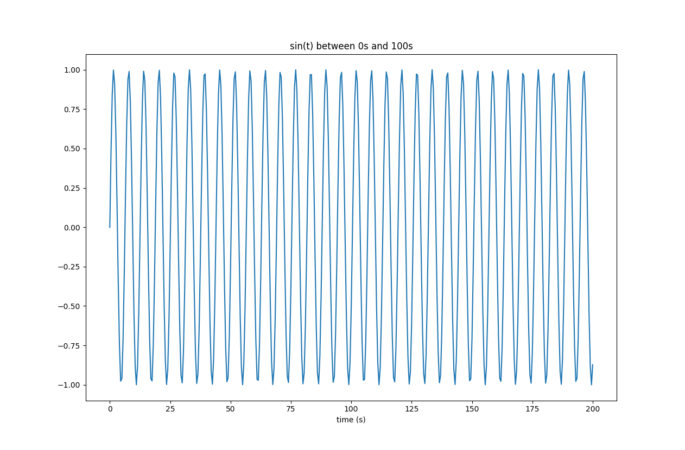
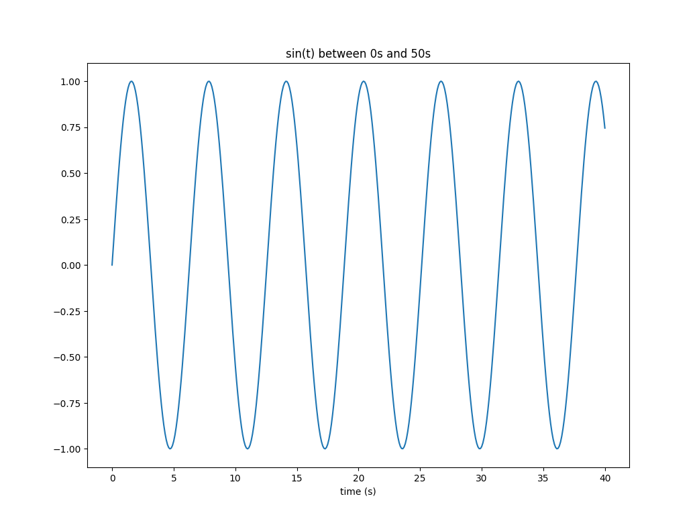

# Lists


#### Level 1 - Creating and Accessing

1. Creating

   Define a list of 10 integers from 1 to 10 and display the size of the list.

2. Creating

   Define a list of 5 first names and print the list. 

3. Creating

   **Part 1**

   - Ask the user how many grades they want to enter.

   - Ask user for the grades, one at a time

   - Save all the grades in a single list

   **Part 2**

   - Create a list with the following values (1, 3, 5)

4. Looping

   **Part 1**

   - Start with a list `a=["hello ", 3, "world, ", 6, "I ", 21,"am ",18,"fine", -2]`

   - For each element in the list, print it.

   **Part 2**

   - Start with a list `a=[5, 19.3, -8.7, 100.234, 6]`

   - For each number in the above list, print it on a line.  Make sure that all the numbers line up appropriately by using the correct f-string formatting.

   

5. Random Access

   - Start with a list `a=["hello ", 3, "world, ", 6, "I ", 21,"am ",18,"fine", -2]`

   **Part 1**

   - Using the above list and *without* a  `for-loop`, write every 1st, 3rd, 5th, 7th and 9th element on the same line.

   **Part 2**

   - Using the above list and a `for-loop` print every second element on a separate line

   *hint: use `range(start,end,step)` where `start`, `end`, `step` are properly set*


6. Manipulating every element

   - Start with a list `a = [1, 7, 2, -3, 5, 9]`

   - Loop over this list, and calculate the sum of all the squares of each element in the list.  Print the sum

$$
\text{total} = \sum_{i=0}^5 a_i^2
$$


#### Level 2 - Applying list functions

1. You have a list of names 'sandy', 'bob', 'bette', 'sally', 'rachel'.

   - Print the name in sorted order, one per line.  Do NOT modify the list!

2. Consider the following list which represent the temperatures every day of the week from Sunday to Saturday 

   ```python
   temperatures = [12.5, 15.5, 10.2, 15.0, 17, 14.6, 15.0]
   ```

   - calculate and display the minimum
   - calculate and display the maximum
   - calculate and display the average 
   - print the sorted list.


3. Consider the following list which represent the temperatures every day of the week from Sunday to Saturday:

   ```python
   temperatures = [12.5, 15.5, 10.2, 15.0, 17, 14.6, 15.0]
   ```

   - Display the temperature on Monday

   - Display the temperature on Saturday

   - Display the average temperature during the week days (Monday to Friday )
     - Add the temperatures of the following 7 days to the same list:
       - 12.3°C
       - 11.4°C
       - 13.2°C
       - 10.5°C
       - 12.4°C
       - 11.0°C
       - 9.4°C


   - Calculate the average on week days over two weeks.

4. Consider the following students grades:

   ```python
   grades = [78,86,97,78,98,68,65,67,86,75,89,69,71,82,93,94]
   ```

   Student 0, 4, 12,14 have dropped the course.

   - Calculate the group average excluding the students who dropped the course

   - Create a function which calculates the same average for any list of `grades` and any list of grades to exclude from the average`ignore_indexes`

     

#### Level 3 

1. Paired Lists: You have two lists, one with voltage readings, and one with current readings taken during a physics lab.

   ```python
   measured_voltage = [15.101699904780466, 87.52514747233391, 205.2337707312554, 289.1094432508661, 414.7758261003678,
                       521.0061492043556, 625.1419596586946, 709.8114743758281, 787.1784934174754, 905.4308513168793]
   measured_current = [3.944899134858856, 1.5777028976680696, 2.7491943548717384, 3.670317402603832, 5.83579244326929,
                       3.015612264536842, 7.93966836058325, 3.033586150442605, 8.267700560322258, 6.856525379569174]
   ```

   Create a function that returns the calculated resistance, by:

   * Loop over both lists, and calculate the resistance (R = V/I) for each reading.
   * Average the resistance results to get a reasonable value for R

   Calculate the measured resistance for this data

2.List comprehension:

Consider the following function: 
$$
f(t) = sin(t)
$$
**Part 1**

- Create a list called `time_values` made of values of x from [0,200] with increments of 0.5 seconds **using a list comprehension.**
- Create a list called `sin_values` with `sin(t)` for each value of t **using a list comprehension.**

**Part 2** (Plotting)

- Plot the `sin_values` versus the `time_values`. 

- Can you explain why plotted line is not smooth (has choppy lines instead of a smooth curve). What should you change to improve this?

  


## Answers

#### Level 1 - Creating and Accessing

1. 

```python
numbers = [1, 2, 3, 4, 5, 6, 7, 8, 9, 10]
print(len(numbers))
```

2. 

```python
a=['sandy', 'bob', 'bette', 'sally', 'rachel']
```

3. 

```python
a=["hello ", 3, "world, ", 6, "I ", 21,"am ",18,"fine", -2]

for element in a:
  print(element)

a=[5, 19.3, -8.7, 100.234, 6]
for element in a:
  print(f"{element:10.3f}")
```


4. 

```python
a=["hello ", 3, "world, ", 6, "I ", 21,"am ",18,"fine", -2]

# part 1
print (a[0], a[2], a[4], a[6], a[8])

# Part 2
for index in range(1,len(a),2):
  print(a[index])
```


5. 

```python 
a = [1, 7, 2, -3, 5, 9]
total = 0
for element in a:
  total = total + element**2
print(total)
```


6. 

```python
# part 1

grades = []
n: int = int( input("How many grades do you want to enter? "))
for i in range(n):
  grade: float = float( input(f"Enter grade for student {i+1}: "))
  grades.append(grade)
  
# part 2
a = [1, 3, 5]
```


#### Level 2 - Applying list functions

1.

```python
a=['sandy', 'bob', 'bette', 'sally', 'rachel']
for name in sorted(a):
  print(name)
```


2. 

```python
temperatures = [12.5, 15.5, 10.2, 15.0, 17, 14.6, 15.0]
print(f"The min temperature this week was: {min(temperatures)}")
print(f"The max temperature this week was: {max(temperatures)}")
print(f"The average temperature this week was: {(sum(temperatures)/ 7):.1f}")
temperatures.sort()
print(temperatures)
```

3. 

```python
"""
Index to day:
0 : Sunday
1 : Monday
2 : Tuesday
3 : Wednesday
4 : Thursday
5 : Friday
6 : Saturday
"""

temperatures = [12.5, 15.5, 10.2, 15.0, 17, 14.6, 15.0]

print(f"The temperature Monday was {temperatures[1]}°C")
print(f"The temperature Saturday was {temperatures[-1]}°C")

temperatures_week_days = temperatures[1:6]  #Last index not included.
average_week_days = sum(temperatures_week_days) / len(temperatures_week_days)
print(f"The average temperature on week days was {average_week_days:.2f}°C")

# adding temperatures:

temperatures.append(12.3)  #index 7
temperatures.append(11.4)  #index 8
temperatures.append(13.2)  #index 9
temperatures.append(10.5)  #index 10
temperatures.append(12.4)  #index 11
temperatures.append(11.0)  #index 12
temperatures.append(9.4)   #index 13

print(temperatures)

temperatures_week_days =  temperatures[1:6] + temperatures[8:13]
average_week_days = sum(temperatures_week_days) / len(temperatures_week_days)
print(f"The average temperature on week days for the past two weeks was {average_week_days:.2f}°C")
```


4. 

   ```python
   # Using indices
   def average(grades:list[float], ignore_indexes: list[int]):
       total = 0
       count = 0
       for i in range(len(grades)):
           if i not in ignore_indexes:
               total += grades[i]
               count += 1
           else:
               # just to validate 
               print(f"Grade {i}: Value: {grades[i]} was ignored")
       return total/count
       
   ```

   

   ```python
   # Using enumerate and another list
   def average(grades:list[float], ignore_indexes: list[int]):
       filtered_grades = []
       for index, grade in enumerate(grades):
           if index not in ignore_indexes:
               filtered_grades.append(grade)
           else:
               # just to validate 
               print(f"Grade {i} Value: {grade}  was ignored")
       return sum(filtered_grades)/len(filtered_grades)
   ```


​	


#### Level 3 - Paired Lists

1. (Note: Resistance is approx 100)

```python
# Using indices

measured_voltage = [15.101699904780466, 87.52514747233391, 205.2337707312554, 289.1094432508661, 414.7758261003678,
                    521.0061492043556, 625.1419596586946, 709.8114743758281, 787.1784934174754, 905.4308513168793]
measured_current = [3.944899134858856, 1.5777028976680696, 2.7491943548717384, 3.670317402603832, 5.83579244326929,
                    3.015612264536842, 7.93966836058325, 3.033586150442605, 8.267700560322258, 6.856525379569174]

num_measurements = min( len(measured_voltage), len(measured_current) )

def calculate_resistance(voltages,currents):
    resistances = []
    for i in range(num_measurements):
        resistances.append(voltages[i]/currents[i])
        
    resistance = sum(resistances)/num_measurements
    return resistance

def main():
    r = calculate_resistance(measured_voltage, measured_current)
    print(f"The average measured resistance is: {r}")
main()
    
```

```python
# Using zip

measured_voltage = [15.101699904780466, 87.52514747233391, 205.2337707312554, 289.1094432508661, 414.7758261003678,
                    521.0061492043556, 625.1419596586946, 709.8114743758281, 787.1784934174754, 905.4308513168793]
measured_current = [3.944899134858856, 1.5777028976680696, 2.7491943548717384, 3.670317402603832, 5.83579244326929,
                    3.015612264536842, 7.93966836058325, 3.033586150442605, 8.267700560322258, 6.856525379569174]

num_measurements = min( len(measured_voltage), len(measured_current) )

def calculate_resistance(voltages,currents):
    resistances = []
    for voltage, current in zip(voltages,currents):
        resistances.append(voltage/current)
        
     resistance = sum(resistances)/num_measurements
     return resistance

def main():
    r = calculate_resistance(measured_voltage, measured_current)
    print(f"The average measured resistance is: {r}")
main()
    
```

2. 

**Part 1**

```python
import math


# Creating the x values
time_values = [i/2 for i in range(0, 401)]

# Creating the y values
sin_values = [math.sinx(t) for t in time_values]

```

**Part 2**

```python
from matplotlib import pyplot as plt

# Displaying
plt.plot(time_values, sin_values)

# Adding graph title and axis title
plt.xlabel('time (s)')
plt.ylabel('y')
plt.title('sin(x)')

# displaying the graph
plt.show()
```

**Result:**



- The plot is not smooth because we are plotting with increments of $$\Delta x$$ = 0.5, we should probably reduce the resolution to smaller increments to get a nicer looking plot, for example $$\Delta x = 0.1$$



> **Sampling of a math function:**
>
> Graphing a function relates to a concept called "Sampling"  which is to take a continuous function such as sin() (has infinite values) and reducing it to a discrete function (fixed number of values, in this case a list of 100 points). The sampling frequency is the number of samples taken per unit of x. In the first graph, we took 2 samples per second. Whereas in the second graph, we increased our sampling to 5 samples per second.

