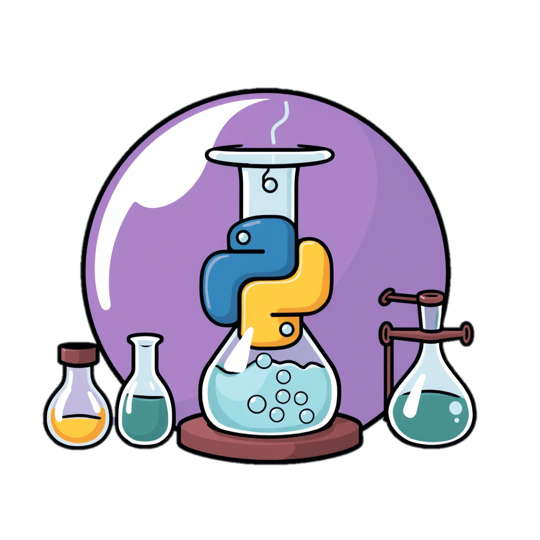

# Programming in Science - Fall 2024

*Welcome to 420-SN1 Programming in Science*

In this course, you will learn everything about the basics of programming to solve scientific problems, read data from files, clean up the data, apply mathematical formulas, and more. 

This image was AI generated. 

This website provides you with additional notes and practice exercises that can help you better understand and master the concepts seen in class. 

- Notes
- Labs 
- Practice Exercises

# Course Outline

You can download a copy of the course outline [here](https://john-abbott-college.github.io/SN1-Notes/Files/FALL2024.COMPUTER%20SCIENCE.420-SN1-GENERAL.pdf).

# Léa Submission Guide

All assignments need to be submitted through Léa. This [guide](https://john-abbott-college.github.io/SN1-Notes/Files/Léa%Guide.pdf) will help you learn how Léa works.

# Tools & Materials

- PyCharm Community Edition 2024
- Python version 3.10 or above
- Access to the Internet.
