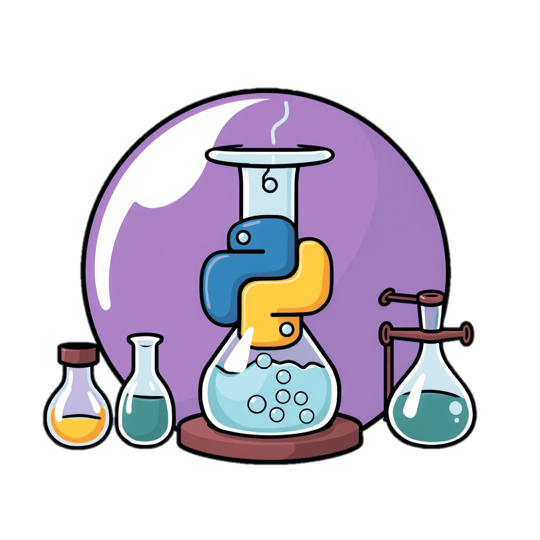

_Welcome to 420-SN1 Programming in Science_

In this course, you will learn everything about the basics of programming to solve scientific problems, read data from files, clean up the data, apply mathematical formulas, and _so much more_.

This image was AI generated.

This website provides you with additional notes and practice exercises that can help you better understand and master the concepts seen in class.

# Course Outline

You can download a copy of the course outline from Léa.

# Tools & Materials

# Website conventions

## Learning Objectives
All credits go to Vikram Singh for the original idea for adding learning objectives to every topic.

::: {.callout-note .objectives icon="false" title="☆ Learning Objectives "}
These are the core objecives to be covered in the course and could be part of the final evaluation. 
:::

::: {.callout-warning .objectives icon="false" title="☆ Additional Objectives "}
These are not core objectives of the course and will typically not be part of the final evaluation (except if teachers decide otherwise). But they are useful for labs/assignments and may or may not be covered by your teacher.
:::

## Content bubbles 
::: {.callout-note title="Hightlighted content"}
This is part of the core content and should be studied. 
:::

::: {.callout-important title="Common mistakes/ code crashes"}
This is a warning often related to code that might lead to errors or crash in your program. They are meant to teach you about common mistakes. 
:::

::: {.callout-warning title="Warning related to a Python configuration"}
This is warning related to a required installation or configuration. Altough it doesn't affect your understanding of the concepts it might hinder you while coding.
:::

## Hidden content

::: {.callout-note title="Expand to understand" collapse="true"}
Additional information that is not part of the core content. It's collapsed for you to optionally look at. 
:::

## Practice exercises

🎯 **Test Myself**: Short questions found throughout each topic's notes to help you **grasp and check your understanding of the concept**. 

✍️ **Practice**: These practice problems are found at the end of each module, they are meant to **reinforce and consolidate** your understanding of a topic. Do as many as you need until you feel comfortable with the topic. 

🧩 **Problem Solving**: These questions are meant to **connect** the topics with what you've learned previously and push you to think a little further. These are excellent preparation for Quizzes and Tests. 

🚀 **Challenge** : Harder, optional problems to challenge yourself further. Some of these could be useful to prepare for the Final Exam. 

:::{.callout-tip title="Solution for an exercise" collapse="true"}
This is a solution for an exercise and is collapsed for you to optionally look at.
:::

