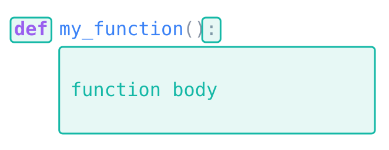
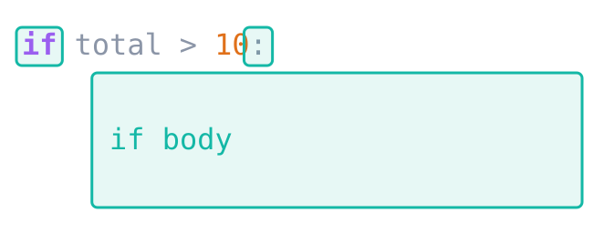

## Pattern
Python is unforgiving when it comes to indentation but the pattern for you to follow is consistent throughout the language: you start by writing a *header*, and then follow it with a *body*.

- The header begins with a keyword sush as `def`, `if`, `elif`, `else`, `for`, `while` etc.
- The header ends with a colon :
- The body may be one or many statements and each line of the body must be indented

::: {layout-ncol=2}







:::


## Comparison
The following 4 programs are identical except for the **indentation**. The first program is logical and works properly, each of the others has some change in the indentation which causes Python to do something different.  

Compare each one with the correct version and try to understand **why** the program is behaving as it is.

### Correct version
```pyodide
num = 8

def my_nightmare(num):
    print("Welcome to my_nightmare!")

    print(num)
    for n in range(0, num):
        print(n)

        if n < 5:
            print("less than 5")
        elif n > 5:
            print("greater than or equal to 5")
        else:
            print("equal to 5")

my_nightmare(num)
print("all done!")
```

### Wrong version 1
```pyodide
num = 8

def my_nightmare(num):
    print("Welcome to my_nightmare!")

print(num)
for n in range(0, num):
    print(n)

    if n < 5:
        print("less than 5")
    elif n > 5:
        print("greater than or equal to 5")
    else:
        print("equal to 5")

my_nightmare(num)
print("all done!")
```

:::{.callout-tip title="Solution" collapse="true"}
In this version, I forgot to indent most of the code that was supposed to be inside the my_nightmare function. Because of that mistake, those lines of code starting with `print(num)` will be run **before** I actually *called* the function on line 17.

Note that this doesn't completely fail because I just happened to have a variable in my program called `num` which had the same name as the parameter of the function. That's a good reason to generally *avoid* using the same for your variables vs the names of parameters. Python would have caught this mistake and told me something was wrong if I had named one of them differently. Change `num` to `number` on the first line and on the 2nd to last line and see what happens.
:::

### Wrong version 2
```pyodide
num = 8

def my_nightmare(num):
    print("Welcome to my_nightmare!")

    print(num)
    for n in range(0, num):
        print(n)

    if n < 5:
        print("less than 5")
    elif n > 5:
        print("greater than or equal to 5")
    else:
        print("equal to 5")

my_nightmare(num)
print("all done!")
```
:::{.callout-tip title="Solution" collapse="true"}
In this version, I forgot to indent most of the code that was supposed to be inside the for-loop. Because of that mistake, those lines of code starting with `if n < 5` will be run **after** the for-loop has finished.

Instead of checking each value of `n` inside the loop, it will only check the final value of `n`.
:::

### Wrong version 3
```pyodide
num = 8

def my_nightmare(num):
    print("Welcome to my_nightmare!")

    print(num)
    for n in range(0, num):
        print(n)

        if n < 5:
            print("less than 5")
        elif n > 5:
            print("greater than or equal to 5")
    else:
        print("equal to 5")

my_nightmare(num)
print("all done!")
```
:::{.callout-hint}
:::{.callout-note title="Hint" collapse="true"}
When is it printing "equal to 5" ?
:::
:::


:::{.callout-tip title="Solution" collapse="true"}
In this version, I forgot to indent the **else:** line. This causes something pretty weird to happen because Python actually allows you to put an **else:** after a `for`-loop (same for a `while`-loop). An **else:** after a loop will be executed when the loop finishes as long as you did **not** end the loop early using `break`.

You're not expected to learn this, **please do not do it**, but you can see that this error in doing your indentation can have very unexpected consequences
:::