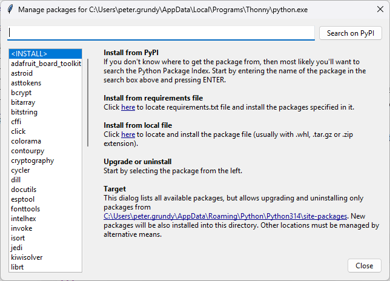

### What is Thonny? 
Thonny is a computer application used to develop and run Python programs. It is especially suited for people who are just learning how to program because it is easy to learn and simple to use. 

You can find more info about Thonny [HERE](https://thonny.org/) 

### Installing Thonny on Your Personal Machine. (Optional)

You will primarily be using Thonny on the lab computers (which have it installed by default) but if you want to install it on your personal machine it is free for all to download and use. To do this you need to:  

- Navigate to the [Thonny](https://thonny.org/) website 
- Look for the 'Download' option as shown below. (It may specify a different version than 5.0.0)  

  
- If you are using a Windows machine then hover over the __Windows__ link. It will then offer you links to the Thonny installer.  For most Windows machines you should choose the version for Intel or AMD computers. Once it is downloaded then you should go to your downloads folder and double click it to install the program. 

- If you are using a Mac then hover on the __Mac__ link. You will be offered two choices: a package for Intel-based Mac computers and another for Apple Silicon machines. If your laptop is less than 5 years old you will need to select the one for Apple Silicon machines otherwise you may need to choose the Intel package.  Click on it to download it. Once finished, go to your downloads folder and run the file by double clicking it. 
(If you try to install the wrong version your will give you a harmless error. All you need to do to fix it is to go back to your browser and download the other version )

### Important Thonny Settings (Both lab and personal machines)
Once Thonny is installed on your local machine you will need to change some settings to make it work better for this course. You need to complete the following steps to do this:   

- Start Thonny  
- Click on the Tools menu in the menu bar and select **Options...**  
- In the Thonny Options Dialog select the **Editor** tab  
- Enable the following checkboxes  
    - Highlight local variables  
    - Automatically show parameter info after typing '('
  

### Installing matplotlib and numpy support 
**NOTE**  
These libraries are only needed later in the course.  

[Matplotlib](https://matplotlib.org/){target="_blank"} and [Numpy](https://numpy.org/){target="_blank"} are powerful libraries used by Python programs to display complex graphs and to analyze complex data.  These libraries are not part of a standard Python installation and are usually installed using a tool called "**pip**".  

 Unfortunately, this can sometime cause permission errors on shared computers such as the lab machines so it is not a great solution for this course.  
 
  Fortunately, Thonny has a way of installing these libraries that is both easy to do and avoids these potential issues. To install these libraries in Thonny you need to perform the following steps. 
  
1. Click on the "**Tools**" menu and select "**Manage Packages**". You will see a window like the one shown below:  

2. Find and select the library you need in the list on the left-hand side of the window. 
3. Choose install. It may take a few moments to complete. 
4. Repeat steps 2 and 3 with any other libraries you may need. 

### Useful videos
#### Installation



#### Guide for new users


