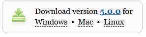
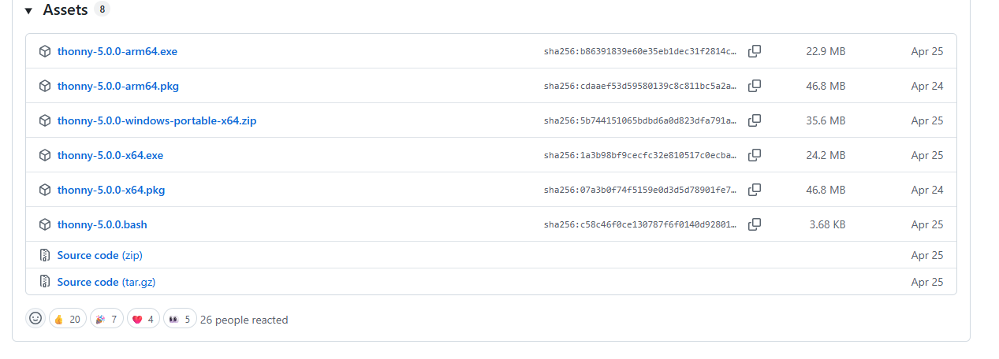
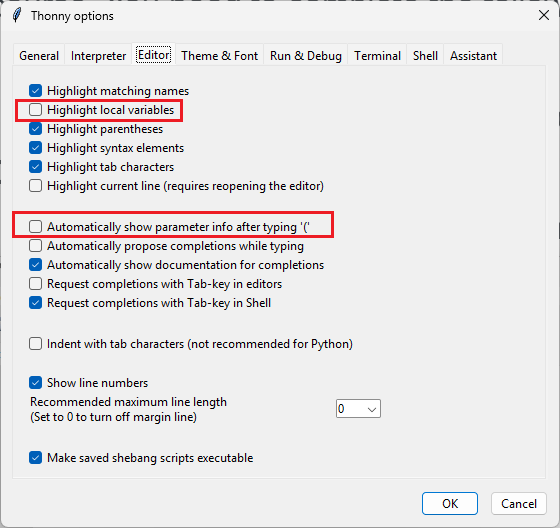

### What is Thonny? 
Thonny is a computer application used to develop and run Python programs. It is especially suited for people who are just learning how to program because it is easy to learn and simple to use. 

You can find more info about Thonny [HERE](https://thonny.org/) 

### Installing Thonny on Your Personal Machine. (Optional)

You will primarily be using Thonny on the lab computers (which have it installed by default) but if you want to install it on your personal machine it is free for all to download and use. To do this you need to:  

- Navigate to the [Thonny](https://thonny.org/) website 
- Click the big button that says 'Download' (It may specify a different version than 5.0.0)  

- Click on it to go to the download page.  Scroll to the bottom of this new page. You should see something like this:  

#### Windows
- For most Windows computers you will want to download the version ending with "x64.exe" such as "thonny-5.0.0-x64.exe" shown above. Click on it, save it, and then run it. 

#### Mac Users: Check Your Chip!
- Click the Apple logo 🍎 at the top left of your screen
- Select **About This Mac**
  - **On Newer Macs:** Next to “Chip,” you’ll see either **Apple** or **Intel**  
  - **On Older Macs:** Next to "Processor," you'll see **Intel Core**  

For **Intel** based machines you should select and download the installer with a name ending in x64.pkg. For example in the picture above you would select "thonny-5.0.0-x64.pkg"  

For machines returning **Apple** processors you should select the installer ending in "amd64.pkg". Looking at the picture above you would select "thonny-5.0.0-amd64.pkg"  

### Important Thonny Settings (Both lab and personal machines)
Once Thonny is installed on your local machine you will need to change some settings to make it work better for this course. You need to complete the following steps to do this:   

- Start Thonny  
- Click on the Tools menu in the menu bar and select **Options...**  
- In the Thonny Options Dialog select the **Editor** tab  
- Enable the following checkboxes  
    - Highlight local variables  
    - Automatically show parameter info after typing '('
  

### Further info

TBD - Will be filled in as the semester progresses. 

