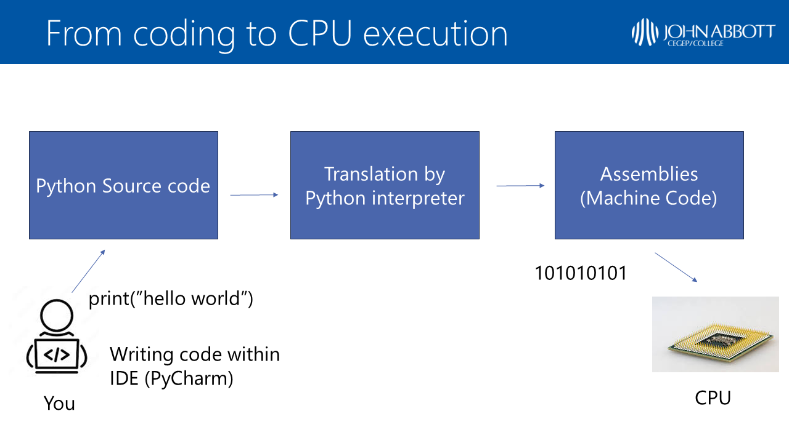

::: {.callout-note .objectives icon="false" title="☆ Learning Objectives "}

- **Describe** what programming is and what it does.
- **Explain** what is a programming language.
- **Explain** what an algorithm is.
:::

# What's binary?

Computers are digital machines: they perform operations using binary (1 or 0) operations. They are useful to perform tasks in a **deterministic** way. This means that a repeated task produces the same result if provided with the same inputs. Therefore computers are very reliable in sending, receiving, processing information and will do so in a consistent manner.

# What is Programming?
Programming is the process of writing a **set of instructions** in the form of source code that can be understood by a computer.

# What's a Program?
A **program** is a precise **set of instructions** that are used to perform a task. A set of instructions that correctly solves a task is called an **algorithm**. Building an algorithm involves finding a general recipe to solve a problem or perform a calculation, then breaking it down into steps a computer can run. 

## Example

Let's look at a simple example: 

::: {.callout-note icon="false"}
# Calculating an Average 
1. _Define the first number_
2. _Define the second number_
3. _Add the two numbers_
4. _Store the result in a variable: `sum`_
5. _Divide the sum by 2_
6. _Store the result in a variable: `average`_
7. _Output average_
:::


In this case, the set of instructions (computing the sum, then dividing by the number of items) is an **algorithm**, and the translation of that algorithm in a programming languages is a **program**:

::: {.callout-note icon="false"}
# Calculating an Average in Python

Here's the translated steps into python code: Try changing the numbers and re-run the code. 

```{python}
number1 = 20  # Define the first number
number2 = 30  # Define the seond number

sum_numbers = number1 + number2 # Add the numbers
average = sum_numbers / 2        # Divide the sum

print("The average is: ", average) # Output the average
```
:::


## Machine Code versus Programming Languages

Computers only understand instructions that are written in **machine code**, which is really elemental and uses a binary number system. That is a numeric system which expresses every number in base-2, everything becomes a sequence of ones and zeros such as "101001010101010100001".

:::{.callout-note collapse="true" title="Why do computers use Binary?"}
Because they are physically made up of electric circuits: more specifically transistors and logic gates. Electricity is either on ("1") or off ("0") in a given circuit. All instructions sent to a computer need to be described in a sequence of "ON" or "OFF" states. This is why computer have a limited set of "elemental" instructions such as "take this number", "store this number here", "add these two numbers", "output this number there", etc.

Everything a computer does is broken down into those elemental instructions. 

🔢 Use [this](https://www.convertbinary.com/text-to-binary/) online converter to write your name in Binary Code.
:::

Binary is hard for humans to work with because it isn't close to how we speak and think. That is where __Programming Languages__ become useful.


:::{.callout-note title="Additional Notes on Binary" collapse="true"}


- Also called base-2 (as oppose to base-10 which we are mostly used to)

- Base 10: Represents the bundles of powers composing a given number (_ones_, _tens_, _hundreds_, _thousands_, etc). Let's use 231 in base 10

  $$
  (231)_{10} = 2 * 10^2 + 3 * 10^1 + 1* 10^0
  $$

  In 231 there are 2 _hundreds_, 3 _tens_ and 1 _ones_. The base 10 requires 10 different symbols to represent real numbers: 0, 1, 2, 3, 4, 5, 6, 7, 8 or 9.

- Base 2: Requires only two symbols to represent numbers 0 or 1. Binary numbers represent the powers of _two_ forming that given number. For example:

  $$
  (0)_{10} =  0 * 2^0 = (0)_{2}
  $$

  $$
  (1)_{10} =  1 * 2^0 = (1)_{2}
  $$

  $$
  (2)_{10} = 1 * 2^1 + 0 * 2^0 = (10)_{2}
  $$

  $$
  (56)_{10} = 1 * 2^5 + 1 * 2^4 + 1 * 2^3 + 0 * 2^2 + 0 * 2^1 + 0 * 2^0 = (111000)_{2}
  $$

- Binary math is not covered in this course, but it if you wish to learn more about binary math and fundamentals of computers, here is an [introductory video](https://www.khanacademy.org/math/algebra-home/alg-intro-to-algebra/algebra-alternate-number-bases/v/number-systems-introduction) on the topic.

:::


## What's a programming language?

**Programming languages** are tools used by humans to communicate with computers in a relatively intuitive way. For example Python, C#, Java, C++ are different programming languages. Learning one of these languages will require learning and practicing its **syntax**, **semantics** and how to correct your spelling mistakes just like learning French, English or Spanish. Programming languages have some similarities with one another, but will have typically different syntax and structure. The **source code** is the set of lines of code written in a given programming language and it is typically saved into a **source file**, which is just a simple text file. 

## What does it mean to "execute" a program?

When you hear your teacher say "Run" or "Execute" the program. This is when you click the play button ▶ in the code editor. Execution is the process where a computer loads the code, and performs all the tasks one by one. 

:::{.callout-note collapse="true" title="A deeper dive into execution"}

When pressing that run button, the computer will translate the source code written into machine code via a series of steps. The binary code is entirely basic instructions that are executed by the CPU. The CPU stands for Central Processing Unit and acts as the brain of a computer will then execute (i.e.: run the instructions) the program.

 {width=80%}

:::


## Python

Python is a widely used programming language created by [Guido van Rossum](https://gvanrossum.github.io/) who named if after the [Monty Python's Flying Circus](https://docs.python.org/3/faq/general.html#:~:text=Details%20here.-,Why%20is%20it%20called%20Python%3F,to%20call%20the%20language%20Python.), a BBC comedy series from the 70s.

