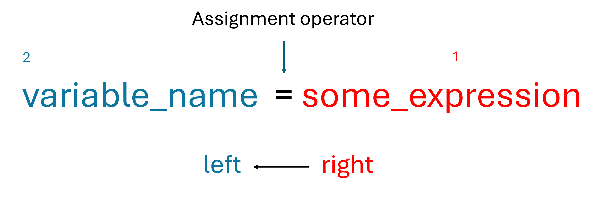
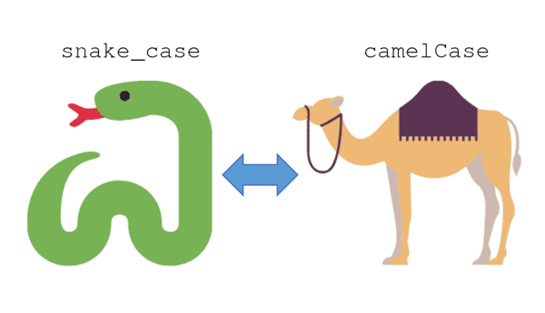
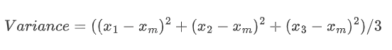

::: {.callout-note .objectives icon="false" title="☆ Learning Objectives"}
- **Describe** what are variables in a program.
- **Use** variables and constants.
- **Distinguish** legal from illegal Python variable names.
- **Follow** Python variable naming conventions. 
- **Recognize** the various basic data types: `str`, `int`, `float` and `bool`
:::

# **Variables**

A variable is a temporary holding place for a value. Think of   it as a box that can store **a single** item.

The value inside a variable can be of different types, for example:

- a number, such as the user's hourly pay, or the number of students in a course;

- a word or sentence (aka. a "string"), such as the user's name;

- many other things that we'll visit later...

## Defining Variables

:::{.callout-note icon="false"}
# **BASIC SYNTHAX**: `variable_name = value`

- Variables are composed of a **name** and a **value**.
- To which you can directly assign a **value**
:::

Here are a few examples:

```python
hourlyPay = 21
numStudents = 30

userName = "Bob"
greeting = "Hello there!"
```

Alternatively, you may also store the result of a Python expression: 

:::{.callout-note icon="false"}
# **BASIC SYNTHAX**: `variable_name = python_expression`

- The expression is **always** to the right hand side of the `=`
- The expression can be using other variables **defined before**.
:::

For instance, the following line will create a variable named _my_sum_ and store the result `335` in memory:

```python
my_sum = 21 + 314       # operation
average  = my_sum / 2   # using another variable
```

<!-- 
Let's animate the execution of this code block (click the Play-Pause ⏯️ button):
```{=html}
<div class="iframe-container" style="position: relative; width: 100%; height: 500px;">
  <iframe 
    src="https://app.codeboot.org/6.0.0/?init=.faW50cm9fdmFyaWFibGVzLnB5~XQAAgAAqAAAAAAAAAAA2nkgDa8sHY-qYmqhI845RcTD-OTvw7E5uhnmp3SLeliWSurqH0TD__6F6AAA=.oYXNzaWdubWVudC5weQ==~XQAAgAAvAAAAAAAAAAA8CAOiEWEDQUfStshlD9UeVa0elrT-4jvOdsj5p7ZyGjIuyqufYTTamICpl43R__S4IAA=.obmFtaW5nX2Vycm9ycy5weQ==~XQAAgABtAAAAAAAAAAA6HcohXJKCXzf5NlpSNu9CtnIJEO90_L6OaQmOyNWC25eZwaQB6DUGeuS_Ytb5vavv_nr18DQkJOjcBXO2dAldpx3B5qdfgYhAXn4ev4U5sVmAQx7E5HweEezmrWnqJfYuDfBQ3__4JJcA.~lang=py-novice.e" 
    width="100%" 
    height="400px" 
    style="border:none;" 
    loading="lazy" 
    data-external="1"
    sandbox="allow-scripts allow-same-origin allow-forms">
  </iframe>
</div>
``` -->

Let's break down the way variables are created and in Python, the following line is evaluated **from right to left**:

{height=250}

1. The expression on the **right side** of the `=` sign is evaluated first.
2. Then, if the variable on the **left side** doesn't already exist, will be created.
3. The variable is **assigned** with the result from step 1.
4. If we use the variable again, the **assignment is updated** with a new value.
5. Now, when the variable is used it returns the most latest value.

Given that assignments are evaluated from right to left in Python, the expression below is **correct** although it is mathematically not correct:

```python
x = 2
x = x + 1  # This is valid in programming
```


<!-- 

<iframe 
  src="https://app.codeboot.org/6.0.0/?init=.oaW50cm9fdmFyaWFibGVzLnB5~XQAAgAAqAAAAAAAAAAA2nkgDa8sHY-qYmqhI845RcTD-OTvw7E5uhnmp3SLeliWSurqH0TD__6F6AAA=.fYXNzaWdubWVudC5weQ==~XQAAgAAvAAAAAAAAAAA8CAOiEWEDQUfStshlD9UeVa0elrT-4jvOdsj5p7ZyGjIuyqufYTTamICpl43R__S4IAA=.obmFtaW5nX2Vycm9ycy5weQ==~XQAAgABtAAAAAAAAAAA6HcohXJKCXzf5NlpSNu9CtnIJEO90_L6OaQmOyNWC25eZwaQB6DUGeuS_Ytb5vavv_nr18DQkJOjcBXO2dAldpx3B5qdfgYhAXn4ev4U5sVmAQx7E5HweEezmrWnqJfYuDfBQ3__4JJcA.~lang=py-novice.e"  width="100%" 
  height="400px" 
  style="border:none;" 
  loading="lazy" 
  data-external="1"
  sandbox="allow-scripts allow-same-origin allow-forms">
</iframe> -->

The value of x is increased by 1.


## Modifying a variable

Variables are **mutable**. This means their values can be **changed** or **updated** over time.

For example, the following lines create a variable called `temperature`, initially setting its value to `23.0`. The second line, is updating its value to `26.0`. Thus erasing the previous value:

```python
temperature = 23.0
temperature = 26.0 #the value has changed
```
:::{.callout-note collapse="true" title="Avoid changing a variable's type"}

In python, the value of a variable can be changed to a different type, though this practice is **highly discouraged**.

For example, the following line assigns a literal of type string to a variable which initially was numeric:

```python
temperature = 23.0
temperature = "too hot"
```
 Later, we will learn why those types are not the same. 
 
- To prevent assigning a variable a literal of a different type in Python, you can use **type checking**, we will discuss this later in the course.

:::

To use a variable after it was created, simply re-type its name where you need it (e.g.: `print(temperature)`, or (`temperature +3 `)) and python will use its value in the expression.

```python
temperature = 23.0  # This line creates the variable
print(temperature)  # This line uses the variable, will print 23.0

temperature2 = temperature + 10  #This line uses the variable to create a new one

print("Temperature: ", temperature)
print("Temperature2:", temperature2)
```


:::{.callout-important title="Common Mistakes"}

1. Using inexistent variables:

```python
print(x)   
```
- `x` doesn't exist

2. Using a variable before **creating it**:

```python
print(temperature3)
temperature3 = 20
```
-  This will cause an error because temperature3 doesn't exist yet at this point.

3. Misspelling a variable:

```python
print(Temperature)  
```
- This will cause an error because Python is case sensitive "T" is not the same as "t"
:::


## Why use variables?
Variables can help make the code easier to read and follow, but also re-use logic. 

### Eliminating magic numbers
**Magic** numbers are unexplained values used in the code which make the code hard to read and understand:

```{python}
price = 16.80
total = price * 1.05
print(total)
```

- Here, the value `1.05` is not explained and is considered a magic number. 

Now consider this improved version using more variables:
```{python}
price = 16.80
tax_rate = 0.05 
total = price + price*tax_rate
print(total)
```
- It's now a little bit clearer that this program is calculating the cost of something afterapplying a $5%$ taxe rate.

- The first program was **hardcoding** the tax rate in the magic number `1.05`

:::{.callout-note title="Hardcoding" collapse="true"}
**Hardcoding** means to embed a value litterally as it is in the code. Think of it as permanantly tattooing your best friend's phone number, and regretting it when they change numbers. 
:::

### Re-using logic
Say, you're creating a script implementing the Pythagorean theorem when $a$ and $b$ are known. 
$$
a^2 + b^2 = c^2
$$

Consider the two program below implementing the same equation. What's the maing difference?

#### Program 1
```{python}
c_2 = 3*3 + 4*4
print(c_2)
```
#### Program 2
```{python}
a = 3
b = 4
c_2 = a*a + b*b
print(c_2)
```

One possible answer is: it's much easier to read, and update the second program because the values of $a$ and $b$ are well isolated in seperate variables.

---
🎯 **Test Myself**: Improve the program below by creating variables for each item price and the total:
```{python}
print("The cost of item 1 is: $ 10")
print("The cost of item 2 is: $ 22")
print("The total cost is $ 32")
```
:::{.callout-tip collapse="true" title="Solution"}
```python
item1 = 10
item2 = 22
total=item1 + item2

print("The cost of item 1 is: $", item1)
print("The cost of item 2 is: $", item2)
print("The total cost is: $", total)
```
:::

## Should everything be turned into a variable?

You don't have to create variables for every piece of data in the program. There's a fine line between making a code re-usable or making too long with too many variables. For example, if you're implementing the Pythagrean equation, the power `2` can be written because it's not expected to change. 

```python
a = 3
b = 4
c_2 = a**2 + b**2 #We'll learn more about operators later on
```
- Typically, the context of a problem will tell you if this is a variable or a fixed piece of information that isn't expected to change. 


## Variable naming rules

1. The variable name **cannot** start with a number, only with letters or `_`

2. It must **contain only** letters, numbers and underscores (`A-z`, `0-9`, and `_`)

3. It cannot contain a **space character**, nor **punctuation character**, nor any **special character** (@, #, $, %, ?, etc..)

4. It must not be any of the [**Python keywords**](https://www.w3schools.com/python/python_ref_keywords.asp), as these are reserved by Python for predefined purposes.

:::{.callout-note title="Additional notes"}
- Python is case sensitive! This means that uppercase `APPLE` and lowercase `apple` are not the same variable names, therefore will be considered by python as two different variables.

- You may use alphabet from other languages too for example: `sûr_la_mer`, `переменная`, `Adiós_Señora` are valid variable names.
:::

## Variable naming convention

Now that you've seen that programming expressions don't play by the math rules, let's break away even more from your math habits.

While, you can use simple names just like `x`, `y`, it is preferable to give variables a name that is more descriptive of what they represent.

> 👉 Variable name should be **meaningful**!
>
> Anyone reading your code should be able to guess **what the variable represents** and **how it will be used** just based on the variable name.

For example, using the variable `t` to represent a temperature reading could lead to confusion because `t` could also mean time, or any other quantity. It is therefore more meaningful to use `temperature`.

```python
3t = 23.0           # ERROR (cannot start with number)
t = 23.0            # BAD!
temperature = 23.0  # GOOD!
```

You may also use abbreviations, so long as they are commonly known (e.g: `max` for the maximum, `min` for the minimum, `avg` for average)

> 💣 Code submitted with poor variable names will have marks deducted.

Programmers came up with conventions to make code more easy to read and share. The [PEP 8 -- Style Guide for Python Code](https://www.python.org/dev/peps/pep-0008/) contains this list of conventions. Here are a few useful conventions we will reinforce in this course. You may select any of these conventions so long as you are consistent throughout your solutions.

| Convention | Formatting | Examples                                               |
| ---------- | :--------- | :----------------------------------------------------- |
| Snake case | two_words  | `avg_temperature`, `estimation_pi`, `area_under_curve` |
| Camel Case | twoWords   | `avgTemperature`, `estimationPi`, `areaUnderCurve`     |

 {height=300}

Source: Convert Naming Convention, https://github.com/NewGuy012/convert-naming-convention

🎯 **Test Myself**: The following variable names contain mistakes. Identify and fix them, then ensure that the new name follow the camel case naming convention. Repeat the exercise, this time using the snake case convention. Use a Python Terminal to validate your answers.

```{pyodide}
2weeksPay = 200.0
employee# = 5612
VACATION_DAYS.2024 = 2
Yearly-Salary = 4800
Inurance_% = 3.0
```

:::{.callout-tip icon="false" title="Solution" collapse="true"}
```python
two_weeks_pay = 200.0
employee_num = 5612
vacation_days_2024 = 2
yearly_salary = 4800
insurance_percent = 3.0
```
:::


## Example - Calculating the variance of three numbers 

Let's have a look at this lengthy equation: `((16-  (16+ 18+ 19)/3)**2 + (18-  (16+ 18+ 19)/3)**2 + (19-  (16+ 18+ 19)/3)**2)/3`

This equation computes the variance of the grades of three students. The formula to calculate the variance of three numbers is as follows, where `x_m` represents the mean of the grades.

{height=50}

Let's break it down in the following steps and implement them:

1. Define the results of each student.
2. Calculate the mean and store it.
3. Calculate the squared difference of each grade and store the results.
4. Calculate the variance and store it into a new variable.
5. Output the variance

**Python implementation of the variance**

Firstly, we need to define three variables representing the student grades and set their values:

```python
# Step 1: Create variables for the grades and enter their values
grade1 = 16
grade2 = 18
grade3 = 19
```
Using variables allows us to reuse the calculation with different numbers if required. 

To calculate the mean we can add up the grades and divide by 3 and store the result in a new variable. This new variable can then be reused as many times as required.

```python
# Step 2: Calculate the mean
mean = (grade1 + grade2 + grade3)/3
```

To compute the squared difference of each grade, we can begin by calculating the difference from the mean and store these differences in new variables (`diff = grade - mean`). Then, using the power operator `**`, we can store the squared differences in another set of variables (e.g., `square_diff = diff ** 2`). While there are no limits in the amount of variable used, intermediate results like `diff` may not be necessary to retain. Hence, we can perform the difference and the power operations into a single calculation.

```python
# Step 3: Calculate the squared difference for each value:
square_diff_1 = (grade1 - mean)**2
square_diff_2 = (grade2 - mean)**2
square_diff_3 = (grade3 - mean)**2
```

The last step is to calculate the variance by averaging the squared differences:

```python
# Step 4: Calculate the variance
variance = (square_diff_1 + square_diff_2 + square_diff_3)/3
```

Finally, we simply need to print the variance.

```python
# Step 5: Output the variance
print("The variance is:", variance)
```


🎯 **Test Myself**: Store your age in a variable as a number. Store one of your parent's age in a variable as a number. Using those two variables, calculate the age difference and print it out in a message.
```{pyodide}


```

:::{.callout-tip icon="false" title="Solution" collapse="true"}
```python
age = 17
parent_age = 47

age_diff = parent_age - age

print("The age diff is",age_diff)
```
:::


# **Constants**

Constants like in math are suppose to be values that never change. In python, they are treated the same way as variables but their values cannot be modified in the program. We say that constants are **immutable**. These values are universally acknowledged to be true and they should not changeover time.

Typically, Python constants are declared and initialized on different modules or files and need to be imported within the source code. We will learn more about modules at a later moment.

Within a created `constants.py` file:

```python
PI = 3.14159265359
GRAVITATION_ACC = 9.81
```

To **use** the constants into your `main.py` file:

```python
import constants #We will learn more about the import statement at a later point

print(constants.PI)
print(constants.GRAVITATION_ACC)
```


:::{.callout-note icon="false" title="⚠️ Constants can still change"}
The constants can still be modified since there is no built-in way to prevent this in Python. However, programmers follow the convention of using uppercase letters to name constants and treat them as immutable. There are also external modules available that can help "objects" that are constants and protected from modification.
:::

# References

1. _2.6. Statements and Expressions — How to Think like a Computer Scientist: Interactive Edition_. (n.d.). https://runestone.academy/ns/books/published/thinkcspy/SimplePythonData/StatementsandExpressions.html
2. _What are Python Variables, Python Constants and Literals? | Definition_. (2021, June 29). Toppr-guides. https://www.toppr.com/guides/python/python-introduction/variables-constants-literals/python-variables-constants-and-literals/#:~:text=Literals%20are%20raw%20values%20or,cannot%20be%20changed%20or%20updated.
