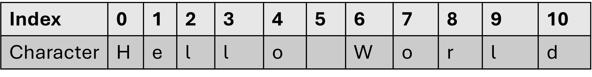

::: {.callout-note .objectives icon="false" title="☆ Learning Objectives "}
- **Recognize** the string data type
- **Convert** strings into numeric data types.
:::

When programming, textual data is represented by _strings_. Textual data can be words such as _Apple_, a short message such as _Hello World_, or longer sentences such as _In high school, Jimmy learned some programming. That's why cegep feels easy for him_. They are made up of a sequence of alphanumeric characters:

{width=80%}

# What's a string?
Strings are nothing more than sequences of unicode character ('a','b','c',....'%','#',....). Each character in a string occupies a specific position or index. For example in "Hello World", the 'H' character is at index 0, the 'e' is at index 1, the 'l' is at index 2, etc.


# Creating a string

Strings can be created in different ways, by using `""`, `''` or `""" """`. Let's explore the various ways of creating strings.

## Using double quotes `""`

```python
print("Hello World")
```

```python
my_string = "Johnny"
print(my_string)
```

​ However, what if we wanted to add a double quote inside the string so that it would read _Hello "World"_ ?

> ​ Try this command `print(""Hello "World"")` What happens? What is the error?

- There are a few workaround this issue:

- Use the escape character `\` in front of each double quote `print("Hello \"World\"")`
- Use another method to create the string (see below) while keeping the inner `""`

## Using single quotes `''`

```python
print('Hello "World" ')
```

- In Python you can also use the single quote`'` to define a string, this is useful when trying to include a double quote `"` within the string.
- Similarly to the double quote, you can use the escape character to include a single quote within the string.

```python
print('I\'m enjoying programming! Well, when there are no bugs.')
```

## Using triple quotes `""""""`

```python
print(""" This is a complex string with double quotes "" and a single quote '' that splits over
...  another line""")
```

- This method of creating strings is called multistring as you can type many lines as well as double quotes and single quotes. It's ideal for long paragraphs.

# Conversions to other types
Because strings store text, computers treat them as plain text rather than numbers—meaning they can’t be used directly in mathematical calculations. Learning how to convert strings to other data types is essential whenever you need to work with numeric data.

## Convert `int`/`float` to `str`
To convert a numeric variable to a string, you can use the `str()` function which wraps the number in `""`:
```python
value = 23.5
value_str = str(value)
```

## Convert `str` to `int`/`float` 

This conversion might occur if handling data stored as text but we need it as a number to perform calculations or other analysis with it. You can use the `int()` or `float()` functions introduced earlier as such:

```python
data_str = "23.5"
data_float = float(data_str)

some_calculation = data_float*3 +4
```

Or, 

```python
data_str = "23"
data_int = int(data_int)
some_calculation = data_int*3 +4
```


:::{.callout-warning title="This can crash!!!"}
Be careful! If the string has any characters that can't be turned into a number (like letters or symbols), this operation will fail and cause your program to crash:

```python
data_fr = "23,5"
data_float = float(data_fr) #<--Error ❌
```
:::
