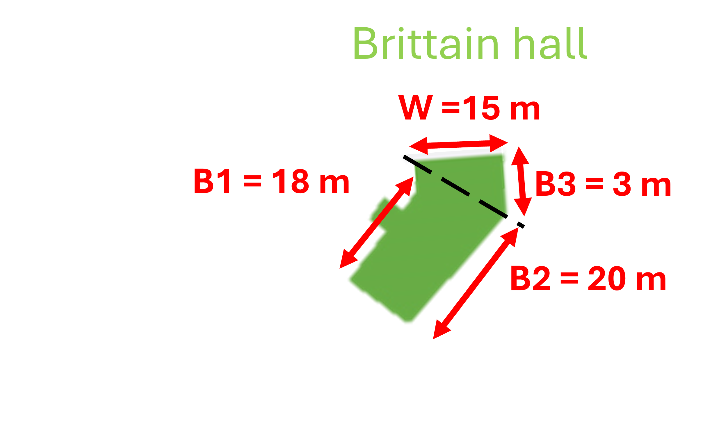

::: {.callout-note .objectives icon="false" title="Learning Objectives Checklist"}

- [ ] **Recognize** the various basic data types: str, int, float and bool
- [ ] **Recognize** scientific notation for large numbers
- [ ] **Evaluate** the resulting data type of expressions that mix different data types.
- [ ] **Evaluate** a comparison between two numbers as True or False.
- [ ] **Perform** type conversions (`int()`, `float()`, `str()`) to fix type-related errors in code.
- [ ] **Distinguish** legal from illegal Python variable names.

:::

We highly recommend you work on the exercises below with pen and paper to practice for quizzes and exams.


# ✍️ **Practice**
What are the data types of the following variable:

## 1. Type Check


**a.**
```python
variable = 10
```

:::{.callout-tip title="Solution" collapse="true"}
```
'int'
```
:::

**b.**
```python
PI = 3.14
```

:::{.callout-tip title="Solution" collapse="true"}
```
'float'
```
:::

**c.**
```python
variable = 3e-5
```

:::{.callout-tip title="Solution" collapse="true"}
```
'float'
```
:::

**d.**
```python
number = "234"
```

:::{.callout-tip title="Solution" collapse="true"}
```
'str'
```
:::

**e.**

```python
value = "2"
value2 = int(value)
```

:::{.callout-tip title="Solution" collapse="true"}
`value`→ `str`
`value2` → `int`
:::

**f.**

```python
grade = 24
total = 25
ratio = grade / total
```

:::{.callout-tip title="Solution" collapse="true"}
`grade` → `int` 

`total` → `int`

`ratio` → `float`

:::

**g.**
```python
num_classrooms = 5
pcs_per_classroom = 22
total_pcs = num_classrooms * pcs_per_classroom

```

:::{.callout-tip title="Solution" collapse="true"}
'int'
:::

**h.**
```python
var1 = 1
var2 = 2
var3 = "3"
var4 = var1 + var2 + var3
```

:::{.callout-tip title="Solution" collapse="true"}
var1 → `int`

var2 → `int`

var3 → `str`

var4 → Error, cannot use + on numeric data types with str.

:::

**i.**
```python
is_freezing = False
```

:::{.callout-tip title="Solution" collapse="true"}
'bool'
:::

**j.**

```python
age = 25
is_legal_age = (age >= 18)

```

:::{.callout-tip title="Solution" collapse="true"}

`int`

'bool'
:::

**k .**

```python
cars_count = 3
has_cars = bool(cars_count)
```

:::{.callout-tip title="Solution" collapse="true"}
`int`

`bool`
:::

## 2. Illegal Variable Names
Which of the following variable names are **illegal**?

- `TRUE`
- `True`
- `true`

:::{.callout-tip title="Solution" collapse="true"}
`True` — reserved keyword for the Boolean type.
:::

## 3. String Creation

Make a string to store the following text:
_The quick brown fox jumps over the lazy dog.Pack my box with five dozen liquor jugs.
Sphinx of black quartz, judge my vow. How vexingly quick daft zebras jump! Bright vixens jump; dozy fowl quack._

<details>
  <summary>👀 Hint</summary>
  <p>It's a multi-line string</p>
</details>

:::{.callout-tip collapse="true" title="Solution"}
```python
story = """The quick brown fox jumps over the lazy dog. Pack my box with five dozen liquor jugs. Sphinx of black quartz, judge my vow. How vexingly quick daft zebras jump! Bright vixens jump; dozy fowl quack.""

```
:::

# 🧩 **Problem Solving**

## 1. Sum of Mismatched Types
Fix the mistakes in the program below so that `sum_val` gets the value `6`.

```{pyodide}
num1 = 2
num2 = "4"

# Intended result: sum_val gets the value 6.
sum_val = num1 + num2
print(sum_val)
```

<details>
  <summary>👀 Hint</summary>
  <p>Double check the data types of the inputs!</p>
</details>

:::{.callout-tip title="Solution" collapse="true"}
```{python}
# Solution #1
num1 = 2
num2 = 4
sum_val = num1 + num2

# Solution #2
# num1 = 2
# num2 = "4"
# sum_val = num1 + int(num2)

# Are there any other solutions you can come up with?
print(sum_val)
```
:::

## 2. Average Grades
Fix the calculation error in the program below, which is supposed to calculate a simple average of two grades.

```{pyodide}
grade1 = 25
grade2 = 26

average = int((grade1+grade2)/2)
print(average)
```

<details>
  <summary>👀 Hint</summary>
  <p>There is more than one issue in the code above. How are averages calculated? And what type of data should they be?</p>
</details>

:::{.callout-tip title="Solution" collapse="true"}
```{python}
grade1 = 25
grade2 = 26
average = (grade1 + grade2) / 2
print(average)
```
:::


## 3. Gravitational potential energy
Calculate the gravitational potential energy of an object using the following formula, where $m$ is the mass of the object, $g$ is the acceleration of gravity which is 9.81 $m/s^2$, $h$ is the height at which the object is located. Assume that the object has a mass of 18Kg and is held at a height of 200 m. Ensure that you are following the naming convention mentioned earlier.

$$
E_p = m \times g \times h
$$

<details>
  <summary>👀 Hint</summary>
  <p>Python variable names should be meaningful!</p>
</details>

:::{.callout-tip icon="false" title="Solution" collapse="true"}

```python

GRAVITATION_ACC = 9.81

mass = 18
height = 200
energy = GRAVITATION_ACC * mass * height

```
:::

## 4. Renovations

Jac Reno needs your assistance in estimating the area of Brittain Hall with a `python` script. We can approximate the shape of BH with a trapezoid with bases $b_1$ and $b2$ and a triangle with base $b3$. We can then estimate the area with the following equation using the width of the hallway $w$ and multiply by **N = 4** (the number of floors). The script must print the estimated area of Brittain hall. 


The measures below are approximations, they may change later on.
$$
Area_{BH} =N \left( \frac{b_1 + b_2}{2}  w + \frac{b_3  w}{2}\right)
$$


<details>
  <summary>👀 Hint</summary>
  <p>Use variables and break down the equations in as many terms to make it more readable. </p>
</details>

```{pyodide}


```
:::{.callout-tip collapse="true" title="Solution"}
```{python}
num_floors = 4 
base1 = 18 # in meters
base2 = 20 # in meters
base3 = 3  # in meters
width = 15 # in meters

trapezoid = width*(base1 + base2)/2 
triangle = width * base3 / 2
area_one_floor= trapezoid + triangle
area_bh = num_floors * area_one_floor

print("The estimated area of Brittain hall is: ", area_bh)
```
Note: There are other valid solutions, but there are better implementations than others:
- Using variables makes the code easier to update with more precise measures
- Breaking down an equation into multiple terms helps making it more readable
- Using comments (`#`) with the units of measurements helps understand the context.
:::