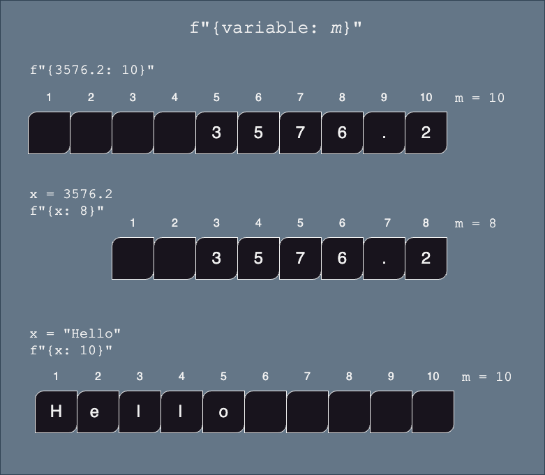
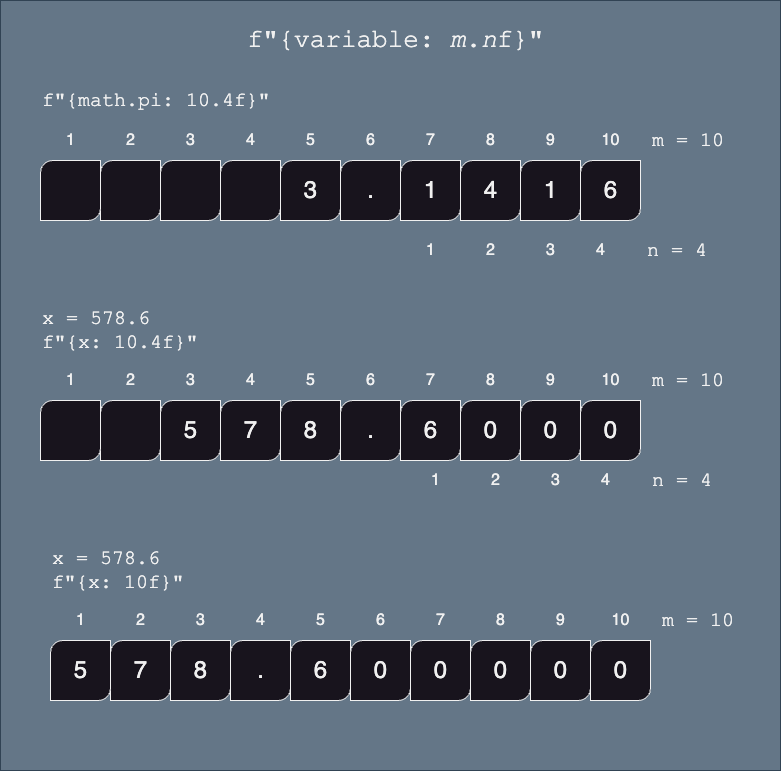
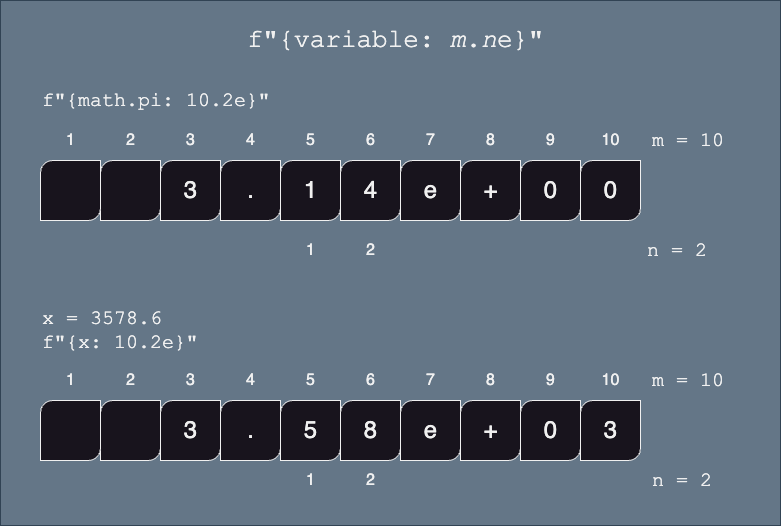
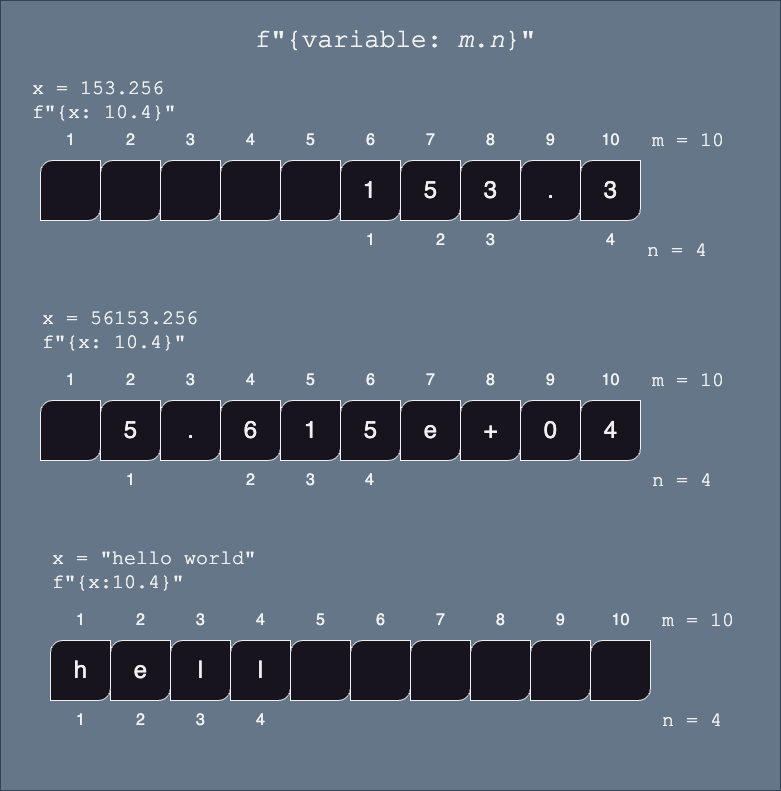
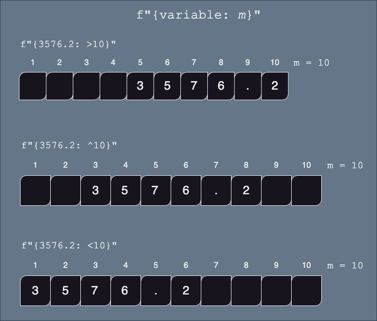

::: {.callout-warning .objectives icon="false" title="☆ Learning Objectives "}
- **Select** the appropriate f-string formatting (not memorize) to achieve the expected output.
:::

This topic is not part of the final assessment, but might be useful for some assignments.

This section is about how to format numbers within an f-string.

Within the `{...}` part of the _f-string_, we can specify how we want our numbers or strings to be formatted (example: left or right aligned, number of characters printed, precision (how many digits) etc.)

:::{.callout-note icon="false"}
# **BASIC SYNTAX**: `{`_`variable: format string`_`}`

- notice that the variable name is followed by a colon `:` and then a format string which is used to define how to format your output.

:::

# Length (or padding)

:::{.callout-note icon="false"}
# **BASIC SYNTAX**: `{`_`expression: m`_`}`

- _`expression`_ (variable or python expression) must have type `int` or `float` or `str`
- _`m`_ is the minimum numbers of characters of the resulting string. It will be padded with spaces if necessary.
- `int` and `float` will be padded so that the number is right aligned
- `str` will be padded so that the string will be left aligned
:::

{width=60%}

# Floating Point Numbers

To control the decimal places of a float, use the `:`_`m.n`_`f` format.

:::{.callout-note icon="false"}
# **BASIC SYNTAX**: `{`_`expression: m.n`_`f}`

- _`expression`_ (variable or python expression) must have type `int` or `float`
- _`m`_ is the minimum numbers of characters of the resulting string. It will be padded with spaces if necessary.
  - if `m` is not specified, then the length of the string will be dependent on the size of the number (i.e. no extra padding)
- _`.n`_ is the required precision (number of digits after the decimal point).
  - if not specified, then zeros will be used to pad the number to accommodate the width of the string
:::

{width=60%}

**Examples**

```{python}
x = 375.2
print( f"{x: .3f}" )     # 'm' is not specified, so only worry about number of digits after decimal point
print( f"{x: 6.3f}" )    # the printed number will be greater than 6 digits, so the '6' is ignored
print( f"{x: 10.3f}" )   # use at least 10 characters for this string, right aligned

print( f"{x: 10} ")				 # use default number of digits after the decimal point
```

<!-- Output:

```text
375.200
375.200
  375.200
    375.2
``` -->

For example, here are a few lines that print the value of pi at different precisions:

```{python}
pi = 3.141592653589793

print("The value of pi without formatting: ", pi)  
print(f"The value of pi with two decimal places: {pi:.2f}")
print(f"The value of pi with three decimal places: {pi:.3f}")
print(f"The value of pi with four decimal places: {pi:.4f}")

print(f"The value of pi with four decimal places: {pi:,.4f}")
```


# Scientific Notation

:::{.callout-note icon="false"}
#  **BASIC SYNTAX**: `{`_`expression: m.n`_`e}`
- _`expression`_ (variable or python expression) must have type `int` or `float`
- _`m`_ is the minimum numbers of characters of the resulting string. It will be padded with spaces if necessary. Note that one space is _always_ reserved for the `+` symbol, even if it is not displayed.
- if `m` is not defined, then the length of the string will be dependent on the size of the number (i.e. no extra padding)
- _`n`_ is the required precision (number of digits after the decimal point).
- if not specified, then zeros will be used to pad the number to accommodate the width of the string (+2) _WEIRD!_
:::

{width=60%}

# Generic Precision

Values that represent a given measurement in your program might need to be rounded to keep the [**significant figures/digits**](https://www.youtube.com/watch?v=eCJ76hz7jPM&t=228s&ab_channel=KhanAcademy), regardless of the output format (scientific notation, or not).

:::{.callout-note icon="false"}
#  **BASIC SYNTAX**: `{`_`expression: m.n`_`}`

 - _`expression`_ (variable or python expression) must have type `float` or `str`
 - _`m`_ is the minimum numbers of characters of the resulting string. It will be padded with spaces if necessary.
 - if `m` is not defined, then the length of the string will be dependent on the size of the number (i.e. no extra padding)
 - _`n`_ is the number of significant digits (**_not_** the number of digits after the decimal point)
 - _`.n`_ is the required precision (number of digits after the decimal point).

 _WEIRD_: if `expression` is a string, then there can be no space between the `:` and the _`m.n`_
:::

Python will determine which is the most appropriate representation

{width=50%}

**Examples**

For example, let's take the length of an object measured with a ruler graduated to 1 mm:

```python
length  = 153.256 # in mm
```

Only 4 digits are said to significant.

- To control the just number of significant digits, you may use `:.` without an "f" (as opposed to floating precision).

```{python}
length  = 153.256 # in mm
print(f"The length of the object is {length:.4}")
```


## Thousands Separator:

:::{.callout-note icon="false"}
#  **BASIC SYNTAX**: `{`_`float_or_integer_variable: ,`_`}` or `{`_`float_or_integer_variable: _`_`}`

 - This is useful to format large numbers such as 10,000,000 or 10_000_000
:::

For instance, here's the population of the United States:

```{python}
population_usa = 340_110_088  

print(f'The population of the usa without formatting {population_usa}')

print(f'The population of the usa in scientific notation {population_usa:_}')

print(f'The population of the usa with commas {population_usa:,}')
```


# Alignment

When the minimum width of the string is specified (using the _m_ argument), the resulting string will be padded with spaces.

We can control whether the spaces are padded to the right or left or evenly on both sides of the value.

To control the decimal places of a float, use the `:`_`m.n`_`f` format.

:::{.callout-note icon="false"}
#  **BASIC SYNTAX**: `{`\*`expression: [><^]m ...}`

 - \*`[<>^]` means either `>`, or `<`, or `^`
   - `>` aligns the value to the right (default for `float`s and `int`s)
   - `<` aligns the value to the left (defulat for `str`s)
 - _`expression`_ (variable or python expression) must have type `int` or `float` or `str`
 - _`m`_ is the minimum numbers of characters of the resulting string. It will be padded with spaces if necessary.
 - `...` refers to any other specific formatting instructions, such as _`.n`_`f` for floating point, etc.
:::

{width=60%}

**Example**

```{python}
x=35.2
print( f"not formatted: {x}")

print( f"minimum size of 10 right aligned:              '{x:10}' ")
print( f"minimum size of 10, 2 decimal - right aligned: '{x:>10.2f}' ")

print( f"minimum size of 10 left aligned:               '{x:<10}' ")
print( f"minimum size of 10, 2 decimal - left aligned:  '{x:<10.2f}' ")

print( f"minimum size of 10 centered:                   '{x:^10}' ")
print( f"minimum size of 10, 2 decimal - centered:      '{x:^10.2f}' ")
```


🎯 **Test Myself**: Print the receipt of the following transaction: price of item1, item2, item3, the subtotal, the tax amount and the total.

We wish to have all the numbers of the receipt aligned to the right.

```{pyodide}
item1 = 15.00
item2 = 23.50
item3 = 26.50
tax_rate = 0.15

sub_total = item1 + item2 + item3
tax_amount = 0.15 * sub_total
total = sub_total + tax_amount

# Complete the code 


```

:::{.callout-tip collapse="true" title="Solution"}
```python
item1 = 15.00
item2 = 23.50
item3 = 26.50
tax_rate = 0.15

sub_total = item1 + item2 + item3
tax_amount = 0.15 * sub_total
total = sub_total + tax_amount

print(f"Item1 ..........{item1:>10.2f}$")
print(f"Item2 ..........{item2:>10.2f}$")
print(f"Item3 ..........{item3:>10.2f}$")
print(f"Item3 ..........{item3:>10.2f}$")
print("--------------------------")
print(f"Sub total..........{sub_total:>7.2f}$")
print(f"Taxes ..........{tax_amount:>10.2f}$")
print(f"Total ..........{total:>10.2f}$")
```
:::


# Percentage
:::{.callout-note icon="false"}
#  **BASIC SYNTAX**: `{`_`expression: %`_`}`
- Percent values can be automatically formatted using `:%`
:::

For instance: 

```{python}
percentage = 0.58
```

To reduce the number of decimals displayed, you can combine it with an floating point precision formatting:


```{python}
percentage = 0.58
print(f"{percentage:.0%}")

```


### Summary

| Formatting                | f string symbol example                                                                                               |
| ------------------------- | --------------------------------------------------------------------------------------------------------------------- |
| Floating Precision        | `{x:f}`, `{x:10.2f}`, `{x:.2f}`, `{x:10f}`                                                                            |
| Scientific notation       | `{x:e`}, `{x:10.2e}`, `{x:.2e}`, `{`_`var`_`:10e}`                                                                    |
| Comma separated thousands | `{x:,}`, `{x:_}`                                                                                                      |
| Significant figures       | `{x:10.5}`, `{x:.5}`                                                                                                  |
| Minimum length            | `{x:10}`                                                                                                              |
| Alignment                 | `{x:<10}`, `{x:>10}`, `{x:^10}`, `{x:<10.2}`, `{x:<10.2}`, `{x:^10.2}`, `{x:<10.2f}`, `{x:<10.2f}`, `{x:^10.2f}`, etc |
| Sign of number            | `{x:+}`                                                                                                               |
| Percent                   | `{x:10.2%}`, `{x:.2%}`                                                                                                |

# Additional resources

1. [Video on f-strings](https://www.youtube.com/watch?v=EoNOWVYKyo0&ab_channel=Indently)
2. [Complete Guide with examples](https://cissandbox.bentley.edu/sandbox/wp-content/uploads/2022-02-10-Documentation-on-f-strings-Updated.pdf)
3. [Official documentation](https://docs.python.org/3/tutorial/inputoutput.html)
