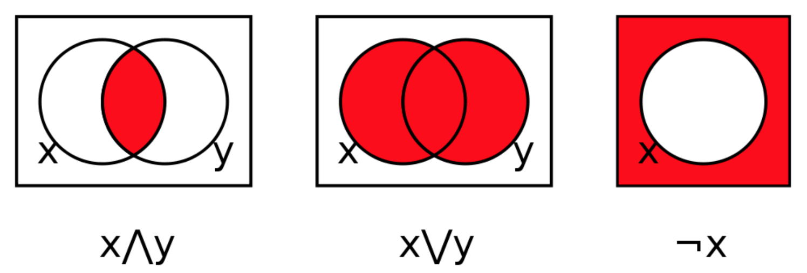

::: {.callout-note .objectives icon="false" title="☆ Learning Objectives "}
- **Interpret** what a logical operation is (`and`, `or`, `not`)
- **Differentiate** the behaviours of an `and` and an `or`. 
- **Evaluate** logical expressions accurately.
:::

Logical operators are used to combine Boolean values and expressions (`True` or `False`). They are helpful when programming more complex decision making. There are instances where we need to test if multiple conditions are true at the same time. 

:::{.callout-note title="Examples"}

*The relative humidity index must be below 100% **AND** the temperature has to be decreasing for it to rain*.

*The oil in the car should be changed every 6 months **OR** every 5,000 km*.

*To return a new sweater you must have the receipt **AND NOT** remove the price tag.*
:::


The combination of **AND**, **OR**, and **NOT** conditions with the boolean values `True` and `False` is called _boolean algebra_ (or boolean logic), each operation has a special symbol in math and in Python.

# Table of logical operators

| MATH | Python | Operation | Description                             |
| :--- | :----- | :-------- | :-------------------------------------- |
| ⋀    | `and`  | AND       | True when all elements are true.        |
| ⋁    | `or`   | OR        | True when at least one element is true. |
| ¬    | `not`  | NOT       | The inverse of an element.              |



# Operator `and`

Both operands must be `True` for the entire statement to be `True`

| English                                                                       | Python                                      |
| ----------------------------------------------------------------------------- | ------------------------------------------- |
|The relative humidity index must be below 100% **AND** the temperature has to be decreasing for it to rain | `humidity_index < 100 and temperature_variation < 0` |

# Operator `or`
At least one of the operans must be `True` for the entire statement to be `True`

| English                           | Python                     |
| --------------------------------- | -------------------------- |
| The oil in the car should be changed every 6 months **OR** every 5,000 km: | `num_months >= 6 or  mileage >= 5000` |

# Operator `not`

This operator acts as a **negation**. It transforms the variable into **its opposite**. It only takes one operand unlike the `and` and `or` which have 2 operands.

| English                                                 | Python                                       |
| :------------------------------------------------------ | :------------------------------------------- |
| I can borrow a book if I do _NOT_ have an overdue book. | `is_permissible = not has_overdue_books` |

# Challenges

Translate the following english expressions into Python code provided the starting sample code.

✍️**Challenge**: *The relative humidity index must be below 100% **AND** the temperature has to be decreasing (negative variation) for it to rain:*

```{pyodide}
rel_humidity = 88.0

temp_variation = -4

expression =                       # Complete this
print("Will it rain?: ", expression)
```

:::{.callout-tip title=Solution collapse="true"}

```python
rel_humidity = 88.0

temp_variation = -4

expression = rel_humidity < 100.0 and temp_variation < 0                      
print("Will it rain? (True/False): ", expression)

```
:::

✍️**Challenge**: *The oil in the car should be changed every 6 months (inclusive) **OR** if the travelled distance **exceeds** 5,000 km*:
```{pyodide}

# Since the last oil change: 
duration = 3.5               # in months
travelled_distance = 6_500   # in Km

expression =                   # Complete this


print("Should I change oil?", expression)
```

:::{.callout-tip title=Solution collapse="true"}

```python

duration = 3.5
travelled_distance = 6_500

expression = duration >= 6 or travelled_distance > 5000


print("Should I change oil?", expression)
```
:::

✍️**Challenge**: *To return a new sweater you must have the receipt **AND NOT** remove the price tag.*

```{pyodide}
has_receipt = True
has_removed_tag = False

expression =                           # Complete this

print("Can the sweater be returned?: ", expression)
```

:::{.callout-tip title=Solution collapse="true"}

```python
has_receipt = True
has_removed_tag = False

expression =  has_receipt and not has_removed_tag                     

print("Can the sweater be returned?: ", expression)
```

:::


