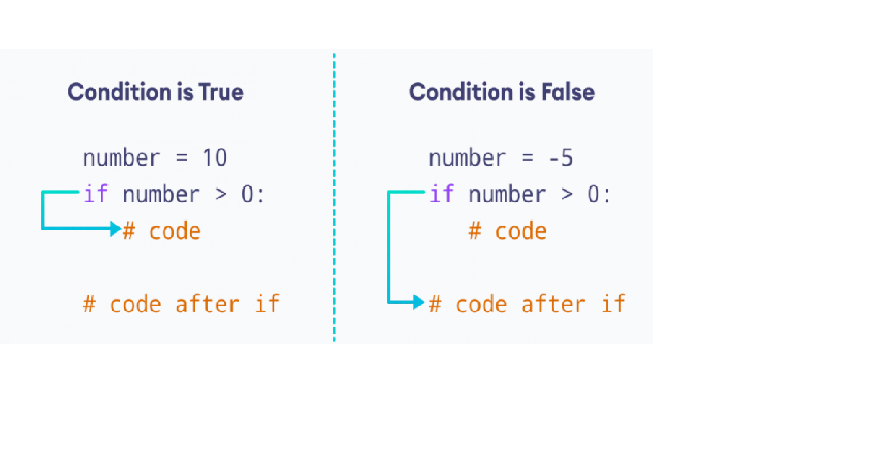

::: {.callout-note .objectives icon="false" title="☆ Learning Objectives "}
- **Write** `if` statements using correct syntax, indentation, and conditions.
- **Use** `if` statements to control program behaviour based on conditions.
- **Combine** multiple conditions using comparison and logical operators.
- **Evaluate** complex conditions using operator precedence and parentheses.
- **Predict** the output and variable values of a program containing conditional statements.
:::

So far you've only written programs that run the same instructions everytime. But what if a program needs to **make a choice** and based on it change behaviours? 

For example, one might ask:

_Is the password correct?_

The answer could be `True` or `False`. Based on that, the program must behave differently:
- If `True`, display **Access Granted!**
- If `False`, display **Access Denied**

Python use comparison operators and logical operators to ask YES/NO questions. Then, based on the answer it uses **conditional statements** to change the behvaiour of the program.


:::{.callout-note title="Reminder" collapse="true"}
Useful reminder before starting the section

**Comparison operators**

- Equals: `a == b`
- Not Equals: `a != b`
- Less than: `a < b`
- Less than or equal to: `a <= b`
- Greater than: `a > b`
- Greater than or equal to: `a >= b`

**Logical operators**

- `and`: combines two conditions as `True` if both are `True`.
- `or`: combines two conditions as `True` if either is `True`.
- `not` : inverts a condition.
:::

# The `if` statement 

Conditionally execute a set of instrcutions if a given condition is true.

:::{.callout-note title="BASIC SYNTAX `if`"}

A conditional `if` statement in Python includes the following elements in this specific order.

```python
if condition:
    statement_body
```

1. The `if` keyword followed by a space
2. A `condition` that evaluates to `True`/`False`.
3. A colon `:` followed by a newline.
4. An indented instruction (`statement_body`) or set of instructions executed if the `condition` is `True`.

:::

The statement works as follows:

- If the condition evaluates to True, the indented statement(s) are executed.
- If the condition evaluates to False, the indented statement(s) are skipped, and execution continues with the instruction after the if block.




:::{.callout-important title="Not indenting error"}
A common mistake beginners make it to forget the indentation of the lines of code within the `if` statment

```python
x = 10
if x == 10:    #  <--- Error ❌
print("It's equal to 10!"). #This line must be indented with the TAB 
```
- Most IDEs will automatically indent lines of code after an if
- **Be careful!** An indententation is not the same as a space. Hit the TAB button to indent not the SPACE button.

:::

# The `condition` of the `if` 

Let's focus on how to build conditions using comparison operators, booleans and logical operators effectively. 

## Comparison operators 
This will be the most common way of building conditional statements in a program for this course. Comparing variables, especially numbers with each other to add decisions.

For instance, let's consider a program which determines if a user is old enough to vote:

```{pyodide}

age = 17

if age >= 18: 
    print("You can vote!")

if age < 18: 
    print("You can't vote!")

print("I'm Done")
```

- The first `if` statement checks if the `age` is greater or equal to 18. If the condition is true, it prints __You can vote__.
- The second `if` statement checks the opposite condition, so if the user's `age` is lower than 18. If it's true, it prints __You can't vote__.
- The last `print` statement is outside the `if` blocks and will execute every time the code runs, no matter the `age` variable's value. Showing that it is independent from the `if` condition.


🎯 **Test Myself**: Modify the value `age` in the code above to display __You can vote__.

:::{.callout-tip collapse="true" title="Solution"}
Set the value of `age` to 18 (or greater).
:::

## Boolean variables 

Boolean variables and conditional statements are designed to be used together. Since a `condition` is a boolean, you can simply use the boolean **as is** in an `if` statement. For instance, consider the boolean `is_raining`. We would like to display a message if this boolean is `True`. One might be tempted to write:

```python
is_raining = True

if is_raining == True:
    print("It's raining!")

```

This isn't wrong, but it's redundant! 

- That's because `is_raining == True` creates a boolean expression that asks whether `is_raining` is `True` (or not).
- Since, the boolean already has the value `True`, it can serve directly as the condition of the `if`

This code can be re-written as such:

```python
is_raining = True

if is_raining:
    print("It's raining!")

```
## Combining conditions

When adding decision making, we sometimes need to check if multiple conditions are met at the same time or if one of them is met. This is when logical operators come in handy!

Let's go back an example we've used in a previous topic. You're trying to make a program which verifies if it will rain tomorrow based on the `humidy_index` and the `temperature_variation`:

__It will rain tomorrow if the humidify is above 0.8 AND the temperature is decreasing (variation is negative)__

To combine these two conditions we can use the **`and`** operator: 

```python
humidity = 0.77
temperature_variation  = -3.2

if humidity > 0.8 and temperature_variation <0:
    print("It will rain tomorrow")
```

🎯 **Test Myself**: What would be the output of the program if we replaced the `and` with an `or`?

:::{.callout-tip collapse="true" title="Solution"}
The conditon will be `True` since the **OR** required at least one to be `True`. The output will be:
`"It will rain tomorrow"`
:::

## Complex conditions

Keep in mind the order of operations when evaluating a conditional statement. For instance, let's test if `a` is smaller or equal to `b` and `c` is **NOT** true in the following example:

```python
a = 33
b = 200
c = False

if  a <= b and not c:
    print("Yeeyy")
```

[⏯️ Animate Execution](https://app.codeboot.org/6.0.0/?init=.oaW50cm9fdmFyaWFibGVzLnB5~XQAAgAAqAAAAAAAAAAA2nkgDa8sHY-qYmqhI845RcTD-OTvw7E5uhnmp3SLeliWSurqH0TD__6F6AAA=.fY29uZGl0aW9uc19wcmlvcml0eS5weQ==~XQAAgABpAAAAAAAAAAAwiAOiEXKguO8oQCi_fr5KEAxZGtKJRmd3cgX-ir_9_eV-JlhqhZlBzDWx5yMRJh-A1hWnLVZO5FGQDK9xxz_xr6lA3xavpdIPY7PTtvyurUtnb2NhM3u4Lsik92QO0Pw8mEA=.~lang=py-novice.a)

Let's break it down:

1. The comparison operation `<=` takes precedence over the rest and runs first:
    - Since `a` is smaller than `b`, so `a <=b` → **`True`** 
2. The `not` operation takes precedence over the `and` and runs second
    - Since the the value of `c` is `True` it gets inverted by the `not` becoming **`True`**. 
3. The `and` is now executed combining: `True and True` → **`True`**
4. Since the condition of the `if` is `True`, the condition body is executed next
5. Lastly, the `print("Yeeyy")` gets executed.


**Remember using more `()` than required is always better than writing ambigious statements**

### Examples 
PAY ATTENTION TO THE PARENTHESIS

I want a large pizza and either a coke or rootbeer

```python
if large_pizza==1 and (coke==1 or rootbeer==1):
  print("OK")
```

I want a large pizza or 2 small pizzas and a coke

```python
if (large_pizza==1 or small_pizza==2) and coke==1:
  print("OK")
```

I want 8 large pizzas and 15 cokes and 15 rootbeers, and if they don't have rootbeers, then 30 cokes

```python
if large_pizza == 8 and ( ( cokes == 15 and rootbeers == 15) or cokes == 30):
    print("OK")
```

🎯 **Test Myself**: Complete the following program to print __Team C qualifies!__ if they won at least one game. **Or**, if they lost none, but scored **at least** 3 goals **while** conceding **not more** than 1 goal.

```{pyodide}
games_won = 0
ganes_lost = 0
goals_scored = 4
goals_against = 2

print("Will Team C qualify?")


print("Program is done!")
```

:::{.callout-tip title="Solution" collapse="true"}
```python
games_won = 0
games_lost = 0
goals_scored = 4
goals_against = 2

print("Will Team C qualify?")

if (games_won >= 1) or (games_lost ==0 and goals_scored > 3 and goals_against <= 1):
    print("Team C qualifies!")


print("Program is done!")
```

:::

# The `statement_body` of the `if` 

All the lines indented under the `if condition:` are part of the body and are executed if the condition is `True`, otherwise they're skipped. 

## Updating a variable

A variable defined before an `if` statement can be modified inside its body. If the condition is `True`, the instructions in the `if` body are executed, and any changes made to the variable are retained after the `if` block.    

For example, imagine a game where a player earns 10 points each time they successfully complete a mission:

```{python}
score = 0

# First mission
has_succeeded = True

# Check if the mission was successful
if has_succeeded:
    print("Mission Passed")
    print("Respect+")
    score += 10

print(score)
```

Since `has_succeeded` is `True`:

- The `if` condition is satisfied, so its body is executed.
- Both messages are displayed.
- `score` is increased by 10, changing its value from `0` to `10`.
- After the `if` block finishes, `score` still has the value `10`.

🎯 **Test Myself**: What would be the output of this program if the assignment changes to`has_succeeded = False`? 

:::{.callout-tip title="Solution" collapse="true"}
The score stays at 0.
:::

:::{.callout-note collapse="true" title="Nesting `if` statements"}

Nesting a condition is placing it inside an outer condition. 

For instance, consider those numbers: `number1 = 200`,`number2 = 33`,`number3 = 500`. Let's imagine we're trying to verify if `number2` is the smaller number. This translates in verifying if `number1 > number2`, then if that's true, verify if `number3 > number2` to conclude if it's the smallest number:


- If number1 is greater than number2, then:
- If number 3 is greater than number2, then:
    - Display: "number 2 is the smallest number"

This would translate into:

```python
number1 = 200
number2 = 33
number3 = 500
if number1 > number2:
    if  number3 > number1:
        print("Both conditions are True")
```

These nested conditions can often be simplified using logical operators and counter conditions. 
:::

