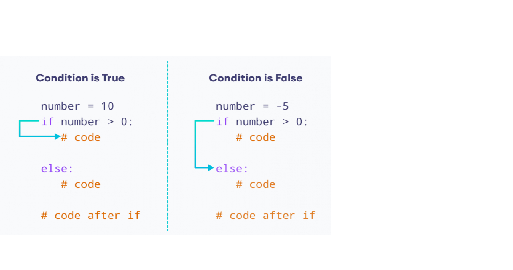
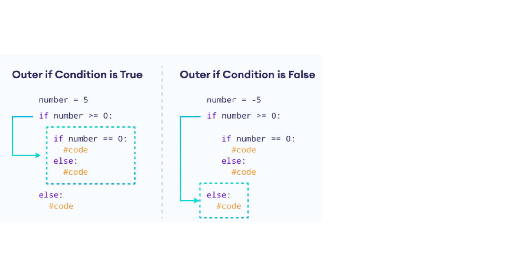

::: {.callout-note .objectives icon="false" title="☆ Learning Objectives "}
- **Write** `if/else` statements using correct syntax, indentation and structure.
- **Use** `if/else` statements to control program behaviour based on conditions and their opposites.
- **Predict** the output and variable values of a program using `if/else` statements and nested `if/else` statements.
- **Apply** if/else statements to solve simple problems
:::

# The `if/else` statement
An `if` statement can have an optional `else` clause. The `else` statement executes if the condition in the `if` statement evaluates to `False`.

:::{.callout-note title="BASIC SYNTAX `if/else`"}
```python
if condition:
    body_if
else:
    body_else
```

Here, if the `condition` inside the `if` statement evaluates to

- **True** - the body of `if` executes, and the body of `else` is skipped.
- **False** - the body of `else` executes, and the body of `if` is skipped

:::



Consider the following code, where the user inputs a number in the program:

```python
number = int(input('Enter a number: '))

if number > 0:
    print('Positive number')
else:
    print('Not a positive number')

print('This statement always executes')
```

Sample output

```
Enter a number: 10
Positive number
This statement always executes
```

- If user enters **10**, the condition `number > 0` evalutes to `True`. Therefore, the body of `if` is executed and the body of `else` is skipped.
- If user enters **0**, the condition `number > 0` evalutes to `False`. Therefore, the body of `if` is skipped and the body of `else` is executed.

#### **Example :**

**how to identify the larger of two numbers**:

```python
# define two numbers
number1 = 200
number2 = 45

# Choose the larger number
if number1 > number2:
    larger_number = number1
else:
    larger_number = number2

# Print the result
print("The larger number is:", larger_number)
```

🎯 **Test Myself**:  Assign a number to a variable and then check if the number is even or odd.

```pyodide

```


# Nested if-else statements

Consider the case where the **instruction placed after the if is another if**.

It is possible to include an `if` statement inside another `if` statement.

```python
if condition:
    if nested_condition:
        # ested code block 1
     else:
        # nested code block 2
 else:
     # nested code block 3

```

#### Example:

```python
number = 5

# outer if statement
if number >= 0:
    # inner if statement
    if number == 0:
      print('Number is 0')

    # inner else statement
    else:
        print('Number is positive')

# outer else statement
else:
    print('Number is negative')
```

Sample output

```
Number is positive
```

Here's how this program works.



#### Here are two important points:

- this use of the if statement is known as **nesting**; remember that every else refers to the if which lies **at the same indentation level**; you need to know this to determine how the *if*s and *else*s pair up;

- consider how the **indentation improves readability**, and makes the code easier to understand and trace.