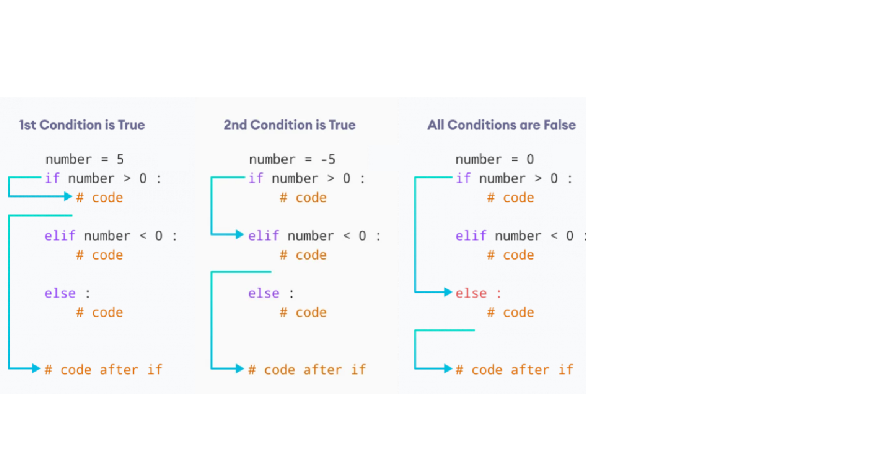

::: {.callout-warning .objectives icon="false" title="☆ Additional Objectives "}
- **Explain** the purpose of the `elif` statement
- **Write** `if/elif/else` statements using correct syntax, indentation and conditions.
- **Identify** when an if/elif/else structure is more appropriate than a simple if/else structure.
- **Construct** an if/elif/else cascade with multiple conditions in the correct order.
- **Identify** the role of the optional else branch and explain what happens when no condition is True.
:::

## The `elif` statement

The `if...else` statement is used to execute a block of code among two alternatives.

However, if we need to make a choice between more than two alternatives, we use the `if...elif...else` statement.

The `elif` keyword is short for "else if" and is used to check multiple conditions, stopping as soon as it finds the first true condition.

:::{.callout-note title="BASIC SYNTAX `if/elif/else`"}
```python
if condition1:
    body_if

elif condition2:
    body_elif

else:
   body_else
```
If the `condition1` inside the `if` statement evaluates to

- **True** - the body of the `if` executes, and the body of the `elif` and the `else` are skipped (**without** checking `condition2`)

- **False** - the body of the `if` is skipped, then the `condition2` is checked. If evaluates to

    - **True**, the body of the `elif` is executed while the body of the `else` is skipped

    - **False**, the body of the `else` is executed instead.


:::



The way to assemble subsequent _if-elif-else_ statements is sometimes called a **cascade**.

Some additional attention has to be paid in this case:

- you **mustn't use elif nor else without a preceding if**;
- else is always the **last branch of the cascade**, regardless of whether you've used elif or not;
- else is an **optional** part of the cascade, and may be omitted;
- if there is an else branch in the cascade, only one of all the branches is executed;
- if there is no else branch, it's possible that none of the available branches is executed.

This may sound a little puzzling, but hopefully some simple examples will help shed more light.

Consider the following code:

```{python}
number = -5

if number > 0:
    print('Positive number')

elif number < 0:
    print('Negative number')

else:
    print('Zero')

print('This statement is always executed')
```


Here, the first condition, `number > 0`, evaluates to `False`. In this scenario, the second condition is checked.

The second condition, `number < 0`, evaluates to `True`. Therefore, the statements inside the `elif` block is executed.

In the above program, it is important to note that regardless the value of `number` variable, only one block of code will be executed.

🎯 **Test Myself**: Write a Python program that asks the user to input a temperature in Celsius and then checks if the temperature is below freezing, above boiling, or in between.

:::{.callout-tip icon="false" collapse="true" title="Solution"}
```python
temperature = float(input("Enter the temperature in Celsius: "))

if temperature < 0:
    print("The temperature is below freezing.")
elif temperature > 100:
    print("The temperature is above boiling.")
else:
    print("The temperature is between freezing and boiling.")
```
:::


🎯 **Test Myself**:  Write a Python program that assigns a letter grade based on a numeric score. Ask the user to input a score, then determine and print the letter grade:

- A: 90-100
- B: 80-89
- C: 70-79
- D: 60-69
- F: below 60


:::{.callout-tip icon="false" collapse="true" title="Solution with if/elif/else"}
```python
score = float(input("Enter your score: "))

if score >= 90:
    grade = "A"
elif score >= 80:
    grade = "B"
elif score >= 70:
    grade = "C"
elif score >= 60:
    grade = "D"
else:
    grade = "F"

print("Your letter grade is:", grade)
```
:::


:::{.callout-tip icon="false" collapse="true" title="Solution with nesting"}
```python
score = float(input("Enter your score: "))

if score >= 90:
    grade = "A"
else:
    if score >= 80:
        grade = "B"
    else:
        if score >= 70:
            grade = "C"
        else:
            if score >= 60:
                grade = "D"
            else:
                grade = "F"

print("Your letter grade is:", grade)
```
:::