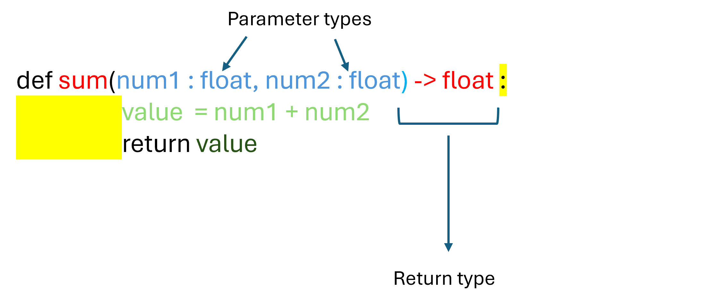
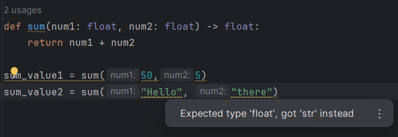

Type hinting reinforces some additional constraints on the types or arguments and returned values of a user defined function. It is optional, but highly recommended to ensure that functions are used as intended.



```python
def sum(num1: float, num2: float)  -> float :
    """Function which adds two numbers"""
    value = num1 + num2
    return value
```

```python
sum(20, 5)  #This will work
```

```python
sum("Hello", "there")  #This still works but will display a warning
```


