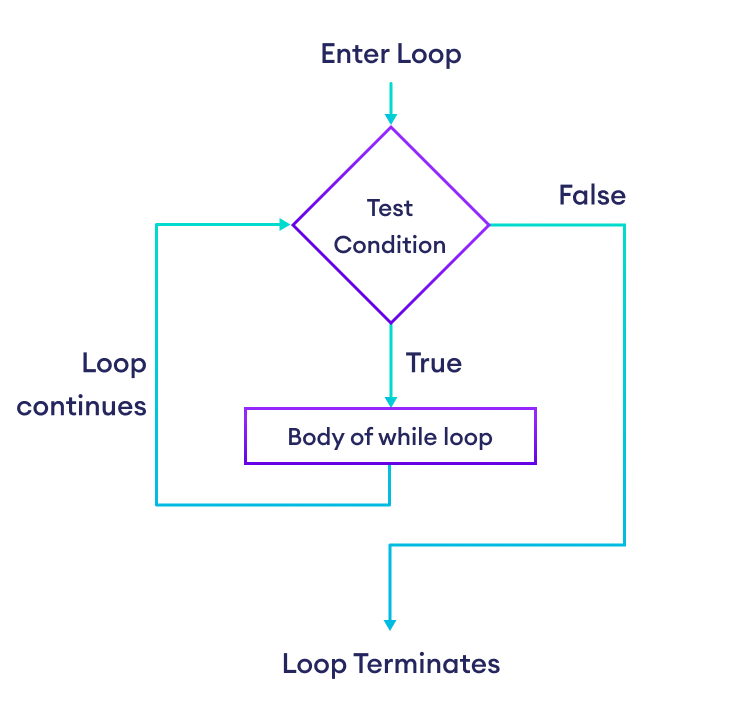

::: {.callout-warning .objectives icon="false" title="☆ Additional Objectives "}
- **Create** `while` loops to repeat code
- **Combine** use `while` loops with conditions and other constructs
- **Evaluate** when `while` loops should be used
- **Predict** the output and effects of using `while` loops in a program.
:::

A `while` loop allows you to repeat lines of code over and over as long as a given condition is `True`. This is useful for tasks like:  
- keep playing a game until the last level is completed  
- keep rolling dice until a 1 is rolled  
- keep refining a calculation until it settles on a final answer  

The structure of a `while` loop is very similar to a simple `if` statement:


:::{.callout-note title="BASIC SYNTAX `while`"}

As long as \<condition\> is `True`, the code inside the body will be executed again and again.

```python
while condition:
    loop_body
```

1. The `while` keyword followed by a space
2. A `condition` that evaluates to `True`/`False`.
3. A colon `:` followed by a newline.
4. An indented instruction (`loop_body`) or set of instructions executed as long as the `condition` is `True`.

:::



You'll recognize this pattern that shows up a lot in Python, where the *body* must be indented. As soon as Python sees a line that is **not** indented then it understands that you've ended the *body*.  

What code can you put inside the *body* of a loop? Well, almost anything:  
- do math & assign to variables  
- print things  
- call functions  
- use if-else... statements  
- even put *more* loops  

## 🔁 Usage examples

When would we use a `while` loop over a `for` loop? Here are "good" examples where it's more convinient to repeat code based on a condition over counting a number of iterations. 

### Playing a game
Keep calling the function `play_turn()` until it returns False, indicating that the game has finished:

```python
keep_playing = True

while keep_playing:
  keep_playing = play_turn()
```
*We will assume that the function play_turn() has been defined earlier and that the function returns True to indicate the game can continue, and it will return False when the game has finished.*

### Adding until a limit is reached
The `total` variable starts at one and keeps doubling until the total has reached or exceeded the limit:

```pyodide
LIMIT = 5
total = 1

while total < LIMIT:
  total = total * 2
  print(f"Total is now {total}")

print(f"The final total was {total}")
```

### Robotics and Microcontrollers
Another use of while loops is in robotics. 

_Until an obstable is detected, keep calling the `forward()` function to move the robot forward and call the `read_obstacle_sensor()` to read the obstacle detection sensor._

```python
obstacle = False

while obstacle:
  print("Go forward")
  forward()

  obstacle = read_obstacle_sensor()

```

## ⚠️ Infinite Loops

Looping is a powerful ability to give your code, but it comes with a new kind of "risk": **your code might loop *forever* which isn't good**. 

Why/how could this happen? The while loop will keep repeating until the given condition becomes False. *If your program never causes the condition to become false then it will loop forever.*


One of the most common mistakes you'll make with while loops is forgetting to update a variable which is used in the condition:

### Bad example 1
For example, if we forget to update our `total` variable:
```python
LIMIT = 5
total = 1

while total < LIMIT:
  print(f"Total is now {total}")
  # ...missing the code here...

print(f"The final total was {total}")
```
In this code `total` never changes therefore it will *always* be < LIMIT therefore the while loop will repeat *forever*.

### Bad example 2
This code will also keep looping forever. Why is that?

```python
keep_playing = True

while keep_playing:
  play_turn()
```

:::{.callout-hint}
:::{.callout-note title="Hint" collapse="true"}
What is the condition that the while loop checks each time?
:::
:::

:::{.callout-tip title="Solution" collapse="true"}
The variable `keep_playing` never gets changed so it will always be `True`, therefore the while loop will repeat forever. This code was ignoring the bool value returned from the play_turn() function.
:::


When you're writing code with `while` loops and it seems like your program is stuck, then you'll have to stop your program and check your while loop to make sure that you didn't forget to update your variables.

## Tracing

Being able to methodically follow exactly what Python is doing becomes even more important when we introduce looping. Let's *trace* through what happens when we run this example:

::: {.columns}
::: {.column width="55%"}
```python
1    LIMIT = 5
2    total = 1
3  
4    while total < LIMIT:
5        total = total * 2                
6        print(f"Total is now {total}")   
7 
8    print(f"The final total was {total}")
```
:::

::: {.column width="45%"}
::: {style="font-size: 80%;"}
| Step | Action                                     |
|------|--------------------------------------------|
|    1 | Assign the value 5 to `LIMIT` |
|    2 | Assign the value 1 to `total` |
|    3 | Check whether `total < LIMIT `. This checks if `1 < 5` & sets the condition to `True` |
|    4 | Double the value of `total`, so now `total` is 2 |
|    5 | Print the message which shows that total is 2 |
|    6 | Go back to line 4 and check whether `total < LIMIT `. This checks if `2 < 5` & sets the condition to `True` |
|    7 | Double the value of `total`, so now `total` is 4 |
|    8 | Print the message which shows that total is 4 |
|    9 | Go back to line 4 and check whether `total < LIMIT `. This checks if `4 < 5` & sets the condition to `True` |
|   10 | Double the value of `total`, so now `total` is 8 |
|   11 | Print the message which shows that total is 8 |
|   12 | Go back to line 4 and check whether `total < LIMIT `. This checks if `8 < 5` & sets the condition to `False` |
|   13 | Do NOT go into the while loop body - jump to line 8 |
|   14 | Print the final value of total which is 8 |
:::
:::
:::


## Cancelling the repeats

Sometimes you may want to stop repeating the loop even when the condition is still True. Using the `break` statement will skip any remaining lines in the loop body and will run the code that comes after the loop body:

```pyodide
count = 0

while count < 5:
  print(f"In the loop (count={count})")
  count = count + 1
  if count == 3:
    break  # this will skip over the next line, and will go to the print("The loop has finished.")
  print(f"The count is now {count}")

print("The loop has finished.")
```


## Skipping part of the body
It's less common to need to do this, but you can also skip the rest of the body statements (just like `break`) but keep running the loop. This is done using the `continue` statement:

```pyodide
count = 0

while count < 5:
  print(f"In the loop (count={count})")
  count = count + 1
  if count == 3:
    continue  # this will skip over the next line, and will go back to the while count < 5 check
  print(f"The count is now {count}")

print("The loop has finished.")
```

**Be careful: if `continue` causes you to skip code that updates the variables used in the condition, your loop may never end.**

## Test Yourself

### Test 1

How many times will this code print *Hello* ?
```python
count = 1

while count < 3:
  print("Hello")
  count = count + 1
```

:::{.callout-tip title="Solution" collapse="true"}
This code will print *Hello* twice because count starts at 1, then becomes 2, then becomes 3 and the condition is no longer true.

```pyodide
count = 1

while count < 3:
  print("Hello")
  count = count + 1
```
:::

### Test 2

How many times will this code print *Hello* ?

```python
count = 3

while count < 3:
  print("Hello")
  count = count + 1
```

:::{.callout-tip title="Solution" collapse="true"}
This won't print *Hello* at all because the condition `count < 3` is False from the very beginning so the code inside the while loop is not executed even once.

```pyodide
count = 3

while count < 3:
  print("Hello")
  count = count + 1      
```
:::


