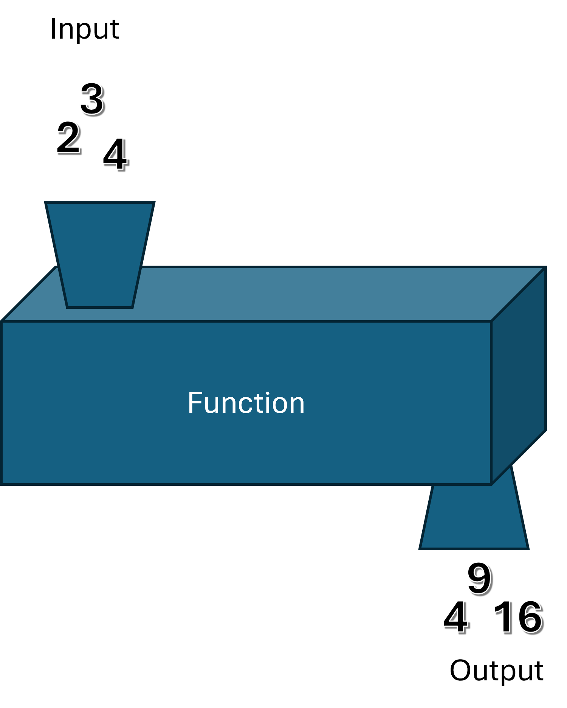

Mathematic functions are often described as a black box which maps an input set X to an output set Y:



- The `math` module allows you to use mathematic functions. You need to firstly import the module:

  ```python
  import math
  ```

- To use the functions defined within the math module, you can use the "dot" ( `.`) to access a function:

  ```python
  math.cos(0)
  ```

- There exists many useful functions performing math operations that we will be using in this course:

```pyodide
import math

# note: when you finish a { } in an f-string with the equal sign
# it will show what comes before the = plus the actual value that
# was calculated

# Rounding up/down:  
print(f"{math.ceil(5.5)=}")
print(f"{math.floor(5.5)=}")

# square root:
print(f"{math.sqrt(9)=}")

# trigonometry:
print(f"{math.sin(3.14)=}")
print(f"{math.cos(0)=}")
print(f"{math.atan(1)=}")
print(f"{math.acos(1)=}")
print(f"{math.asin(1)=}")

# mathematical constants:
print(f"{math.pi=}")
print(f"{math.tau=}")

# converting between degrees and radians:
print(f"{math.radians(90)=}")
print(f"{math.degrees(1.57)=}")
```
  
- If you intend on using a particular function or constant often, you can import only what you are interested in, and you won't need to type **math.** before its name:

```pyodide
from math import sin
from math import cos
from math import pi

sin_pi = sin(pi)
cos_pi = cos(pi)

print(sin_pi)
print(cos_pi)
```
