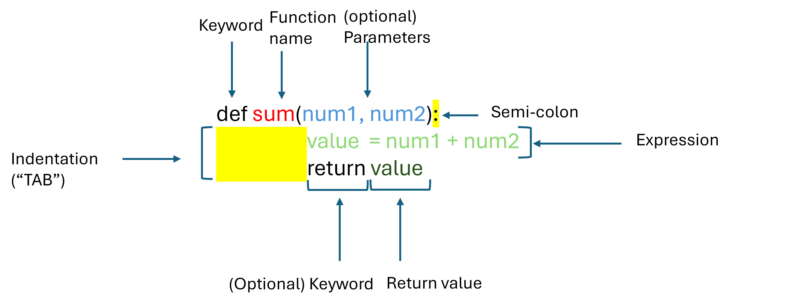

::: {.callout-note .objectives icon="false" title="☆ Learning Objectives "}
- **Write** create custom functions using the `def` keyword.
- **Use** invoke functions with and without parameters, and with and without return values.
- **Combine** use of functions to create more complex programs.
- **Evaluate** when functions should use print() vs return statements
- **Predict** the output and effects of calling functions in a program.
:::

::: {.callout-warning .objectives icon="false" title="☆ Additional Objectives "}
- **Write** create functions with default parameters.
- **Use** invoke functions with default parameters
:::

This is what the simplest function definition looks like:

```python
def function_name():
    # One or more lines of code
    # go here and will be executed every
    # time that the function is invoked/called
    # 
    # We call these lines of code the "body" of the function
```

To define your own functions you must:

- Use the keyword `def` followed by the name of your function
- Add parenthesis `()`
- Use a semi-colon: `:`
- Use an indentation character (TAB) for every line of code within the function.

**Example:**

```python
def show_message():
    print("Greetings!")

show_message()
```

**output:**

```text
Greetings!
```

### Parameterized functions

A function becomes more powerful when it can accept input, or **parameters**, from the caller. This makes the function flexible and more adaptable. Parameters differ from regular variables in two key ways:

- They only exist within the function where they are defined.
- They receive their value when the function is called, through the corresponding **arguments** provided.

If your function needs to use parameters, then add them into the definition. You can add as many parameters as you need separated by `,`

```python
def function_name(parameter1, parameter2, parameter3):
    # function body goes here
```

A function can have **as many parameters as you want**, but the more parameters you have, the harder it is to memorize their roles and purposes.

**Example:**

```python
def show_message(name):
    print(f"Greetings {name}!")

show_message("Robert")
```

**output:**

```text
Greetings Robert!
```


### Functions that return values

Some functions are design to *do* things and others are designed to *return* values.

We use the `print()` function to *do* something (i.e. to draw some text/numbers on the screen). `print()` is a function that *does* something but it doesn't give us anything back that we could use in our program. 

When you think of a function such as `cos` on your calculator, you give it some value (e.g. a number of radians which is the *parameter*) and it gives you back a number (i.e. a *result*) that is the cosine of that parameter. This is an example of a function that *returns* a value.

Let's make a small function that uses parameters and returns a value:


```python
# This function takes two numbers as parameters and returns their sum
def sum(num1, num2):
    result = num1 + num2

    return result

sum(10, 8)
```



**output:**

```text
```

Wait, why is there no output? Simple...we did not tell Python to print anything so it didn't print anything.  

When using functions that return values, we almost always need to add some more code to either save the returned value (i.e. into a variable), or we could print it out directly.

```python
def sum(num1, num2):
    result = num1 + num2

    return result

answer = sum(10, 8)

print(f"The sum of 10 and 8 is: {answer}")
```

**output:**

```text
The sum of 10 and 8 is: 18
```

:::{.callout-note collapse="false" title="Printing vs returning values"}
It is important to understand the difference between printing and returning values. `print()` simply draws something on the screen whereas `return` gives something back to the part of the program that called the function.

You can think of this like if you ask a friend to draw a picture of you, do you just want them to show you what they drew, or do you want them to hand you the paper/canvas with the drawing so that you can keep it? If they give you the drawing, then that is like a function that is *returning* something to you (and you can do whatever you want with it because it is yours now).

*Usually*, if a function is going to return a value then there will **not** be a `print()` inside the the body of the function.  
:::  

### **How functions work:**

- when you **invoke** (also referred to as **call**) a function, Python remembers the place where it happened and _jumps_ into the invoked function;

- the body of the function is then **executed**;

- reaching the end of the function forces Python to **return** to the place directly after the point of invocation.


**Example 1 - Function with parameters and return value**

```python
def multiply(num1, num2):
    """Function to multiply two numbers."""
    # You can see here that a return statement can do calculations etc - you don't
    # have to store the result in a variable first (though it's often a good idea to do so for clarity)
    return num1 * num2

# Method call
multiply(4,3)
```

**Example 2 - Function without parameters**

```python
def greetings():
    print("Hello! Welcome to the AI world! How may I help you today?")

# Method call
greetings()
```

**Example 3: Functions without return value**

```python
def even_odd( num ):
    """Function to determine if number is even or odd."""
    if (num % 2 == 0):
        print("even")
    else:
        print("odd")

# To call this function
even_odd(23)
```

#### Default values

```python
def divide(numerator, denominator = 1):
    """Function to divide a numerator by a denominator.
    If denominator unspecified, the default value is 1. """
    return numerator / denominator


# To call this function
divide(3,2)

divide(3)  # will perform 3/1
```

#### Calling a function within a function

To make things more complex, functions may even call other functions. Let's look at a more complex example:

Let's create functions to calculate the variance of three numbers. A variance is the average of the squared differences from the mean. Calculating the variance is a bot complicated so we break the problem down into smaller steps and create a function for each of the steps we need to do:

```{pyodide}
def average(num1, num2, num3):
    """Calculates the average of three numbers"""
    sum = num1 + num2 + num3
    return sum/3

def squared_difference(num1, num2):
    """Calculated the squared difference between two numbers"""
    return (num1-num2)**2

def variance(num1, num2, num3):
    mean = average(num1, num2, num3)
    sqared_diff1 = squared_difference(num1, mean)
    sqared_diff2 = squared_difference(num2, mean)
    sqared_diff3 = squared_difference(num3, mean)
    
    variance_value = average(sqared_diff1, sqared_diff2, sqared_diff3)
    return variance_value
    
   
value = variance(16, 18, 19)   
print("The variance is:", value)
```


### **Pros of using functions:**

- One big benefit of using functions is that you can reuse code you've already written instead of starting from scratch each time. Now if you need to calculate the average of three different numbers, you can easily switch the values:

  ```python
  variance = variance(22, 21, 24)
  print("The variance is:", value)
  ```

- The best functions are as general as possible so they can be used in many different contexts.

  - In the example above `average()` is a good example of a re-usable function, as it is the same calculation when calculating average temperature in Montréal in the past 3 days:

  ```python
  temperature1 = 23.5
  temperature2 = 26.8
  temperature3 = 32.5

  avg_temperature = average(temperature1, temperature2, temperature3)
  ```

  - As you progress through this course, you will learn how to create your own functions in a way that optimizes code re-usability.
