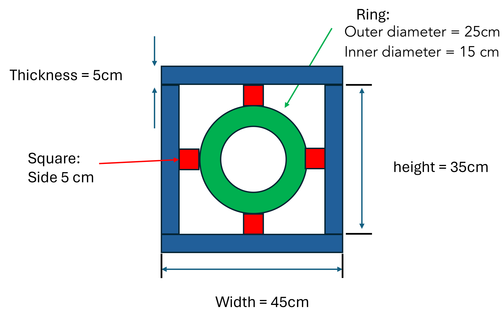

## Level 1

### Daily Practice
**Step 1:**  
Write one function for each day of the week that simply prints the name of the day. Name your function the same as the day of the week while following our naming conventions (i.e. *snake_case*). 

**Step 2:**  
Write one more function called `print_week()` that calls all of the functions you wrote in Step 1, in the correct order.

**Step 3:**  
Call (invoke) your function `print_week()` to print the names of the days of the week.  

```{pyodide}


```

:::{.callout-tip title="Solution" collapse="true"}
```pyodide
def monday():
  print("Monday")

def tuesday():
  print("Tuesday")
  
def wednesday():
  print("Wednesday")
  
def thursday():
  print("Thursday")
  
def friday():
  print("Friday")
  
def saturday():
  print("Saturday")
  
def sunday():
  print("Sunday")

def print_week():
  monday()
  tuesday()
  wednesday()
  thursday()
  friday()
  saturday()
  sunday()

# Finally, tell Python to run the print_week function
# that will in turn call all of the other function.
print_week()
```
:::

### Daily Practice 2
Do something similar to the previous exercise, but do not print anything inside the 7 weekday functions. Only use a `print()` statement in the `print_week()` function. The output should be the same as the previous exercise.

<details>
  <summary>👀 Hint</summary>
  <p>If a function is not printing values, how can the code that called that function get something back for its own use?</p>
</details>

```{pyodide}


```

:::{.callout-tip title="Solution" collapse="true"}
```pyodide
def monday():
  return "Monday"

def tuesday():
  return "Tuesday"
  
def wednesday():
  return "Wednesday"
  
def thursday():
  return "Thursday"
  
def friday():
  return "Friday"
  
def saturday():
  return "Saturday"
  
def sunday():
  return "Sunday"

def print_week():
  # Save the value returned from the monday() function into a variable
  # and then print that variable:
  monday_name = monday()
  print(monday_name)

  # Same idea as for monday, we but could re-use the same variable for 
  # other days of the week if we want to:  
  day = tuesday()
  print(day)

  day = wednesday()
  print(day)

  # We don't absolutely have to save the return value into a variable,
  # we could just print the returned value directly:
  print(thursday())
  print(friday())

  # And lastly, we could also call the functions from inside { } in an
  # f-string and print these weekdays on separate lines using a
  # multi-line f-string:
  print(f"""{saturday()}
{sunday()}""")

# Finally, tell Python to run the print_week function
# that will in turn call all of the other function.
print_week()
```
:::


### Sumthings up

Write a simple function called `calculate_sum()` which takes two numbers as input and returns the sum. Call (*invoke*) the function `calculate_sum()` with values 3, 4 and print the returned value.

```pyodide
# start with the function definition:

# and then call the function:

```

<details>
  <summary>👀 Hint</summary>
  <p>What would you expect this function to "return"</p>
</details>

:::{.callout-tip title="Solution" collapse="true"}
```{pyodide}
def calculate_sum(num1, num2):
    sum = num1 + num2
    return sum

total = calculate_sum(3, 4)
print(total)
```
:::

### Summing squares

Consider the following function which implements this formula:

$$
n_1^2 + n_2^2
$$

```python
def sum_squares(num1, num2):
    result = num1**2 + num2**2
    return result
```

What will be the output of this line of code:

```python
print(sum_squares(3, 4) + sum_squares(1, 2))
```

:::{.callout-tip title="Solution" collapse="true"}
The first call to `sum_squares()` passed in the values 3 & 4 so inside sum_squares it will do the math:  
```{python}
def sum_squares(num1, num2):
    result = 3**2 + 4**2
    return result # 25
```

The second call to `sum_squares()` passed in the values 1 & 2 so inside sum_squares it will do the math:  
```{python}
def sum_squares(num1, num2):
    result = 1**2 + 2**2
    return result # 5
```

After calling sum_squares twice, we effectively have this line of code:  
```{python}
print(25 + 5)
```
:::


### f of x

Write a function which helps apply this formula:

$$
f(x) = (x-4)(x+7)
$$

Then, use it to evaluate $f(x)$ for the values of $x$:

- $x = 4$
- $x=-7$
- $x=2$
- $x=-6$

```{pyodide}
# start with the function definition:

# and then call the function:

```

<details>
  <summary>👀 Hint</summary>
  <p>What would you expect this function to "return"</p>
</details>


:::{.callout-tip title="Solution" collapse="true"}
```{pyodide}
def f_quadratic(x):
    term1 = (x - 4)
    term2 = (x + 7)
    return term1 * term2

print(f_quadratic(4))  #prints 0
print(f_quadratic(-7)) #prints 0
print(f_quadratic(2))  #prints -18
print(f_quadratic(-6)) #prints -10
```
:::

### A matter of threes
Write a function which helps apply this formula:

$$
f(x,y) = 3(x+y)
$$

Then, use it to evaluate $f(x,y)$ for the following values:  
- $x = 3$ , $y=4$
- $x = 5$ , $y=6$
- $x = 2$ , $y=8$

```{pyodide}
# start with the function definition:

# and then call the function:

```

:::{.callout-tip title="Solution" collapse="true"}
```{pyodide}
def f_plane(x, y):
    return 3 * (x + y)

print(f_plane(3, 4))  #21 
print(f_plane(5, 6))  #33
print(f_plane(2, 8))  #30
```
:::

## Tracing

Consider the following functions:

```python
def function1():
  print("Hi")
  function2()
  function3()

def function2():
  print("How are you?")

def function3():
  print("Bye")
```

1. What will be the output when calling `function1()`:

```python
function1() 
```

:::{.callout-tip title="Solution" collapse="true"}
```{text}
Hi
How are you?
Bye
```
:::

2. What will be the output when running those lines of code: 

   ```python
   function1()  
   function2()
   function3()
   ```

:::{.callout-tip title="Solution" collapse="true"}
```{text}
Hi
How are you?
Bye
How are you?
Bye
```
:::

## Level 2

### The Average

Consider the following function:

```python
def calculate_average(num1, num2):
	result = (num1 + num2) / 2
```

_Part 1:_ What will be the *output* of the following lines:

```python
average = calculate_average(3, 4)

print(average)
```
:::{.callout-tip title="Solution" collapse="true"}
None
:::

_Part 2:_ Explain the reason for this outcome and propose an improvement.

:::{.callout-tip title="Solution" collapse="true"}
The function didn't `return` the average. The calculation was done and the average was saved into a variable called `result` but nothing was *returned*. When you try to *use* the result of a function that didn't actually return anything, Python gives you a special value called `None` which means *nothing*.
 
To fix this we should add a `return` statement:
```{pyodide}
def calculate_average(num1, num2):
  result = (num1 + num2) / 2
  return result

average = calculate_average(3, 4)
print(average)
```
:::


### Fun Circles

Write a simple function called `area_circle()` which takes the `radius` as parameter and returns the area:

$$
A_{circle} = \pi r^2
$$

```{pyodide}

```

- Calculate the area of a circle with `radius = 2` by using the function defined above.
- Calculate the area of a circle with `radius = 9` by using the function defined above.
- Calculate the area of a ring which has an inner circle of radius 4 and an outer circle of radius 6.

<details>
  <summary>👀 Hint</summary>
  <p>What do you need to import for this to work?</p>
</details>

:::{.callout-tip title="Solution" collapse="true"}
```{pyodide}
import math

def area_circle(radius):
    area = math.pi * (radius ** 2)
    return area

area1 = calculate_area_circle(2)
area2 = area_circle(9)
area_ring = area_circle(6) - area_circle(4)
```
:::

## More areas

1. Write a simple function called `area_rect()` which takes the `width` and `height` of a rectangle and returns the area:
   $$
   A_{rect} = w * h
   $$

   ```pyodide

   ```

2. Write a simple function called `area_square()` which takes the `side` and returns the area:
   $$
   A_{square}= s^2
   $$


   ```pyodide

   ```

3. Using the `area_cricle()`, `area_rect()` and `area_square()` functions, calculate the area of the following shape. You can assume that the red squares are perfect, that the green central ring is composed of two perfect inner and outer circles and that the blue borders are all perfect rectangles. :



```pyodide

```

:::{.callout-tip title="Solution" collapse="true"}
```{pyodide}
import math

def area_circle(radius):
    area = math.pi * (radius ** 2)
    return area

def area_square(side_length):
  area = side_length**2
  return area

def area_rect(height, width):
  area = height * width
  return area

area_ring = area_circle(25) - area_circle(15)
area_borders = (2 * area_rect(45,5) + 2 * area_rect(35,5))
area_squares = 4 * area_square(5)

total_area = area_ring + area_borders + area_squares

print(f"The total area is {total_area}")
```
:::


## Calculus ?!

Don't run away if you haven't taken Cal 1 yet! Read through this part and you'll see that there's just a pattern you need to follow...

Given some function:
$$
f(x)=x^{n}
$$

where `n` is the *exponent* of x. The *derivative* of this function is given by something called the *power rule*:
$$
f'(x)=nx^{n - 1}
$$

For example, if we have the function:
$$
f(x)=x^{3}
$$
then the derivative is:
$$
f'(x)=3x^{2}
$$


Write a function called power_rule that has one parameter called *exponent*. The result of the function will be a **string** representation of the derivative with respect to x. Your string should look like:
"12x**2"
to represent $$12x^2$$

Try your function like:

```python
derivative1 = power_rule(3)
print(derivative1)
```

<details>
  <summary>👀 Hint </summary>
  <p>Your function must return a string. An f-string would be really useful here!</p>
</details>

:::{.callout-tip title="Solution" collapse="true"}
```{pyodide}
def power_rule(exponent):
    derivative = f"{exponent}x**{exponent - 1}"
    return derivative

f_prime = power_rule(3)
print(f_prime)

f_prime = power_rule(25)
print(f_prime)
```
:::
